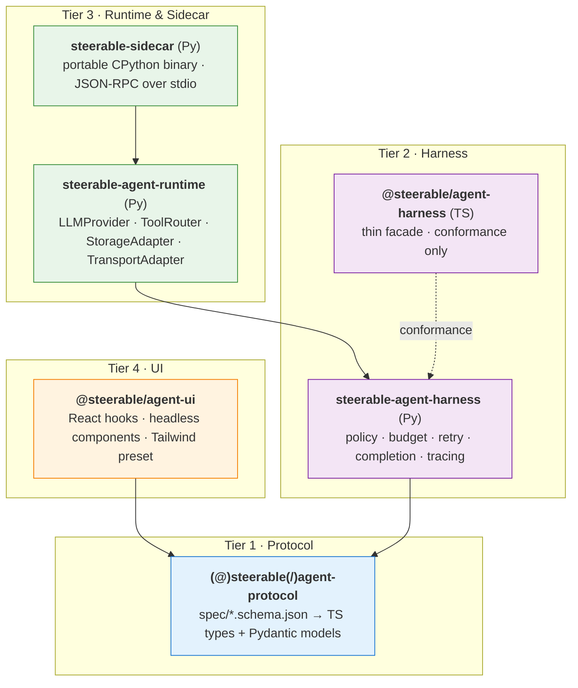

<div align="center">

# Steerable

**The agent plumbing you'd otherwise rewrite.**

Typed wire protocol · pluggable LLM runtime · embeddable Python sidecar · headless React chat UI.
Pick any subset, skip the rest.

[](LICENSE)
[](https://github.com/pathlyapp/steerable-framework/actions/workflows/ci.yml)
[](https://pathlyapp.github.io/steerable-framework/)
[](https://pathlyapp.github.io/steerable-framework/storybook/)

[](https://www.npmjs.com/package/@steerable/agent-protocol)
[](https://www.npmjs.com/package/@steerable/agent-ui)
[](https://pypi.org/project/steerable-agent-runtime/)
[](https://pypi.org/project/steerable-sidecar/)

[](https://www.python.org/)
[](https://nodejs.org/)
[](https://docs.npmjs.com/generating-provenance-statements)

[Docs](https://pathlyapp.github.io/steerable-framework/) · [Storybook](https://pathlyapp.github.io/steerable-framework/storybook/) · [Examples](./examples) · [Releases](https://github.com/pathlyapp/steerable-framework/releases) · [Discussions](https://github.com/pathlyapp/steerable-framework/discussions)

</div>

---

## Table of contents

- [Why Steerable](#why-steerable)
- [Quickstart — pick your path (5 minutes)](#quickstart--pick-your-path-5-minutes)
- [Architecture](#architecture)
- [What's in the box](#whats-in-the-box)
- [Comparison](#comparison)
- [Who's using it in production](#whos-using-it-in-production)
- [Project status & roadmap](#project-status--roadmap)
- [Documentation](#documentation)
- [Community & support](#community--support)
- [Contributing](#contributing)
- [Acknowledgements](#acknowledgements)
- [License](#license)

---

## Why Steerable

Building an LLM agent product means rewriting the same five things every time. Steerable is the layered library you'd build on day 30 — shipped on day 0.

| The problem you've already solved twice | Steerable's answer |
|---|---|
| **"What shape is this SSE stream?"** Every team invents their own envelope; FE and BE drift. | One JSON Schema → generated **TypeScript types + Pydantic models**, in lockstep release. `content`, `tool_call`, `tool_result`, `error`, `done`, `budget_exhausted` all standardised; conformance test suite verifies the two language SDKs stay byte-compatible. |
| **Tool dispatch / budgets / retries / safety regex** | `agent-harness` (Py): `decide_tool_mode`, `consume_budget`, `next_retry_delay_ms`, `is_terminal_result`, command-safety patterns. **Pure functions, zero I/O coupling** — drop into FastAPI / Celery / a notebook. 105 unit + golden tests. |
| **LLM provider abstraction** | `agent-runtime` (Py): one `LLMProvider` interface, adapters for **Ollama / OpenAI-compatible / Anthropic**, `@tool` decorator, `ToolRouter`, SSE-over-HTTP and stdio JSON-RPC transports. |
| **Shipping LLMs in a desktop app without a network round-trip** | `steerable-sidecar`: a portable, signed CPython binary that speaks JSON-RPC over stdio. Bundle with Electron / Tauri / Wails / your custom shell — **macOS notarised, Windows code-signed**, ~300 MB stripped target. |
| **Chat UI that doesn't look like 2003** | `@steerable/agent-ui`: 5 headless React components + 3 hooks + Tailwind preset. Every component has Storybook + a11y (axe) + visual-regression baselines locked in CI. |

Every layer is independently published. Use just the protocol types, just the UI, just the sidecar — there is no monolith to swallow.

---

## Quickstart — pick your path (5 minutes)

### "I'm building a Python agent backend"

```bash
uv add steerable-agent-protocol steerable-agent-harness steerable-agent-runtime
```

```python
from steerable_agent_runtime import ToolRouter, tool
from steerable_agent_protocol import ToolCall

router = ToolRouter()

@tool(router=router, description="Read a file by path")
async def read_file(path: str) -> dict:
    return {"path": path, "content": open(path).read()}

result = await router.dispatch(ToolCall(id="c1", name="read_file", arguments={"path": "README.md"}))
# result.success, result.data, result.error — all typed.
```

Full runnable: [`examples/py-minimal`](./examples/py-minimal).

### "I'm building a React chat UI on top of someone else's SSE endpoint"

```bash
pnpm add @steerable/agent-protocol @steerable/agent-ui
```

```tsx
import { ChatPanel, useChatStream } from '@steerable/agent-ui';

export function Chat() {
  const { messages, send, isStreaming } = useChatStream({
    endpoint: '/api/chats/123/send',
  });
  return <ChatPanel messages={messages} onSubmit={send} isStreaming={isStreaming} />;
}
```

`useChatStream` parses every standard `SSEEvent` shape into typed messages — you don't write a parser, you don't argue about envelope format. See live components at the [Storybook](https://pathlyapp.github.io/steerable-framework/storybook/).

### "I'm shipping an Electron app and want LLMs to run locally"

```bash
pnpm add @steerable/agent-protocol @steerable/agent-ui
# Then bundle the sidecar binary into resources/python-runtime/<platform>/
# (build script: packages/sidecar/build/build_sidecar.py)
```

```ts
import { spawn } from 'node:child_process';

const proc = spawn(sidecarPath, [], { stdio: ['pipe', 'pipe', 'inherit'] });
proc.stdin.write(JSON.stringify({
  jsonrpc: '2.0', id: 1, method: 'agent.chat.stream',
  params: { messages: [{ role: 'user', content: 'hi' }] },
}) + '\n');
// SSE-over-JSON-RPC events stream back on stdout, one per line.
```

Full runnable: [`examples/sidecar-roundtrip`](./examples/sidecar-roundtrip). Real-world embedder: [`deeppath-agent`](https://github.com/deeppath/deeppath-agent).

---

## Architecture

Four tiers, strict no-upward-imports rule. Each tier is shippable on its own.



**The rules:**
- Tier N never imports Tier N+1. Adopting any layer means inheriting only the layers below it.
- TS↔Py for `agent-protocol` is **codegen, not parallel implementation** — `spec/*.schema.json` is the single source of truth.
- All 7 publishable packages release **lockstep** (same `X.Y.Z` everywhere), gated by CI on every tag push.

---

## What's in the box

<details open>
<summary><b>Tier 1 — Protocol</b> · <code>@steerable/agent-protocol</code> + <code>steerable-agent-protocol</code></summary>

- `SSEEvent` envelope (universal stream shape — `content` / `tool_call` / `tool_result` / `error` / `done` / `budget_exhausted` / extensible)
- `ToolCall`, `ToolResult` — closed schemas, byte-stable
- `ChatMessage`, `ChatAgent` — open schemas, extensible payloads
- `AgentSession`, `HarnessTrace`, `TraceSpan`, `TraceEvent` — runtime introspection
- `SidecarRequest`, `SidecarResponse`, `SidecarError`, `SidecarNotification`, `SidecarHealth` — JSON-RPC envelope for the sidecar
- `CommandSafetyPattern` — declarative regex/glob patterns for tool guardrails
- Codegen: `pnpm gen` (TS) + `uv run python scripts/generate_py.py` (Py); drift checker fails CI on hand edits

</details>

<details>
<summary><b>Tier 2 — Harness</b> · <code>steerable-agent-harness</code></summary>

- **Policy**: `decide_tool_mode(name)` — classifies tools as read/write/network/etc. for downstream gating
- **Budget**: `BudgetLimit`, `BudgetState`, `consume_budget(state, limit, tokens=, step=, tool_call=)` — pure-function step accounting; emits the standard `budget_exhausted` event when tripped
- **Retry**: `RetryPolicy`, `next_retry_delay_ms(policy, attempt)` — deterministic exponential-backoff with optional jitter
- **Completion**: `is_terminal_result(result)` — consistent loop-termination predicate
- **Tracing**: `HarnessTrace` builder with `TraceSpan` / `TraceEvent` recorders
- **Safety patterns**: command-safety regex/glob compiled from `spec/safety/CommandSafetyPattern.schema.json`
- **44 unit tests + 18 golden snapshots**; zero DB / HTTP coupling

</details>

<details>
<summary><b>Tier 3 — Runtime & Sidecar</b> · <code>steerable-agent-runtime</code> + <code>steerable-sidecar</code></summary>

- **LLMProvider** interface + adapters: **Ollama**, **OpenAI-compat** (works with vLLM, llama.cpp server, Together, Groq, …), **Anthropic**
- **ToolRouter** + `@tool` decorator with auto-derived JSON Schema from Python type hints
- **StorageAdapter** interface + InMemory + SQLAlchemy reference implementations
- **TransportAdapter**: FastAPI SSE (server-sent events) + stdio JSON-RPC (sidecar)
- **Sidecar binary** built from `python-build-standalone` — boots in <1s, ~300 MB stripped, macOS notarised, Windows signed
- Cross-platform build (`packages/sidecar/build/build_sidecar.py`); aggressive stdlib pruning under a 800 MB CI budget gate

</details>

<details>
<summary><b>Tier 4 — UI</b> · <code>@steerable/agent-ui</code></summary>

- **Components**: `ChatPanel`, `MessageList`, `OrchestrationPlanCard`, `ToolCallRenderer`, `SSEStreamView` — all headless / Tailwind-themable
- **Hooks**: `useChatStream`, `useAgentSession`, `useToolCallStatus`
- **Tailwind preset** — drop-in tokens (`bg-agent-canvas`, `rounded-agent-md`, etc.)
- **Storybook** — every component, every state, with axe a11y + Playwright visual-regression locked in CI
- 44 unit tests + 27 stories + 4 MDX docs

</details>

---

## Comparison

There is no "best agent framework" — there's the right one for your shape of problem.

|  | Steerable | LangChain (Py + JS) | Vercel AI SDK (TS) | OpenAI Assistants API |
|---|---|---|---|---|
| **One wire protocol shared by TS + Py (codegen-aligned)** | ✅ | ⚠️ (separate Py / JS impls) | ❌ (TS only) | ⚠️ (proprietary REST, not OSS) |
| **Pure-function harness (drop into any framework)** | ✅ | ⚠️ (LCEL/Runnable coupling) | ⚠️ (React/Next coupling) | n/a (SaaS) |
| **Embeddable local-LLM sidecar (offline desktop)** | ✅ | ❌ | ❌ | ❌ (cloud-only) |
| **Headless, themable React chat components** | ✅ | ❌ | ✅ | ❌ |
| **Lockstep release across all layers** | ✅ | n/a | n/a | n/a |
| **Self-hosted, no vendor lock-in** | ✅ | ✅ | ✅ | ❌ |

**Reach for Steerable when** you need typed cross-language contracts, plan to ship to desktop / on-prem / air-gapped, or want a UI library you can theme without `!important` wars.

**Don't reach for Steerable when** your agent lives entirely inside one Python process with no FE, you're happy with cloud-hosted Assistants, or you want a high-level `prompt -> answer` SDK with batteries included for every model — Steerable is closer to "Express for agents" than "Rails for agents".

---

## Who's using it in production

- **[DeepPath](https://deeppath.cc)** — web (`@steerable/agent-protocol` + `@steerable/agent-ui`), API (all 3 Py packages), Electron desktop (sidecar + UI). The framework was extracted from this codebase and is dogfooded back into it on every release.

If you're using Steerable in production, send a PR adding your project here.

---

## Project status & roadmap

**Current**: `0.2.x` series — public registries, lockstep tag-driven releases, three production consumers shipping.

| Phase | Status | What lands |
|---|---|---|
| **0.x consolidation** | 🟢 in progress | Stable surface API, integration tests against three downstream repos, downstream lockfile bumps semi-automated |
| **0.3+ Trusted Publishing** | 🟡 next | PyPI auth migrates from API token → OIDC; cross-platform sidecar build matrix in GHA |
| **0.4+ Sidecar slimming** | 🟡 planned | Switch to `python-build-standalone` `install_only_stripped` distro; target ~300 MB (down from current ~700 MB) |
| **1.0** | ⚪ gated on | One full minor cycle without breaking changes; spec freeze (`additionalProperties` semantics locked); shared `1.0.0` decision for protocol+harness pair |

Full open-follow-up list: [`TODO.md`](./TODO.md). Pre-1.0 contract: minor (`0.X`) is the breaking-change axis.

---

## Documentation

- **[Getting Started](./docs/getting-started.md)** — full walkthrough, ~5 minutes
- **[Specs](./docs/spec/)** — wire-level reference for every event/envelope shape
- **[Examples](./examples)** — 3 runnable end-to-end smoke tests:
  - [`py-minimal`](./examples/py-minimal) — protocol + harness + tool dispatch
  - [`ts-minimal`](./examples/ts-minimal) — protocol + harness facade
  - [`sidecar-roundtrip`](./examples/sidecar-roundtrip) — spawn the sidecar binary and complete a JSON-RPC roundtrip
- **[Storybook](https://pathlyapp.github.io/steerable-framework/storybook/)** — every UI component, live, with a11y + visual regression baselines
- **[CHANGELOG](./CHANGELOG.md)** — release notes
- **[INTEGRATION-TESTING.md](./INTEGRATION-TESTING.md)** — how to develop framework + downstream consumer in lockstep
- **[RELEASING.md](./RELEASING.md)** — `bump_to.sh X.Y.Z → tag → push` is the entire flow

---

## Community & support

- 💬 **Questions / ideas / show & tell** → [GitHub Discussions](https://github.com/pathlyapp/steerable-framework/discussions)
- 🐛 **Bug reports / feature requests** → [GitHub Issues](https://github.com/pathlyapp/steerable-framework/issues)
- 🔒 **Security disclosures** → see [`SECURITY.md`](./SECURITY.md) (please email the maintainers privately first; do not open a public issue)
- 📦 **npm provenance** → every `@steerable/*` tarball ships sigstore attestations; verify with `npm audit signatures @steerable/agent-ui`

---

## Contributing

Contributions are welcome — both small (typo fixes, examples) and structural (new LLM adapters, new sidecar transport).

```bash
git clone https://github.com/pathlyapp/steerable-framework
cd steerable-framework
pnpm install
uv sync --all-packages

pnpm gen          # regenerate TS+Py types from spec/
pnpm test         # 44 + 27 stories
uv run pytest     # 105 tests
```

If your change touches `spec/`, the codegen drift checker will fire in CI — re-run `pnpm gen && uv run python scripts/generate_py.py` and commit the regenerated files.

Working on Steerable alongside one of the consumer repos? See [`INTEGRATION-TESTING.md`](./INTEGRATION-TESTING.md) — covers the local toggle scripts (`use_framework_local.sh` / `use_framework_npm.sh` / `use_framework_source.sh`) that flip each consumer between published-registry mode and sibling-source mode.

Cutting a release? See [`RELEASING.md`](./RELEASING.md). Short version:

```bash
./scripts/release/bump_to.sh 0.3.0
git add -A && git commit -m "chore(release): v0.3.0"
git tag v0.3.0
git push origin main v0.3.0   # CI lockstep-validates, creates Release, publishes to npm + PyPI
```

All commits must be DCO-signed (`git commit -s`); the [DCO check](.github/workflows/dco.yml) runs on every PR.

---

## Acknowledgements

Steerable stands on the work of:

- **[python-build-standalone](https://github.com/astral-sh/python-build-standalone)** — the portable CPython distribution that makes the sidecar possible (and the reason you can ship a single signed binary instead of asking users to install Python).
- **[Sigstore](https://sigstore.dev/)** — npm tarball provenance attestations.
- **[uv](https://github.com/astral-sh/uv)** — Python dependency resolution at C-speed; the entire Py workspace is built around it.
- **[release-please](https://github.com/googleapis/release-please)** — used briefly for the early 0.x releases; replaced by tag-driven lockstep when the per-component versioning collided with our cross-language lockstep gate (lessons captured in [`RELEASING.md`](./RELEASING.md)).
- The headless React component patterns popularised by [Radix UI](https://www.radix-ui.com/) and [Headless UI](https://headlessui.com/) — `@steerable/agent-ui` follows the same "logic in hooks, no markup opinions" split.

---

## License

[Apache License 2.0](./LICENSE). See [`NOTICE`](./NOTICE) for third-party attributions baked into the sidecar binary.
