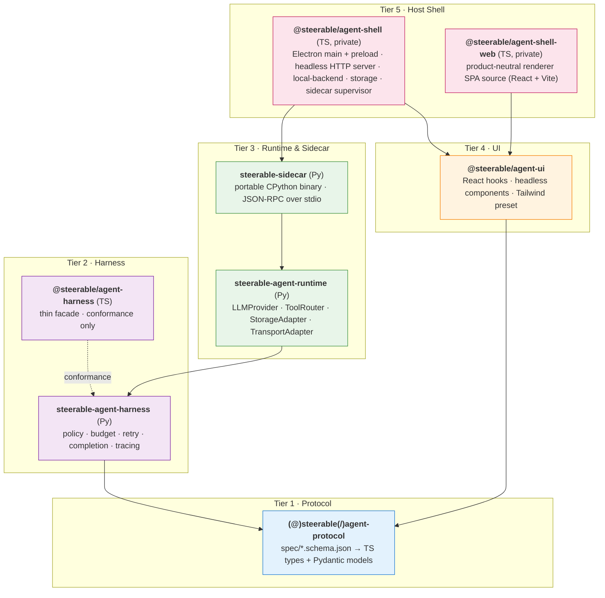

<div align="center">

# Steerable

**The model-quality layer that makes local, quantized, and cheap models behave.**

Recovers and executes malformed tool calls · vetoes bad completion drafts · catches fabricated data · self-calibrates token estimates.
Plus the plumbing you'd otherwise rewrite: typed wire protocol · pluggable LLM runtime · embeddable Python sidecar · headless React chat UI. Pick any subset, skip the rest.

[](LICENSE)
[](https://github.com/pathlyapp/steerable-framework/actions/workflows/ci.yml)
[](https://steerableframework.com/)
[](https://steerableframework.com/storybook/)
[](https://steerableframework.com/demo/)

[](https://www.npmjs.com/package/@steerable/agent-protocol)
[](https://www.npmjs.com/package/@steerable/agent-ui)
[](https://pypi.org/project/steerable-agent-runtime/)
[](https://pypi.org/project/steerable-sidecar/)

[](https://www.python.org/)
[](https://nodejs.org/)
[](https://docs.npmjs.com/generating-provenance-statements)

[Docs](https://steerableframework.com/) · [Storybook](https://steerableframework.com/storybook/) · [Live demo](https://steerableframework.com/demo/) · [Examples](./examples) · [Releases](https://github.com/pathlyapp/steerable-framework/releases) · [Discussions](https://github.com/pathlyapp/steerable-framework/discussions)

> **80.7% on [Terminal-Bench 2.1](https://snorkel.ai/leaderboard/terminal-bench-2-1/)** with GLM-5.3-Flash — same band as Claude Code + Opus 4.8 (78.9%) and Codex CLI + GPT-5.5 (83.1%). Harbor hidden tests, 89-task catalog, six-run mean. [Numbers and protocol](#terminal-bench-21).

> **Want to see it running before reading anything?**
> Open the [hosted live demo](https://steerableframework.com/demo/) — the real Tier 5 agent shell UI running in your browser on mock data, no backend or API key required.
> Locally: `git clone … && pnpm install && pnpm agent-shell:web` boots the same shell against your own model.

</div>

---

## Table of contents

- [Why Steerable](#why-steerable)
- [Terminal-Bench 2.1](#terminal-bench-21)
- [Quickstart — pick your path (5 minutes)](#quickstart--pick-your-path-5-minutes)
- [Architecture](#architecture)
- [What's in the box](#whats-in-the-box)
- [Comparison](#comparison)
- [Who's using it in production](#whos-using-it-in-production)
- [Project status & roadmap](#project-status--roadmap)
- [Documentation](#documentation)
- [Community & support](#community--support)
- [Contributing](#contributing)
- [Acknowledgements](#acknowledgements)
- [License](#license)

---

## Why Steerable

Every agent SDK assumes the model emits clean, structured `tool_calls`. Local, quantized, and cheap models don't. Steerable is the model-quality layer that closes that gap — plus the plumbing layers you'd otherwise rewrite, each shippable on its own.

| The problem you've already solved twice | Steerable's answer |
|---|---|
| **"The model emitted a tool call as prose. Again."** Local, quantized, and cheap models break the assumptions every SDK makes about structured `tool_calls`. | The **model-quality layer** — the part no vendor SDK will build for you. `pseudo.py` recovers *and executes* malformed calls in three formats (MiniMax XML, DeepSeek `<function=>`, markdown); a `before_completion` veto answers `accept`/`retry`/`narrate` on a completion draft; grounding judges catch fabricated data; token estimates self-calibrate against observed usage. See the [roadmap](https://steerableframework.com/roadmap/#the-differentiator-the-model-quality-layer). |
| **"What shape is this SSE stream?"** Every team invents their own envelope; FE and BE drift. | One JSON Schema → generated **TypeScript types + Pydantic models**, in lockstep release. `content`, `tool_call`, `tool_result`, `error`, `done`, `budget_exhausted` all standardised; conformance test suite verifies the two language SDKs stay byte-compatible. |
| **Tool dispatch / budgets / retries / safety regex** | `agent-harness` (Py): `decide_tool_mode`, `consume_budget`, `next_retry_delay_ms`, `is_terminal_result`, command-safety patterns. **Pure functions, zero I/O coupling** — drop into FastAPI / Celery / a notebook. 49 unit + golden tests. |
| **LLM provider abstraction** | `agent-runtime` (Py): one `LLMProvider` interface across **four wire protocols** — OpenAI-compatible chat/completions (Ollama, vLLM, DeepSeek, Groq, …), OpenAI Responses, Anthropic-native, Gemini-native — with a live gateway model catalog, per-vendor sampling presets, `@tool` decorator, `ToolRouter`, SSE-over-HTTP and stdio JSON-RPC transports. |
| **Shipping LLMs in a desktop app without a network round-trip** | `steerable-sidecar`: a portable, signed CPython binary that speaks JSON-RPC over stdio (34 methods). Bundle with Electron / Tauri / Wails / your custom shell — **macOS notarised, Windows code-signed**, ~95 MB stripped on darwin-arm64 under a CI size budget. |
| **Chat UI that doesn't look like 2003** | `@steerable/agent-ui`: 7 headless React components + 14 rich cards + 3 hooks + Tailwind preset. Every component has Storybook + a11y (axe) + visual-regression baselines locked in CI. |

Every layer is independently published. Use just the protocol types, just the UI, just the sidecar — there is no monolith to swallow.

---

## Terminal-Bench 2.1

A Flash-cost model on Steerable. Harbor hidden tests, 89-task catalog, six independent full runs: mean **80.7%** (SD 2.9 points). We report the mean, not the 86.5 high-water mark. Cost per solved task **~$0.146** (~$10.50 per catalog run). Protocol and run list: [`docs/evals.md`](./docs/evals.md).

**Same model · GLM-5.3-Flash** — identical cheap model, same Harbor catalog-89 protocol:

| Agent | TB 2.1 | Cost / solved | Notes |
| ----- | ------ | ------------- | ----- |
| **Steerable** | **80.7%** | **$0.146** | this repo, 6× catalog-89 · **+7.3 vs Pi** |
| Claude Code | 83.1% | $0.162 | this repo, 1 catalog run |
| Pi | 73.4% | $0.061 | this repo, 3 catalog runs |

Z.AI's own Claude Code run of the same Flash model is 84.3% under a 6-hour timeout (Claude Code 2.1.207) — a different protocol; we wrap at 170 minutes.

---

## Quickstart — pick your path (5 minutes)

### "I'm building a Python agent backend"

```bash
uv add steerable-agent-protocol steerable-agent-harness steerable-agent-runtime
```

```python
from steerable_agent_runtime import ToolRouter, tool
from steerable_agent_protocol import ToolCall

router = ToolRouter()

@tool(router=router, description="Read a file by path")
async def read_file(path: str) -> dict:
    return {"path": path, "content": open(path).read()}

result = await router.dispatch(ToolCall(id="c1", name="read_file", arguments={"path": "README.md"}))
# result.success, result.data, result.error — all typed.
```

Full runnable: [`examples/py-minimal`](./examples/py-minimal).

### "I'm building a React chat UI on top of someone else's SSE endpoint"

```bash
pnpm add @steerable/agent-protocol @steerable/agent-ui
```

```tsx
import { ChatPanel, useChatStream } from '@steerable/agent-ui';

export function Chat() {
  const { messages, send, isStreaming } = useChatStream({
    endpoint: '/api/chats/123/send',
  });
  return <ChatPanel messages={messages} onSubmit={send} isStreaming={isStreaming} />;
}
```

`useChatStream` parses every standard `SSEEvent` shape into typed messages — you don't write a parser, you don't argue about envelope format. See live components at the [Storybook](https://steerableframework.com/storybook/).

### "I'm shipping an Electron app and want LLMs to run locally"

```bash
# Bundle the sidecar binary into resources/python-runtime/<platform>/
# (build script: packages/sidecar/build/build_sidecar.py)
```

```ts
import { spawn } from 'node:child_process';

const proc = spawn(sidecarPath, [], { stdio: ['pipe', 'pipe', 'inherit'] });
proc.stdin.write(JSON.stringify({
  jsonrpc: '2.0', id: 1, method: 'agent.chat.stream',
  params: { messages: [{ role: 'user', content: 'hi' }] },
}) + '\n');
// SSE-over-JSON-RPC events stream back on stdout, one per line.
```

TypeScript hosts can skip the subprocess plumbing with `@steerable/agent-runtime` (`packages/agent-runtime/ts` — source-consumed via `link:`, not on npm yet): it owns spawn, the `lifecycle.ready` handshake, health pings, bounded auto-restart, and graceful drain, and exposes the full CoreLoop-level API (`chatStream` / `cancelChat` / `steerChat` / session fork & branch tree / …).

Full runnable: [`examples/sidecar-roundtrip`](./examples/sidecar-roundtrip). Real-world embedder: [`deeppath-agent`](https://github.com/deeppath/deeppath-agent).

### "I just want to see the agent shell running"

The Tier 5 host shell runs standalone with neutral branding (no product, no packs), in two modes:

```bash
pnpm install
pnpm agent-shell:web       # BS mode: builds shell + neutral web app, boots the headless server
# → http://127.0.0.1:4787  (Steerable Shell)

pnpm agent-shell:client    # desktop client mode: same build, launched as an Electron window
```

Both are the production code path (prod web build, shell default preload) — the browser-dev Electron mock is dev-server-only and tree-shaken out of prod builds, so it never appears here.

---

## Architecture

Five tiers, strict no-upward-imports rule. Each tier is shippable on its own.


```mermaid
flowchart TB
    subgraph T5[Tier 5 · Host Shell]
        SH["<b>@steerable/agent-shell</b> (TS, private)<br/>Electron main + preload · headless HTTP server · local-backend · storage · sidecar supervisor"]
        SHW["<b>@steerable/agent-shell-web</b> (TS, private)<br/>product-neutral renderer SPA source (React + Vite)"]
    end

    subgraph T4[Tier 4 · UI]
        UI["<b>@steerable/agent-ui</b><br/>React hooks · headless components · Tailwind preset"]
    end

    subgraph T3[Tier 3 · Runtime & Sidecar]
        RT["<b>steerable-agent-runtime</b> (Py)<br/>LLMProvider · ToolRouter · StorageAdapter · TransportAdapter"]
        SC["<b>steerable-sidecar</b> (Py)<br/>portable CPython binary · JSON-RPC over stdio"]
    end

    subgraph T2[Tier 2 · Harness]
        H["<b>steerable-agent-harness</b> (Py)<br/>policy · budget · retry · completion · tracing"]
        HF["<b>@steerable/agent-harness</b> (TS)<br/>thin facade · conformance only"]
    end

    subgraph T1[Tier 1 · Protocol]
        P["<b>(@)steerable(/)agent-protocol</b><br/>spec/*.schema.json → TS types + Pydantic models"]
    end

    SH --> UI
    SH --> SC
    SHW --> UI
    UI --> P
    RT --> H
    SC --> RT
    H --> P
    HF -. conformance .-> H

    classDef t1 fill:#e3f2fd,stroke:#1976d2
    classDef t2 fill:#f3e5f5,stroke:#7b1fa2
    classDef t3 fill:#e8f5e9,stroke:#388e3c
    classDef t4 fill:#fff3e0,stroke:#f57c00
    classDef t5 fill:#fce4ec,stroke:#c2185b
    class P t1
    class H,HF t2
    class RT,SC t3
    class UI t4
    class SH,SHW t5
```

**The rules:**
- Tier N never imports Tier N+1. Adopting any layer means inheriting only the layers below it.
- TS↔Py for `agent-protocol` is **codegen, not parallel implementation** — `spec/*.schema.json` is the single source of truth.
- All 11 published packages — 6 on npm (protocol, harness, UI, pack-sdk, agent-shell, agent-shell-web) + 5 on PyPI (protocol, harness, runtime, sidecar, egress-proxy) — release **lockstep** (same `X.Y.Z` everywhere), gated by CI on every tag push. Tier 5 (`agent-shell` / `agent-shell-web` / `pack-sdk`) is published to npm (compiled `dist`, source, and pure-types respectively); the TS sidecar wrapper `@steerable/agent-runtime` is versioned in lockstep but source-consumed.
- Tier 5 is **product-neutral**: brand, telemetry endpoints, help links, and data-directory names are injected by the consuming product's assembly root (`setProductBrand` / `setProductConfig`), enforced by the `shell:neutral` gate in CI.

---

## What's in the box

<details open>
<summary><b>Tier 1 — Protocol</b> · <code>@steerable/agent-protocol</code> + <code>steerable-agent-protocol</code></summary>

- `SSEEvent` envelope (universal stream shape — `content` / `tool_call` / `tool_result` / `error` / `done` / `budget_exhausted` / extensible)
- `ToolCall`, `ToolResult` — closed schemas, byte-stable
- `ChatMessage`, `ChatAgent` — open schemas, extensible payloads
- `AgentSession`, `HarnessTrace`, `TraceSpan`, `TraceEvent` — runtime introspection
- `SidecarRequest`, `SidecarResponse`, `SidecarError`, `SidecarNotification`, `SidecarHealth` — JSON-RPC envelope for the sidecar
- `CommandSafetyPattern` — declarative regex/glob patterns for tool guardrails
- Codegen: `pnpm gen` (TS) + `uv run python scripts/generate_py.py` (Py); drift checker fails CI on hand edits

</details>

<details>
<summary><b>Tier 2 — Harness</b> · <code>steerable-agent-harness</code></summary>

- **Policy**: `decide_tool_mode(name)` — classifies tools as read/write/network/etc. for downstream gating
- **Budget**: `BudgetLimit`, `BudgetState`, `consume_budget(state, limit, tokens=, step=, tool_call=)` — pure-function step accounting; emits the standard `budget_exhausted` event when tripped
- **Retry**: `RetryPolicy`, `next_retry_delay_ms(policy, attempt)` — deterministic exponential-backoff with optional jitter
- **Completion**: `is_terminal_result(result)` — consistent loop-termination predicate
- **Tracing**: `HarnessTrace` builder with `TraceSpan` / `TraceEvent` recorders
- **Safety patterns**: command-safety regex/glob compiled from `spec/safety/CommandSafetyPattern.schema.json`
- **49 unit + golden snapshot tests**; zero DB / HTTP coupling

</details>

<details>
<summary><b>Tier 3 — Runtime & Sidecar</b> · <code>steerable-agent-runtime</code> + <code>steerable-sidecar</code> + <code>steerable-egress-proxy</code></summary>

- **CoreLoop** — the production single-agent step loop, yielding a structured `LoopEvent` stream (15 kinds): pseudo tool-call recovery, `before_completion` veto, three default compaction paths plus one opt-in (`micro_compact_interval_rounds`) with both circuit breakers, soft-timeout wrap-up, duplicate-call dedup, per-tool timeouts
- **LLMProvider** interface across **four wire protocols**: **OpenAI-compatible** chat/completions (Ollama, vLLM, llama.cpp server, DeepSeek, Groq, Together, …), **OpenAI Responses** (with `store: false` + encrypted-reasoning round-trips), **Anthropic-native**, **Gemini-native** — vendor divergences are data (`PROVIDER_COMPAT_HOSTS` + per-model sampling presets)
- **Gateway model catalog** — live `GET /models` discovery (`models.list`, refreshable), bundled serving-provider catalog (`catalog.describe`), strict `reasoning_effort` handling
- **ToolRouter** + `@tool` decorator with JSON Schema auto-derived from Python type hints (explicit `schema=` always overrides); exposure tiers (`direct` / `deferred` / `hidden`) with `tool_search`
- **MCP client** — stdio servers, deterministic `mcp__<server>__<tool>` naming, per-server catalog caps, deferred-by-default exposure
- **Plugin lifecycle** — entry-point + local-directory sources; `plugin.list` / `enable` / `disable` / `reload` without a sidecar restart
- **Subagents** — named profiles with per-profile tool domains (fail-closed), models, and system prompts; opt-in orchestration pool (`agent_spawn` / `agent_send` / `agent_wait` / …)
- **Approval + sandbox executors** — 8-variant approval algebra across request/session/durable scopes; per-exec Seatbelt confinement with enforcement returned as a value; bundled per-host egress allow-list proxy with ask-the-user widening
- **StorageAdapter** interface + InMemory + SQLAlchemy reference implementations
- **TransportAdapter**: FastAPI SSE + stdio JSON-RPC (sidecar), plus **AG-UI** and **ACP** peer transports
- **Sidecar binary** built from `python-build-standalone` — boots in <1s, ~95 MB stripped on darwin-arm64, macOS notarised, Windows signed
- Cross-platform build (`packages/sidecar/build/build_sidecar.py`); aggressive stdlib pruning under a CI size budget

</details>

<details>
<summary><b>Tier 4 — UI</b> · <code>@steerable/agent-ui</code></summary>

- **Components**: `ChatPanel`, `MessageList`, `AgentSelector`, `ModelSelector` (live/stale/offline catalog states), `OrchestrationPlanCard`, `ToolCallRenderer`, `SSEStreamView` — all headless / Tailwind-themable
- **Cards** (`@steerable/agent-ui/cards`): 14 rich message cards — `QuizCard`, `CoverageReportCard`, `AnalysisDocumentCard`, `ResearchPlanCard`, `SuggestedRepliesCard`, `AskUserQuestionsCard`, `ThinkingProcessCard`, `PlanStepsCard`, `PlanSelectorCard`, `SearchSourcesCard`, `SummaryMessageCard`, `ActionSegmentCard`, `ToolExecutionCard`, `OrchestrationPlanCard`
- **Hooks**: `useChatStream`, `useAgentSession`, `useToolCallStatus` + chat-session state primitives (`useChatSession`, `useChatComposer`, `useChatList`, `MockChatStreamTransport`, …)
- **Tailwind preset** — drop-in tokens (`bg-agent-canvas`, `rounded-agent-md`, etc.)
- **Storybook** — every component, every state, with axe a11y + Playwright visual-regression locked in CI
- 167 unit tests + 43 stories + 4 MDX docs

</details>

<details>
<summary><b>Tier 5 — Host Shell</b> · <code>@steerable/agent-shell</code> + <code>@steerable/agent-shell-web</code> + <code>@steerable/pack-sdk</code> (private)</summary>

- **Two hosts, one runtime**: Electron desktop shell (main process, IPC, strict CSP, visible PTY via node-pty) and headless HTTP server (`/api/v2/*`, SSE) assembled from the same `HostRuntime`
- **Local backend**: chat/project/agent CRUD, CoreLoop streaming, skill loader (brand-placeholder rendering), subagent profiles, cross-turn background tasks with a panel UI, git-worktree isolation, session branch tree, usage/insights storage (SQLite via better-sqlite3)
- **Sidecar supervision**: boot, health, egress proxy, seatbelt/exec sandbox, reverse approval/ask-user bridges
- **Connection diagnostics**: LLM connection diagnosis panel, system/ambient proxy detection, and egress hints surfaced in settings — a misconfigured gateway fails with a remedy, not a hang
- **Scenario-pack extension points** (`pack-sdk` types): services, tools, migrations, seeds, skills, IPC namespaces, HTTP routes, renderer chat slots & settings panels, brand/logo — composed at build time by the product's assembly root
- **Renderer SPA source** (`agent-shell-web`): product-neutral React app consumed by product web entries via the `@/` alias + `createProductViteConfig` factory
- **Packaging helpers**: `scripts/prepare-sidecar.sh` / `prepare-framework-wheels.sh` build the embedded Python runtime for product installers
- **Neutrality gate**: `pnpm --filter @steerable/agent-shell shell:neutral` fails CI on any product hardcoding in shell sources or skill text
- 615 node-side unit tests + 220 renderer component tests

</details>

---

## Comparison

There is no "best agent framework" — there's the right one for your shape of problem.

|  | Steerable | LangChain (Py + JS) | Vercel AI SDK (TS) | OpenAI Assistants API |
|---|---|---|---|---|
| **One wire protocol shared by TS + Py (codegen-aligned)** | ✅ | ⚠️ (separate Py / JS impls) | ❌ (TS only) | ⚠️ (proprietary REST, not OSS) |
| **Pure-function harness (drop into any framework)** | ✅ | ⚠️ (LCEL/Runnable coupling) | ⚠️ (React/Next coupling) | n/a (SaaS) |
| **Embeddable local-LLM sidecar (offline desktop)** | ✅ | ❌ | ❌ | ❌ (cloud-only) |
| **Headless, themable React chat components** | ✅ | ❌ | ✅ | ❌ |
| **Lockstep release across all layers** | ✅ | n/a | n/a | n/a |
| **Self-hosted, no vendor lock-in** | ✅ | ✅ | ✅ | ❌ |

**Reach for Steerable when** you need typed cross-language contracts, plan to ship to desktop / on-prem / air-gapped, or want a UI library you can theme without `!important` wars.

**Don't reach for Steerable when** your agent lives entirely inside one Python process with no FE, you're happy with cloud-hosted Assistants, or you want a high-level `prompt -> answer` SDK with batteries included for every model — Steerable is closer to "Express for agents" than "Rails for agents".

For a comparison with agent-specific frameworks and products (Codex, DeepSeek Harness, LangGraph, OpenAI Agents SDK, Claude Agent SDK), see [the docs comparison page](https://steerableframework.com/comparison/).

---

## Who's using it in production

- **[DeepPath](https://deeppath.cc)** — web (`@steerable/agent-protocol` + `@steerable/agent-ui`), API (all 3 Py packages), Electron desktop (sidecar + UI). The framework was extracted from this codebase and is dogfooded back into it on every release.

If you're using Steerable in production, send a PR adding your project here.

---

## Project status & roadmap

**Current**: `0.6.x` series — public registries, lockstep tag-driven releases, one production consumer ([DeepPath](https://deeppath.cc)) shipping on web, API, and desktop.

| Phase | Status | What lands |
|---|---|---|
| **0.x consolidation** | 🟢 in progress | Stable surface API, integration tests against downstream repos, downstream lockfile bumps semi-automated |
| **0.3+ Trusted Publishing** | ✅ done | npm `--provenance` (sigstore) + PyPI Trusted Publishing over OIDC; cross-platform sidecar build/sign matrix in GHA |
| **0.4+ Sidecar slimming** | ✅ done | `install_only_stripped` distro landed; darwin-arm64 bundle 94.7 MB (was ~700 MB class), CI budgets back at the 320 MB design target |
| **0.5–0.6 Architecture-review waves 0–4** | ✅ done | Append-only model-visible history, world-state diffing with `cache_control` emission, tool exposure tiers + `tool_search`, MCP client, approval algebra, per-exec sandbox, AG-UI/ACP peer transports, plugin lifecycle, gateway model catalog — details in the [roadmap](https://steerableframework.com/roadmap/) |
| **1.0** | ⚪ gated on | One full minor cycle without breaking changes; spec freeze (`additionalProperties` semantics locked); shared `1.0.0` decision for protocol+harness pair |

Where the architecture is headed, what's genuinely missing, and what's explicitly out of scope: **[Architecture Review & Roadmap](https://steerableframework.com/roadmap/)** — a gap scorecard against Codex and DeepSeek Harness, with the honest negatives.

Full open-follow-up list: [`TODO.md`](./TODO.md). Pre-1.0 contract: minor (`0.X`) is the breaking-change axis.

---

## Documentation

- **[Getting Started](./docs/getting-started.md)** — full walkthrough, ~5 minutes
- **[Evals](./docs/evals.md)** — Terminal-Bench 2.1 catalog-89 score of record (Steerable + GLM-5.3-Flash **80.7%**) plus Harbor cheap-12 (`claude-code` / `codex` / `pi`)
- **[Specs](./docs/spec/)** — wire-level reference for every event/envelope shape
- **[Examples](./examples)** — 3 runnable end-to-end smoke tests:
  - [`py-minimal`](./examples/py-minimal) — protocol + harness + tool dispatch
  - [`ts-minimal`](./examples/ts-minimal) — protocol + harness facade
  - [`sidecar-roundtrip`](./examples/sidecar-roundtrip) — spawn the sidecar binary and complete a JSON-RPC roundtrip
- **[Storybook](https://steerableframework.com/storybook/)** — every UI component, live, with a11y + visual regression baselines
- **[CHANGELOG](./CHANGELOG.md)** — release notes
- **[INTEGRATION-TESTING.md](./INTEGRATION-TESTING.md)** — how to develop framework + downstream consumer in lockstep
- **[RELEASING.md](./RELEASING.md)** — `bump_to.sh X.Y.Z → tag → push` is the entire flow

---

## Community & support

- 💬 **Questions / ideas / show & tell** → [GitHub Discussions](https://github.com/pathlyapp/steerable-framework/discussions)
- 🐛 **Bug reports / feature requests** → [GitHub Issues](https://github.com/pathlyapp/steerable-framework/issues)
- 🔒 **Security disclosures** → see [`SECURITY.md`](./SECURITY.md) (please email the maintainers privately first; do not open a public issue)
- 📦 **npm provenance** → every `@steerable/*` tarball ships sigstore attestations; verify with `npm audit signatures @steerable/agent-ui`

---

## Contributing

Contributions are welcome — both small (typo fixes, examples) and structural (new LLM adapters, new sidecar transport).

```bash
git clone https://github.com/pathlyapp/steerable-framework
cd steerable-framework
pnpm install
uv sync --all-packages

pnpm gen          # regenerate TS+Py types from spec/
pnpm test         # ~1,000 TS tests (incl. Storybook stories)
uv run pytest     # ~1,950 tests
```

If your change touches `spec/`, the codegen drift checker will fire in CI — re-run `pnpm gen && uv run python scripts/generate_py.py` and commit the regenerated files.

Working on Steerable alongside one of the consumer repos? See [`INTEGRATION-TESTING.md`](./INTEGRATION-TESTING.md) — covers the local toggle scripts (`use_framework_local.sh` / `use_framework_npm.sh` / `use_framework_source.sh`) that flip each consumer between published-registry mode and sibling-source mode.

Cutting a release? See [`RELEASING.md`](./RELEASING.md). Short version:

```bash
./scripts/release/bump_to.sh 0.3.0
git add -A && git commit -m "chore(release): v0.3.0"
git tag v0.3.0
git push origin main v0.3.0   # CI lockstep-validates, creates Release, publishes to npm + PyPI
```

All commits must be DCO-signed (`git commit -s`); the [DCO check](.github/workflows/dco.yml) runs on every PR.

---

## Acknowledgements

Steerable stands on the work of:

- **[python-build-standalone](https://github.com/astral-sh/python-build-standalone)** — the portable CPython distribution that makes the sidecar possible (and the reason you can ship a single signed binary instead of asking users to install Python).
- **[Sigstore](https://sigstore.dev/)** — npm tarball provenance attestations.
- **[uv](https://github.com/astral-sh/uv)** — Python dependency resolution at C-speed; the entire Py workspace is built around it.
- **[release-please](https://github.com/googleapis/release-please)** — used briefly for the early 0.x releases; replaced by tag-driven lockstep when the per-component versioning collided with our cross-language lockstep gate (lessons captured in [`RELEASING.md`](./RELEASING.md)).
- The headless React component patterns popularised by [Radix UI](https://www.radix-ui.com/) and [Headless UI](https://headlessui.com/) — `@steerable/agent-ui` follows the same "logic in hooks, no markup opinions" split.

---

## License

[Apache License 2.0](./LICENSE). See [`NOTICE`](./NOTICE) for third-party attributions baked into the sidecar binary.
