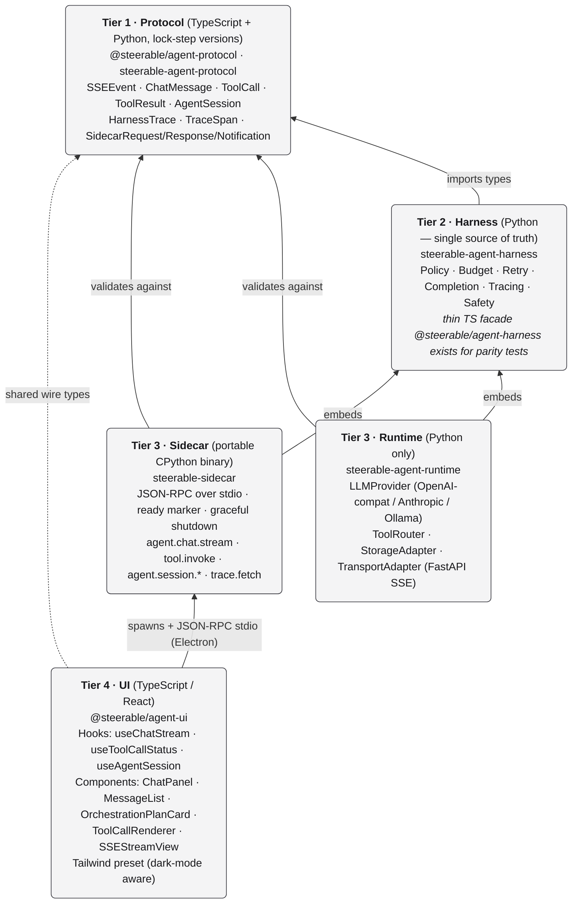

# Steerable Framework

> An open-source, spec-first agent framework extracted from the DeepPath
> ecosystem. Build AI agents in Python (server) and TypeScript (browser/Electron)
> with a single source-of-truth wire protocol, a deterministic harness, a
> pluggable runtime, and a portable sidecar binary that lets desktop apps share
> 100% of their agent business logic with their web backend.

## Why Steerable

Most agent frameworks are either **single-language** (lock you out of the
desktop / browser) or **stitched together at the API level** (your web app and
your Python server drift apart within weeks). Steerable's spec-first design
means:

- One JSON Schema → Python Pydantic + TypeScript types + runtime validators
- Drift between languages is detected by CI, not by users
- Web (TS), API (Py), and desktop (Electron + Py sidecar) all consume the **same** primitives

## Architecture (Tier 1 → Tier 4)

Arrows point from a layer to what it **depends on**. Dashed arrows mark
shared-type relationships and out-of-band channels (Electron spawning the
sidecar over stdio).

The two top-tier consumers (a web app + a desktop Electron app) load **the same
agent-protocol types**, so any change to a wire type either flows through CI
codegen or is rejected by drift checks before it ships.

## What's in v0.1.0

| Package                       | Tier | Status   |
| ----------------------------- | ---- | -------- |
| `@steerable/agent-protocol`   | 1    | Released |
| `steerable-agent-protocol`    | 1    | Released |
| `@steerable/agent-harness`    | 2    | Facade   |
| `steerable-agent-harness`     | 2    | Released |
| `steerable-agent-runtime`     | 3    | Released |
| `steerable-sidecar`           | 3    | Released |
| `@steerable/agent-ui`         | 4    | Released |

## Get started in 5 minutes

→ [**Getting Started**](getting-started.md)

## UI Storybook

The full `@steerable/agent-ui` component library — every variant, every state, with copy-paste hook examples — is published as a live Storybook alongside this site:

→ <a href="storybook/index.html" target="_blank"><strong>Browse the Storybook</strong></a>

The Storybook ships an a11y panel (axe-core) and includes per-story snapshots; pull-requests that regress visual or accessibility quality are blocked by the CI gates in `.github/workflows/storybook-quality.yml`.

## Specs

- [Spec Overview](spec/overview.md)
- [Architecture (Tier 1–4)](spec/architecture.md)
- [Events](spec/events.md)
- [Tools](spec/tools.md)
- [Chat](spec/chat.md)
- [Safety](spec/safety.md)
- [Runtime: AgentSession + HarnessTrace](spec/runtime.md)
- [Sidecar: JSON-RPC over stdio](spec/sidecar.md)

## Examples

- [`examples/py-minimal/`](https://github.com/pathlyapp/steerable-framework/tree/main/examples/py-minimal) — Python protocol + harness + tool dispatch
- [`examples/ts-minimal/`](https://github.com/pathlyapp/steerable-framework/tree/main/examples/ts-minimal) — TypeScript protocol consumer
- [`examples/sidecar-roundtrip/`](https://github.com/pathlyapp/steerable-framework/tree/main/examples/sidecar-roundtrip) — Spawn sidecar, run a chat-stream end-to-end

## Migrating from DeepPath internals

→ [DeepPath → Steerable migration guide](migration/deeppath.md)
