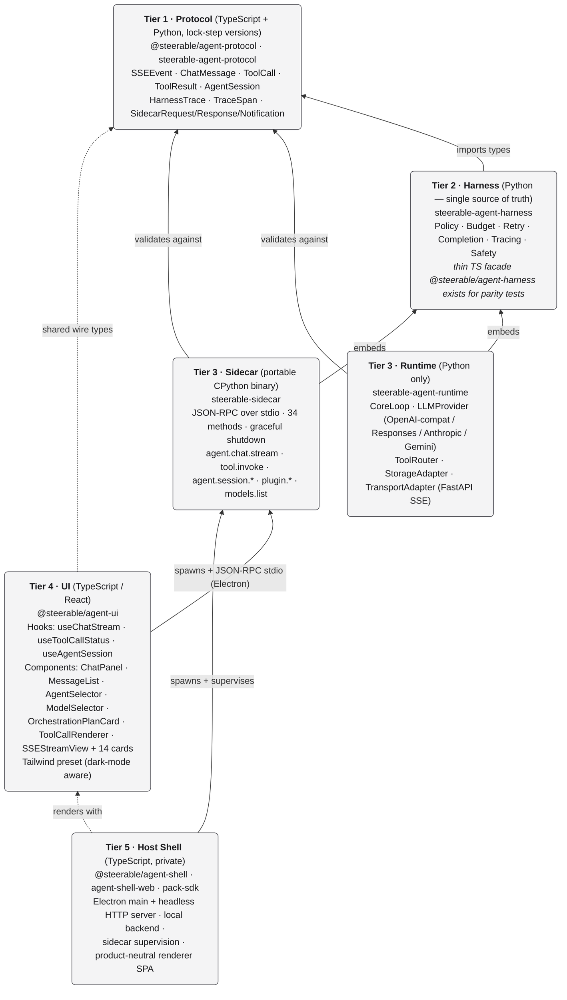

---
hide:
  - navigation
  - toc
---

<div class="sf-hero" markdown>


# Steerable

<p class="sf-tagline">The model-quality layer that makes local, quantized, and cheap models behave.</p>

<p class="sf-sub" markdown>
Recovers and executes malformed tool calls · vetoes bad completion drafts · catches fabricated data · self-calibrates token estimates.
Plus the plumbing you'd otherwise rewrite: typed wire protocol · pluggable LLM runtime · embeddable Python sidecar · headless React chat UI.
Pick any subset, skip the rest — every layer ships on its own.
</p>

<div class="sf-cta" markdown>
[Get started](getting-started.md){ .md-button .md-button--primary }
<a href="demo/" class="md-button">Live demo</a>
<a href="storybook/" class="md-button">Storybook</a>
[GitHub](https://github.com/pathlyapp/steerable-framework){ .md-button }
</div>

<p class="sf-badges">
  <a href="https://github.com/pathlyapp/steerable-framework/blob/main/LICENSE"></a>
  <a href="https://github.com/pathlyapp/steerable-framework/actions/workflows/ci.yml"></a>
  <a href="https://www.npmjs.com/package/@steerable/agent-ui"></a>
  <a href="https://pypi.org/project/steerable-agent-runtime/"></a>
</p>

</div>

<div class="sf-score-strip" markdown>
<div class="sf-score sf-score--ours" markdown>
<span class="sf-score-value">80.7%</span>
<span class="sf-score-label">Steerable + GLM-5.3-Flash</span>
<span class="sf-score-meta">TB 2.1 · 6-run mean @max · this repo</span>
</div>
<div class="sf-score" markdown>
<span class="sf-score-value">+7.3</span>
<span class="sf-score-label">vs Pi on the same Flash model</span>
<span class="sf-score-meta">Pi + GLM-5.3-Flash · 73.4%</span>
</div>
<div class="sf-score" markdown>
<span class="sf-score-value">$0.146</span>
<span class="sf-score-label">per solved task</span>
<span class="sf-score-meta">six-run mean · ~$10.50 / catalog-89</span>
</div>
</div>

<h2 class="sf-section">Why Steerable</h2>

<p class="sf-lede" markdown>
Every agent SDK assumes the model emits clean, structured `tool_calls`. Local, quantized, and cheap models don't.
Steerable is the model-quality layer that closes that gap — plus the plumbing layers you'd otherwise rewrite, each shippable on its own.
</p>

<div class="sf-grid" markdown>
<div class="sf-card" markdown>
### The model-quality layer
Local, quantized, and cheap models break the structured-`tool_calls` assumptions every SDK makes. Steerable recovers *and executes* malformed calls (MiniMax XML, DeepSeek `<function=>`, markdown), vetoes completion drafts (`accept` / `retry` / `narrate`), judges grounding, and self-calibrates token estimates. [Why this is the differentiator](roadmap.md#the-differentiator-the-model-quality-layer).
</div>
<div class="sf-card" markdown>
### One wire protocol
One JSON Schema → generated **TypeScript types + Pydantic models**. `content`, `tool_call`, `tool_result`, `error`, `done`, `budget_exhausted` — all standardised, with a conformance suite keeping both SDKs byte-compatible. All 8 published packages share one lockstep `X.Y.Z`; npm tarballs ship **sigstore provenance** attestations.
</div>
<div class="sf-card" markdown>
### Pure-function harness
Policy, budget, retry, completion, tracing, safety patterns. **Zero I/O coupling** — drop into FastAPI, Celery, or a notebook. Unit and golden tests in CI.
</div>
<div class="sf-card" markdown>
### Pluggable runtime
One `LLMProvider` interface across **four wire protocols** — OpenAI-compatible chat/completions (Ollama, vLLM, DeepSeek, Groq, …), OpenAI Responses, Anthropic-native, Gemini-native — plus a live gateway model catalog, per-vendor sampling presets, `@tool` decorator, `ToolRouter`, SSE-over-HTTP and stdio JSON-RPC transports.
</div>
<div class="sf-card" markdown>
### Embeddable sidecar
A portable, signed CPython binary speaking JSON-RPC over stdio (34 methods). Ship local LLMs inside **Electron / Tauri / Wails** — macOS notarised, Windows code-signed — with an OS sandbox, per-host egress proxy, and plugin lifecycle built in.
</div>
<div class="sf-card" markdown>
### Headless React UI
7 components + 14 rich cards + 3 hooks + Tailwind preset. Every state covered by Storybook, axe a11y, and visual-regression baselines locked in CI.
</div>
</div>

<h2 class="sf-section">Terminal-Bench 2.1</h2>

<p class="sf-lede" markdown>
The score of record is still Steerable + GLM-5.3-Flash **80.7%** at `reasoning_effort=max` (six-run mean, SD 2.9). The figures below are a **separate n=1** protocol: GLM-5.3-Flash and DeepSeek-V4-Flash 0731 at `high`, Qwen3.8-27B at `medium`, five harnesses, one OpenRouter account, Harbor catalog-89. Timeout, error, and missing trials count as fail. Terminus is omitted. DSH is on both figures (SHA `c576a88`); its dollars are OpenRouter analytics tokens for the catalog window, scored with the same pinned-host list formula as the twelve Harbor cells. Protocol and run list: [Evals](evals.md).
</p>

<div class="sf-bench sf-bench--wide">

<div class="sf-bench-duo">

<div class="sf-bench-group sf-bench-group--focus">
<div class="sf-bench-kicker">Same protocol · three Flash models · five harnesses</div>
<p class="sf-bench-blurb">Grouped bars are pass/89. Color is the harness. This is n=1 at high/medium, not the 80.7% @max six-run.</p>
<svg class="sf-bars" viewBox="0 0 760 336" role="img" aria-label="Terminal-Bench 2.1 n=1 pass over 89 for three models and five harnesses: Steerable, Pi, Claude Code, Codex, DSH.">
<line class="axis" x1="56" y1="48" x2="56" y2="280"/>
<line class="axis" x1="56" y1="280" x2="730" y2="280"/>
<text class="tick" x="50" y="284" text-anchor="end">0</text>
<text class="tick" x="50" y="219" text-anchor="end">25</text>
<text class="tick" x="50" y="154" text-anchor="end">50</text>
<text class="tick" x="50" y="89" text-anchor="end">75</text>
<text class="tick" x="50" y="58" text-anchor="end">89</text>
<line class="grid" x1="56" y1="215" x2="730" y2="215"/>
<line class="grid" x1="56" y1="150" x2="730" y2="150"/>
<line class="grid" x1="56" y1="85" x2="730" y2="85"/>
<line class="grid" x1="56" y1="54" x2="730" y2="54"/>
<rect class="bar--steer" fill="#5c6bc0" x="79" y="99.6" width="22" height="180.4"/>
<rect class="bar--pi" fill="#0e7490" x="107" y="114.9" width="22" height="165.1"/>
<rect class="bar--cc" fill="#c2410c" x="135" y="104.7" width="22" height="175.3"/>
<rect class="bar--codex" fill="#a1a1aa" x="163" y="153.0" width="22" height="127.0"/>
<rect class="bar--dsh" fill="#15803d" x="191" y="130.2" width="22" height="149.8"/>
<text class="barVal" x="90" y="95" text-anchor="middle">79.8</text>
<text class="barVal" x="118" y="110" text-anchor="middle">73.0</text>
<text class="barVal" x="146" y="100" text-anchor="middle">77.5</text>
<text class="barVal" x="174" y="149" text-anchor="middle">56.2</text>
<text class="barVal" x="202" y="125" text-anchor="middle">66.3</text>
<text class="axisTitle" x="146" y="298" text-anchor="middle">GLM @high</text>
<rect class="bar--steer" fill="#5c6bc0" x="303" y="102.1" width="22" height="177.9"/>
<rect class="bar--pi" fill="#0e7490" x="331" y="122.5" width="22" height="157.5"/>
<rect class="bar--cc" fill="#c2410c" x="359" y="178.4" width="22" height="101.6"/>
<rect class="bar--codex" fill="#a1a1aa" x="387" y="140.3" width="22" height="139.7"/>
<rect class="bar--dsh" fill="#15803d" x="415" y="104.8" width="22" height="175.2"/>
<text class="barVal" x="314" y="98" text-anchor="middle">78.7</text>
<text class="barVal" x="342" y="118" text-anchor="middle">69.7</text>
<text class="barVal" x="370" y="174" text-anchor="middle">44.9</text>
<text class="barVal" x="398" y="136" text-anchor="middle">61.8</text>
<text class="barVal" x="426" y="100" text-anchor="middle">77.5</text>
<text class="axisTitle" x="370" y="298" text-anchor="middle">DS0731 @high</text>
<rect class="bar--steer" fill="#5c6bc0" x="527" y="125.0" width="22" height="155.0"/>
<rect class="bar--pi" fill="#0e7490" x="555" y="137.8" width="22" height="142.2"/>
<rect class="bar--cc" fill="#c2410c" x="583" y="120.0" width="22" height="160.0"/>
<rect class="bar--codex" fill="#a1a1aa" x="611" y="135.2" width="22" height="144.8"/>
<rect class="bar--dsh" fill="#15803d" x="639" y="142.9" width="22" height="137.1"/>
<text class="barVal" x="538" y="121" text-anchor="middle">68.5</text>
<text class="barVal" x="566" y="133" text-anchor="middle">62.9</text>
<text class="barVal" x="594" y="116" text-anchor="middle">70.8</text>
<text class="barVal" x="622" y="131" text-anchor="middle">64.0</text>
<text class="barVal" x="650" y="138" text-anchor="middle">60.7</text>
<text class="axisTitle" x="594" y="298" text-anchor="middle">Qwen @medium</text>
<rect class="bar--steer" fill="#5c6bc0" x="56" y="314" width="10" height="10"/>
<text class="tick" x="70" y="323">Steerable</text>
<rect class="bar--pi" fill="#0e7490" x="148" y="314" width="10" height="10"/>
<text class="tick" x="162" y="323">Pi</text>
<rect class="bar--cc" fill="#c2410c" x="198" y="314" width="10" height="10"/>
<text class="tick" x="212" y="323">Claude Code</text>
<rect class="bar--codex" fill="#a1a1aa" x="318" y="314" width="10" height="10"/>
<text class="tick" x="332" y="323">Codex</text>
<rect class="bar--dsh" fill="#15803d" x="396" y="314" width="10" height="10"/>
<text class="tick" x="410" y="323">DSH</text>
</svg>
<p class="sf-bench-foot">Mean = pass/89. GLM/DS @high pin z-ai / alibaba; Qwen @medium pin alibaba (Pi maps medium to <code>--thinking high</code>). DeepSeek is 0731 GA, not the 0423 preview. Steerable/Pi/CC/Codex SHA <code>6f70bf5</code> + fill <code>19213d7</code>. DSH SHA <code>c576a88</code> (Qwen missing <code>winning-avg-corewars</code> counts as fail).</p>
</div>

<div class="sf-bench-group sf-bench-group--focus">
<div class="sf-bench-kicker">Cost × score · fifteen cells · same list-price formula</div>
<p class="sf-bench-blurb">Color is the harness. Shape is the model: circle GLM, square DeepSeek, diamond Qwen. Larger marker is Steerable. Dollars are OpenRouter list on the pinned host, not the published GLM @max $0.146 axis. Green DSH markers use OpenRouter analytics tokens for the catalog window (Harbor DSH trials still write no tokens).</p>
<svg class="sf-scatter" viewBox="0 0 800 428" role="img" aria-label="Terminal-Bench 2.1 n=1 score against OpenRouter list dollars per solved task for fifteen catalog-89 cells. Color is harness, shape is model. DSH dollars inferred from OpenRouter analytics.">
<line class="grid" x1="48.0" y1="32" x2="48.0" y2="332"/>
<line class="grid" x1="216.6" y1="32" x2="216.6" y2="332"/>
<line class="grid" x1="344.2" y1="32" x2="344.2" y2="332"/>
<line class="grid" x1="471.8" y1="32" x2="471.8" y2="332"/>
<line class="grid" x1="599.4" y1="32" x2="599.4" y2="332"/>
<line class="grid" x1="768.0" y1="32" x2="768.0" y2="332"/>
<line class="grid" x1="48" y1="298.7" x2="768" y2="298.7"/>
<line class="grid" x1="48" y1="232.0" x2="768" y2="232.0"/>
<line class="grid" x1="48" y1="165.3" x2="768" y2="165.3"/>
<line class="grid" x1="48" y1="98.7" x2="768" y2="98.7"/>
<line class="grid" x1="48" y1="65.3" x2="768" y2="65.3"/>
<line class="axis" x1="48" y1="32" x2="48" y2="332"/>
<line class="axis" x1="48" y1="332" x2="768" y2="332"/>
<text class="tick" x="48.0" y="348" text-anchor="middle">$0.10</text>
<text class="tick" x="216.6" y="348" text-anchor="middle">$0.25</text>
<text class="tick" x="344.2" y="348" text-anchor="middle">$0.50</text>
<text class="tick" x="471.8" y="348" text-anchor="middle">$1</text>
<text class="tick" x="599.4" y="348" text-anchor="middle">$2</text>
<text class="tick" x="768.0" y="348" text-anchor="middle">$5</text>
<text class="tick" x="42" y="302.7" text-anchor="end">45</text>
<text class="tick" x="42" y="236.0" text-anchor="end">55</text>
<text class="tick" x="42" y="169.3" text-anchor="end">65</text>
<text class="tick" x="42" y="102.7" text-anchor="end">75</text>
<text class="tick" x="42" y="69.3" text-anchor="end">80</text>
<text class="axisTitle" x="408" y="372" text-anchor="middle">$ per solved task (log) · OpenRouter list on pinned host</text>
<text class="axisTitle" x="14" y="182" text-anchor="middle" transform="rotate(-90 14 182)">TB 2.1 score (n=1 pass / 89)</text>
<circle class="pt pt--pi" fill="#0e7490" stroke="#0e7490" cx="86.1" cy="112.0" r="11"/>
<text class="lbl" x="100" y="108">Pi · GLM</text>
<text class="sub" x="100" y="118">73.0% · $0.12</text>
<circle class="pt pt--cc" fill="#c2410c" stroke="#c2410c" cx="198.1" cy="82.0" r="11"/>
<text class="lbl" x="212" y="78">Claude Code · GLM</text>
<text class="sub" x="212" y="88">77.5% · $0.23</text>
<rect class="pt pt--pi" fill="#0e7490" stroke="#0e7490" x="223.2" y="123.0" width="22" height="22"/>
<text class="lbl" x="250" y="130">Pi · DS</text>
<text class="sub" x="250" y="140">69.7% · $0.28</text>
<circle class="pt pt--ours" fill="#5c6bc0" stroke="#5c6bc0" cx="381.4" cy="66.7" r="14"/>
<text class="lbl lbl--ours" x="398" y="81">Steerable · GLM</text>
<text class="sub" x="398" y="91">79.8% · $0.61</text>
<rect class="pt pt--cc" fill="#c2410c" stroke="#c2410c" x="430.0" y="288.3" width="22" height="22"/>
<text class="lbl" x="456" y="286">Claude Code · DS</text>
<text class="sub" x="456" y="296">44.9% · $0.85</text>
<circle class="pt pt--codex" fill="#71717a" stroke="#71717a" cx="481.6" cy="224.0" r="11"/>
<text class="lbl" x="496" y="220">Codex · GLM</text>
<text class="sub" x="496" y="230">56.2% · $1.06</text>
<polygon class="pt pt--cc" fill="#c2410c" stroke="#c2410c" points="567.3,110.7 583.3,126.7 567.3,142.7 551.3,126.7"/>
<text class="lbl" x="548" y="116" text-anchor="end">Claude Code · Qwen</text>
<text class="sub" x="548" y="126" text-anchor="end">70.8% · $1.68</text>
<rect class="pt pt--ours" fill="#5c6bc0" stroke="#5c6bc0" x="602.3" y="61.0" width="26" height="26"/>
<text class="lbl lbl--ours" x="598" y="58" text-anchor="end">Steerable · DS</text>
<text class="sub" x="598" y="72" text-anchor="end">78.7% · $2.18</text>
<polygon class="pt pt--codex" fill="#71717a" stroke="#71717a" points="647.6,156.0 663.6,172.0 647.6,188.0 631.6,172.0"/>
<text class="lbl" x="628" y="198" text-anchor="end">Codex · Qwen</text>
<text class="sub" x="628" y="208" text-anchor="end">64.0% · $2.60</text>
<polygon class="pt pt--pi" fill="#0e7490" stroke="#0e7490" points="666.2,163.3 682.2,179.3 666.2,195.3 650.2,179.3"/>
<text class="lbl" x="686" y="176">Pi · Qwen</text>
<text class="sub" x="678" y="186">62.9% · $2.87</text>
<polygon class="pt pt--ours" fill="#5c6bc0" stroke="#5c6bc0" points="732.1,124.0 750.1,142.0 732.1,160.0 714.1,142.0"/>
<text class="lbl lbl--ours" x="710" y="128" text-anchor="end">Steerable · Qwen</text>
<text class="sub" x="710" y="138" text-anchor="end">68.5% · $4.12</text>
<rect class="pt pt--codex" fill="#71717a" stroke="#71717a" x="732.3" y="173.7" width="26" height="26"/>
<text class="lbl" x="728" y="218" text-anchor="end">Codex · DS</text>
<text class="sub" x="728" y="228" text-anchor="end">61.8% · $4.42</text>
<circle class="pt pt--dsh" fill="#15803d" stroke="#15803d" cx="88.5" cy="156.7" r="11"/>
<text class="lbl" x="104" y="152">DSH · GLM</text>
<text class="sub" x="104" y="162">66.3% · $0.12</text>
<rect class="pt pt--dsh" fill="#15803d" stroke="#15803d" x="690.3" y="71.0" width="22" height="22"/>
<text class="lbl" x="686" y="100" text-anchor="end">DSH · DS</text>
<text class="sub" x="686" y="110" text-anchor="end">77.5% · $3.48</text>
<polygon class="pt pt--dsh" fill="#15803d" stroke="#15803d" points="694.8,183.0 705.8,194.0 694.8,205.0 683.8,194.0"/>
<text class="lbl" x="694" y="248" text-anchor="middle">DSH · Qwen</text>
<text class="sub" x="694" y="258" text-anchor="middle">60.7% · $3.36</text>
<rect class="pt pt--steer" fill="#5c6bc0" stroke="#5c6bc0" x="48" y="388" width="14" height="14"/>
<text class="legend" x="66" y="399">Steerable</text>
<rect class="pt pt--pi" fill="#0e7490" stroke="#0e7490" x="150" y="388" width="14" height="14"/>
<text class="legend" x="168" y="399">Pi</text>
<rect class="pt pt--cc" fill="#c2410c" stroke="#c2410c" x="200" y="388" width="14" height="14"/>
<text class="legend" x="218" y="399">Claude Code</text>
<rect class="pt pt--codex" fill="#71717a" stroke="#71717a" x="330" y="388" width="14" height="14"/>
<text class="legend" x="348" y="399">Codex</text>
<rect class="pt pt--dsh" fill="#15803d" stroke="#15803d" x="420" y="388" width="14" height="14"/>
<text class="legend" x="438" y="399">DSH</text>
<text class="legend" x="490" y="399">circle GLM · square DeepSeek · diamond Qwen</text>
</svg>
<p class="sf-bench-foot">List dollars from per-trial Harbor <code>result.json</code> tokens on the pinned host (GLM Z.AI $0.15/$0.50/cache $0.03 per 1M; DeepSeek Alibaba $0.352/$1.056; Qwen Alibaba $0.425/$2.55). Cache billed at cache-read when <code>n_cache_tokens ≤ n_input_tokens</code> (DeepSeek/Qwen cache-read uses the input rate, matching the other twelve cells). Codex GLM/Qwen and Pi Qwen include GitHub 360-minute unfinished snapshots scored as fail. DSH tokens are OpenRouter analytics for 2026-09-14 13:14–20:00 UTC (catalog window; cheap-12 that morning excluded); Harbor DSH trials still write no tokens. Not mixed with the published GLM @max $0.146.</p>
</div>

</div>

</div>

<p class="sf-lede" markdown>
Same GLM-5.3-Flash, same Harbor catalog-89 protocol: Claude Code 83.1% at $0.162 per solved task, Steerable **80.7%** at **$0.146**, Pi 73.4% at $0.061. About **$10.50 per full 89-task run** — usable as a coding agent, not a demo loop.
</p>

<h2 class="sf-section">Quickstart — pick your path</h2>

<div class="sf-tabs" markdown>

=== "Python agent backend"

    ```bash
    uv add steerable-agent-protocol steerable-agent-harness steerable-agent-runtime
    ```

    ```python
    from steerable_agent_runtime import ToolRouter, tool
    from steerable_agent_protocol import ToolCall

    router = ToolRouter()

    @tool(router=router, description="Read a file by path")
    async def read_file(path: str) -> dict:
        return {"path": path, "content": open(path).read()}

    result = await router.dispatch(
        ToolCall(id="c1", name="read_file", arguments={"path": "README.md"})
    )
    # result.success, result.data, result.error — all typed.
    ```

=== "React chat UI"

    ```bash
    pnpm add @steerable/agent-protocol @steerable/agent-ui
    ```

    ```tsx
    import { ChatPanel, useChatStream } from '@steerable/agent-ui';

    export function Chat() {
      const { messages, send, isStreaming } = useChatStream({
        endpoint: '/api/chats/123/send',
      });
      return <ChatPanel messages={messages} onSubmit={send} isStreaming={isStreaming} />;
    }
    ```

=== "Electron + local LLM"

    ```bash
    # Bundle the sidecar binary into resources/python-runtime/<platform>/
    # TS hosts: link:../steerable-framework/packages/agent-runtime/ts
    ```

    ```ts
    import { AgentRuntime } from '@steerable/agent-runtime';

    const runtime = new AgentRuntime({ sidecarPath });
    await runtime.start();   // spawn + lifecycle.ready handshake

    const stream = await runtime.chatStream({
      provider: 'openai_compat',
      model: 'glm-5.3-flash',
      baseUrl: process.env.GATEWAY_BASE_URL!,
      apiKey: process.env.GATEWAY_API_KEY!,
      messages: [{ role: 'user', content: 'hi' }],
    });
    for await (const event of stream.events) { /* typed SSEEvent stream */ }
    ```

</div>

<h2 class="sf-section">Architecture</h2>

<p class="sf-lede" markdown>
Five tiers, strict no-upward-imports rule. Tier N never imports Tier N+1 — adopting any layer means inheriting only the layers below it.
</p>


```mermaid
graph BT
  T5["<b>Tier 5 · Host Shell</b> (TypeScript, private)<br/>@steerable/agent-shell · agent-shell-web · pack-sdk<br/>Electron main + headless HTTP server · local backend ·<br/>sidecar supervision · product-neutral renderer SPA"]

  T4["<b>Tier 4 · UI</b> (TypeScript / React)<br/>@steerable/agent-ui<br/>Hooks: useChatStream · useToolCallStatus · useAgentSession<br/>Components: ChatPanel · MessageList · AgentSelector · ModelSelector ·<br/>OrchestrationPlanCard · ToolCallRenderer · SSEStreamView + 14 cards<br/>Tailwind preset (dark-mode aware)"]

  T3S["<b>Tier 3 · Sidecar</b> (portable CPython binary)<br/>steerable-sidecar<br/>JSON-RPC over stdio · 34 methods · graceful shutdown<br/>agent.chat.stream · tool.invoke · agent.session.* · plugin.* · models.list"]

  T3R["<b>Tier 3 · Runtime</b> (Python only)<br/>steerable-agent-runtime<br/>CoreLoop · LLMProvider (OpenAI-compat / Responses / Anthropic / Gemini)<br/>ToolRouter · StorageAdapter · TransportAdapter (FastAPI SSE)"]

  T2["<b>Tier 2 · Harness</b> (Python — single source of truth)<br/>steerable-agent-harness<br/>Policy · Budget · Retry · Completion · Tracing · Safety<br/><i>thin TS facade @steerable/agent-harness exists for parity tests</i>"]

  T1["<b>Tier 1 · Protocol</b> (TypeScript + Python, lock-step versions)<br/>@steerable/agent-protocol · steerable-agent-protocol<br/>SSEEvent · ChatMessage · ToolCall · ToolResult · AgentSession<br/>HarnessTrace · TraceSpan · SidecarRequest/Response/Notification"]

  T5 -->|"spawns + supervises"| T3S
  T5 -.->|"renders with"| T4
  T4 -.->|"shared wire types"| T1
  T4 -->|"spawns + JSON-RPC stdio (Electron)"| T3S
  T3S -->|"embeds"| T2
  T3S -->|"validates against"| T1
  T3R -->|"embeds"| T2
  T3R -->|"validates against"| T1
  T2 -->|"imports types"| T1

  classDef tier fill:#f4f4f5,stroke:#3f3f46,color:#18181b,rx:6,ry:6,padding:12;
  class T1,T2,T3R,T3S,T4,T5 tier;
```

<h2 class="sf-section">What's in the box</h2>

| Package | Tier | What you get |
| ------- | ---- | ------------ |
| [`@steerable/agent-protocol`](https://www.npmjs.com/package/@steerable/agent-protocol) · `steerable-agent-protocol` | 1 | `SSEEvent` envelope, `ToolCall` / `ToolResult`, `ChatMessage`, sidecar JSON-RPC types — codegen from `spec/`, drift-checked in CI |
| `@steerable/agent-harness` · [`steerable-agent-harness`](https://pypi.org/project/steerable-agent-harness/) | 2 | `decide_tool_mode`, `consume_budget`, `next_retry_delay_ms`, `is_terminal_result`, command-safety patterns |
| [`steerable-agent-runtime`](https://pypi.org/project/steerable-agent-runtime/) · `@steerable/agent-runtime` (TS, source-only) | 3 | `CoreLoop` + `LLMProvider` adapters (OpenAI-compat / Responses / Anthropic / Gemini), `ToolRouter` + `@tool`, storage & transport adapters (FastAPI SSE, stdio JSON-RPC); the TS package owns the sidecar process lifecycle for pure-TypeScript hosts |
| [`steerable-sidecar`](https://pypi.org/project/steerable-sidecar/) · [`steerable-egress-proxy`](https://pypi.org/project/steerable-egress-proxy/) | 3 | Portable CPython binary — boots in <1s, macOS notarised, Windows signed — plus the bundled per-host CONNECT allow-list egress proxy |
| [`@steerable/agent-ui`](https://www.npmjs.com/package/@steerable/agent-ui) | 4 | `ChatPanel`, `MessageList`, `AgentSelector`, `ModelSelector`, `OrchestrationPlanCard`, `ToolCallRenderer`, `SSEStreamView` + 14-card `/cards` subpath + hooks + Tailwind preset |
| `@steerable/agent-shell` · `agent-shell-web` · `pack-sdk` | 5 | Electron + headless host shell, local backend, sidecar supervision, product-neutral renderer — published to npm (`dist` / source / pure-types respectively) |

<h2 class="sf-section">How it compares</h2>

<p class="sf-lede" markdown>
Steerable isn't the only way to ship an agent. The short, honest version against the frameworks you're probably also evaluating:
</p>

| Dimension | Steerable | OpenAI Codex | DeepSeek Harness | LangGraph | OpenAI Agents SDK | Claude Code / Agent SDK |
| --------- | --------- | ------------ | ---------------- | --------- | ----------------- | ----------------------- |
| **Form factor** | Layered library — the same loop in a desktop sidecar and a server | Product family: CLI, IDE, desktop, cloud — Rust core | Plugin-based harness (TS) on Cordis | Orchestration library — you write the graph | Lightweight framework over the Responses API | One closed-source bundle behind both the CLI and the Agent SDK |
| **Loop / events** | `CoreLoop` + structured `LoopEvent` taxonomy; mid-turn `agent.chat.steer` | Session-owned turn loop; interrupt/abort; 12-event hooks | Inbox-driven ReactLoop; steer / inject / followup | Interrupts at node boundaries | Handoffs + guardrails; no mid-run steer | Mid-turn fold queue; hooks can veto continuation |
| **Sandbox** | Seatbelt + bwrap/Landlock, fail-closed; command classifier; per-host egress proxy | Approvals + ExecPolicy + Seatbelt/Landlock + Guardian | `sandbox.confine`, fail-closed | None built-in | Guardrails; no sandbox | Permission modes; Seatbelt/bwrap opt-in, fail-open |
| **Model quality** | Recovers malformed tool calls; completion veto; grounding; token calibration | Assumes structured `tool_calls` | Assumes structured `tool_calls` | Substrate — you own the loop | Built for frontier models | Built for frontier models |
| **Maturity** | `0.6.x`; one production consumer | Massive real-world usage | Pre-release (`0.1.x`); internal use | Widely adopted in production | Production, OpenAI-tied | Production; Anthropic models via first-party, Bedrock, Vertex, Foundry, Gateway |

<p class="sf-lede" markdown>
Where Steerable genuinely differs, where it lags, and how to choose: [Full comparison](comparison.md).
</p>

<h2 class="sf-section">Who's using it</h2>

<p class="sf-lede" markdown>
**[DeepPath](https://deeppath.cc)** — web (`agent-protocol` + `agent-ui`), API (all three Python packages), Electron desktop (sidecar + UI).
The framework was extracted from this codebase and is dogfooded back into it on every release.
</p>

<h2 class="sf-section">Explore</h2>

<div class="sf-links" markdown>
[Full walkthrough](getting-started.md){ .md-button }
[Comparison](comparison.md){ .md-button }
[Evals](evals.md){ .md-button }
[Wire spec](spec/overview.md){ .md-button }
[Architecture](spec/architecture.md){ .md-button }
[Events](spec/events.md){ .md-button }
[Tools](spec/tools.md){ .md-button }
[Chat](spec/chat.md){ .md-button }
[Safety](spec/safety.md){ .md-button }
[Runtime](spec/runtime.md){ .md-button }
[Sidecar](spec/sidecar.md){ .md-button }
[ACP (editor embed)](spec/acp.md){ .md-button }
[UI components](ui/index.md){ .md-button }
[DeepPath migration](migration/deeppath.md){ .md-button }
</div>
