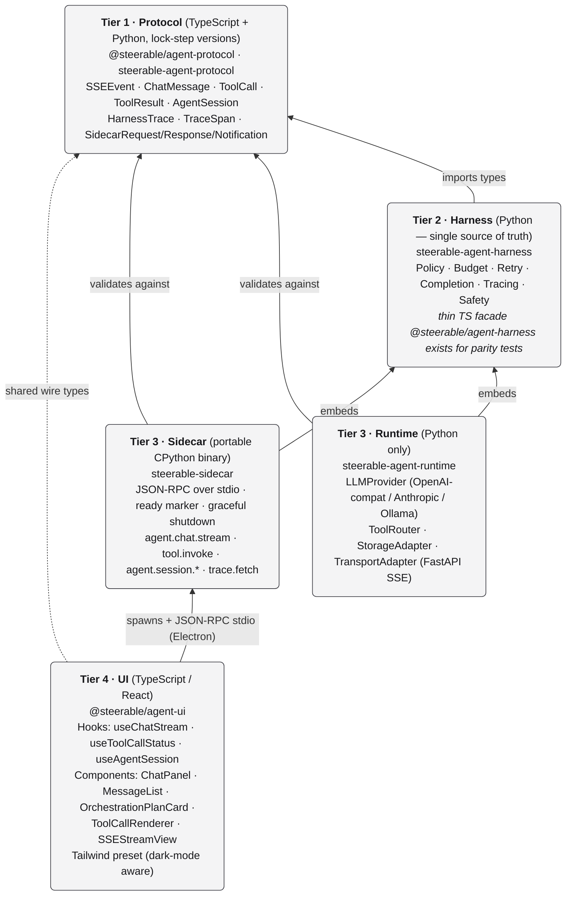

---
hide:
  - navigation
  - toc
---

<div class="sf-hero" markdown>


# Steerable

<p class="sf-tagline">The agent plumbing you'd otherwise rewrite.</p>

<p class="sf-sub" markdown>
Typed wire protocol · pluggable LLM runtime · embeddable Python sidecar · headless React chat UI.
Pick any subset, skip the rest — every layer ships on its own.
</p>

<div class="sf-cta" markdown>
[Get started](getting-started.md){ .md-button .md-button--primary }
<a href="demo/" class="md-button">Live demo</a>
<a href="storybook/" class="md-button">Storybook</a>
[GitHub](https://github.com/pathlyapp/steerable-framework){ .md-button }
</div>

<p class="sf-badges">
  <a href="https://github.com/pathlyapp/steerable-framework/blob/main/LICENSE"></a>
  <a href="https://github.com/pathlyapp/steerable-framework/actions/workflows/ci.yml"></a>
  <a href="https://www.npmjs.com/package/@steerable/agent-ui"></a>
  <a href="https://pypi.org/project/steerable-agent-runtime/"></a>
</p>

</div>

<h2 class="sf-section">Why Steerable</h2>

<p class="sf-lede" markdown>
Building an LLM agent product means rewriting the same five things every time.
Steerable is the layered library you'd build on day 30 — shipped on day 0.
</p>

<div class="sf-grid" markdown>
<div class="sf-card" markdown>
### One wire protocol
One JSON Schema → generated **TypeScript types + Pydantic models**, released in lockstep. `content`, `tool_call`, `tool_result`, `error`, `done`, `budget_exhausted` — all standardised, with a conformance suite keeping both SDKs byte-compatible.
</div>
<div class="sf-card" markdown>
### Pure-function harness
Policy, budget, retry, completion, tracing, safety patterns. **Zero I/O coupling** — drop into FastAPI, Celery, or a notebook. 105 unit + golden tests.
</div>
<div class="sf-card" markdown>
### Pluggable runtime
One `LLMProvider` interface with **Ollama / OpenAI-compatible / Anthropic** adapters, `@tool` decorator, `ToolRouter`, SSE-over-HTTP and stdio JSON-RPC transports.
</div>
<div class="sf-card" markdown>
### Embeddable sidecar
A portable, signed CPython binary speaking JSON-RPC over stdio. Ship local LLMs inside **Electron / Tauri / Wails** — macOS notarised, Windows code-signed.
</div>
<div class="sf-card" markdown>
### Headless React UI
5 components + 3 hooks + Tailwind preset. Every state covered by Storybook, axe a11y, and visual-regression baselines locked in CI.
</div>
<div class="sf-card" markdown>
### Lockstep releases
All 7 publishable packages share one `X.Y.Z`, gated by CI on every tag push. npm tarballs ship **sigstore provenance** attestations.
</div>
</div>

<h2 class="sf-section">Quickstart — pick your path</h2>

<div class="sf-tabs" markdown>

=== "Python agent backend"

    ```bash
    uv add steerable-agent-protocol steerable-agent-harness steerable-agent-runtime
    ```

    ```python
    from steerable_agent_runtime import ToolRouter, tool
    from steerable_agent_protocol import ToolCall

    router = ToolRouter()

    @tool(router=router, description="Read a file by path")
    async def read_file(path: str) -> dict:
        return {"path": path, "content": open(path).read()}

    result = await router.dispatch(
        ToolCall(id="c1", name="read_file", arguments={"path": "README.md"})
    )
    # result.success, result.data, result.error — all typed.
    ```

=== "React chat UI"

    ```bash
    pnpm add @steerable/agent-protocol @steerable/agent-ui
    ```

    ```tsx
    import { ChatPanel, useChatStream } from '@steerable/agent-ui';

    export function Chat() {
      const { messages, send, isStreaming } = useChatStream({
        endpoint: '/api/chats/123/send',
      });
      return <ChatPanel messages={messages} onSubmit={send} isStreaming={isStreaming} />;
    }
    ```

=== "Electron + local LLM"

    ```bash
    pnpm add @steerable/agent-protocol @steerable/agent-ui
    # Bundle the sidecar binary into resources/python-runtime/<platform>/
    ```

    ```ts
    import { spawn } from 'node:child_process';

    const proc = spawn(sidecarPath, [], { stdio: ['pipe', 'pipe', 'inherit'] });
    proc.stdin.write(JSON.stringify({
      jsonrpc: '2.0', id: 1, method: 'agent.chat.stream',
      params: { messages: [{ role: 'user', content: 'hi' }] },
    }) + '\n');
    // SSE-over-JSON-RPC events stream back on stdout, one per line.
    ```

</div>

<h2 class="sf-section">Architecture</h2>

<p class="sf-lede" markdown>
Four tiers, strict no-upward-imports rule. Tier N never imports Tier N+1 — adopting any layer means inheriting only the layers below it.
</p>


```mermaid
graph BT
  T4["<b>Tier 4 · UI</b> (TypeScript / React)<br/>@steerable/agent-ui<br/>Hooks: useChatStream · useToolCallStatus · useAgentSession<br/>Components: ChatPanel · MessageList · OrchestrationPlanCard ·<br/>ToolCallRenderer · SSEStreamView<br/>Tailwind preset (dark-mode aware)"]

  T3S["<b>Tier 3 · Sidecar</b> (portable CPython binary)<br/>steerable-sidecar<br/>JSON-RPC over stdio · ready marker · graceful shutdown<br/>agent.chat.stream · tool.invoke · agent.session.* · trace.fetch"]

  T3R["<b>Tier 3 · Runtime</b> (Python only)<br/>steerable-agent-runtime<br/>LLMProvider (OpenAI-compat / Anthropic / Ollama)<br/>ToolRouter · StorageAdapter · TransportAdapter (FastAPI SSE)"]

  T2["<b>Tier 2 · Harness</b> (Python — single source of truth)<br/>steerable-agent-harness<br/>Policy · Budget · Retry · Completion · Tracing · Safety<br/><i>thin TS facade @steerable/agent-harness exists for parity tests</i>"]

  T1["<b>Tier 1 · Protocol</b> (TypeScript + Python, lock-step versions)<br/>@steerable/agent-protocol · steerable-agent-protocol<br/>SSEEvent · ChatMessage · ToolCall · ToolResult · AgentSession<br/>HarnessTrace · TraceSpan · SidecarRequest/Response/Notification"]

  T4 -.->|"shared wire types"| T1
  T4 -->|"spawns + JSON-RPC stdio (Electron)"| T3S
  T3S -->|"embeds"| T2
  T3S -->|"validates against"| T1
  T3R -->|"embeds"| T2
  T3R -->|"validates against"| T1
  T2 -->|"imports types"| T1

  classDef tier fill:#f4f4f5,stroke:#3f3f46,color:#18181b,rx:6,ry:6,padding:12;
  class T1,T2,T3R,T3S,T4 tier;
```

<h2 class="sf-section">What's in the box</h2>

| Package | Tier | What you get |
| ------- | ---- | ------------ |
| [`@steerable/agent-protocol`](https://www.npmjs.com/package/@steerable/agent-protocol) · `steerable-agent-protocol` | 1 | `SSEEvent` envelope, `ToolCall` / `ToolResult`, `ChatMessage`, sidecar JSON-RPC types — codegen from `spec/`, drift-checked in CI |
| `@steerable/agent-harness` · [`steerable-agent-harness`](https://pypi.org/project/steerable-agent-harness/) | 2 | `decide_tool_mode`, `consume_budget`, `next_retry_delay_ms`, `is_terminal_result`, command-safety patterns |
| [`steerable-agent-runtime`](https://pypi.org/project/steerable-agent-runtime/) | 3 | `LLMProvider` adapters, `ToolRouter` + `@tool`, storage & transport adapters (FastAPI SSE, stdio JSON-RPC) |
| [`steerable-sidecar`](https://pypi.org/project/steerable-sidecar/) | 3 | Portable CPython binary — boots in <1s, macOS notarised, Windows signed |
| [`@steerable/agent-ui`](https://www.npmjs.com/package/@steerable/agent-ui) | 4 | `ChatPanel`, `MessageList`, `OrchestrationPlanCard`, `ToolCallRenderer`, `SSEStreamView` + hooks + Tailwind preset |

<h2 class="sf-section">Who's using it</h2>

<p class="sf-lede" markdown>
**[DeepPath](https://deeppath.cc)** — web (`agent-protocol` + `agent-ui`), API (all three Python packages), Electron desktop (sidecar + UI).
The framework was extracted from this codebase and is dogfooded back into it on every release.
</p>

<h2 class="sf-section">Explore</h2>

<div class="sf-links" markdown>
[Full walkthrough](getting-started.md){ .md-button }
[Wire spec](spec/overview.md){ .md-button }
[Architecture](spec/architecture.md){ .md-button }
[Events](spec/events.md){ .md-button }
[Tools](spec/tools.md){ .md-button }
[Chat](spec/chat.md){ .md-button }
[Safety](spec/safety.md){ .md-button }
[Runtime](spec/runtime.md){ .md-button }
[Sidecar](spec/sidecar.md){ .md-button }
[UI components](ui/index.md){ .md-button }
[DeepPath migration](migration/deeppath.md){ .md-button }
</div>
