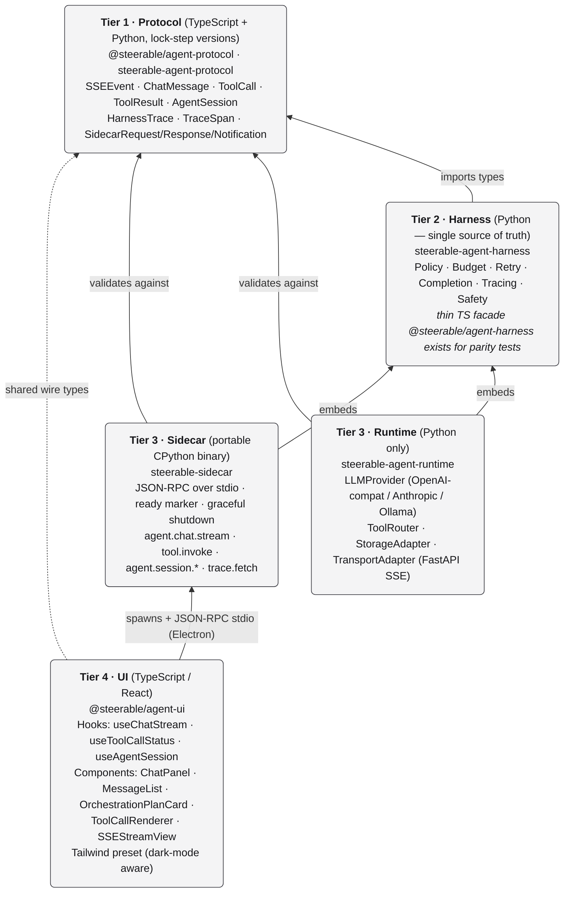

---
hide:
  - navigation
  - toc
---

<div class="sf-hero" markdown>


# Steerable

<p class="sf-tagline">The model-quality layer that makes local, quantized, and cheap models behave.</p>

<p class="sf-sub" markdown>
Recovers and executes malformed tool calls · vetoes bad completion drafts · catches fabricated data · self-calibrates token estimates.
Plus the plumbing you'd otherwise rewrite: typed wire protocol · pluggable LLM runtime · embeddable Python sidecar · headless React chat UI.
Pick any subset, skip the rest — every layer ships on its own.
</p>

<div class="sf-cta" markdown>
[Get started](getting-started.md){ .md-button .md-button--primary }
<a href="demo/" class="md-button">Live demo</a>
<a href="storybook/" class="md-button">Storybook</a>
[GitHub](https://github.com/pathlyapp/steerable-framework){ .md-button }
</div>

<p class="sf-badges">
  <a href="https://github.com/pathlyapp/steerable-framework/blob/main/LICENSE"></a>
  <a href="https://github.com/pathlyapp/steerable-framework/actions/workflows/ci.yml"></a>
  <a href="https://www.npmjs.com/package/@steerable/agent-ui"></a>
  <a href="https://pypi.org/project/steerable-agent-runtime/"></a>
</p>

</div>

<div class="sf-score-strip" markdown>
<div class="sf-score sf-score--ours" markdown>
<span class="sf-score-value">80%</span>
<span class="sf-score-label">Steerable + GLM-5.3-Flash</span>
<span class="sf-score-meta">TB 2.1 · 4-run mean · this repo</span>
</div>
<div class="sf-score" markdown>
<span class="sf-score-value">+7</span>
<span class="sf-score-label">vs Pi on the same Flash model</span>
<span class="sf-score-meta">Pi + GLM-5.3-Flash · 73%</span>
</div>
<div class="sf-score" markdown>
<span class="sf-score-value">79–84%</span>
<span class="sf-score-label">Native frontier CLI band</span>
<span class="sf-score-meta">vendor-submitted · tbench.ai</span>
</div>
</div>

<h2 class="sf-section">Why Steerable</h2>

<p class="sf-lede" markdown>
Every agent SDK assumes the model emits clean, structured `tool_calls`. Local, quantized, and cheap models don't.
Steerable is the model-quality layer that closes that gap — plus the plumbing layers you'd otherwise rewrite, each shippable on its own.
</p>

<div class="sf-grid" markdown>
<div class="sf-card" markdown>
### The model-quality layer
Local, quantized, and cheap models break the structured-`tool_calls` assumptions every SDK makes. Steerable recovers *and executes* malformed calls (MiniMax XML, DeepSeek `<function=>`, markdown), vetoes completion drafts (`accept` / `retry` / `narrate`), judges grounding, and self-calibrates token estimates. [Why this is the differentiator](roadmap.md#the-differentiator-the-model-quality-layer).
</div>
<div class="sf-card" markdown>
### One wire protocol
One JSON Schema → generated **TypeScript types + Pydantic models**. `content`, `tool_call`, `tool_result`, `error`, `done`, `budget_exhausted` — all standardised, with a conformance suite keeping both SDKs byte-compatible. All 7 publishable packages share one lockstep `X.Y.Z`; npm tarballs ship **sigstore provenance** attestations.
</div>
<div class="sf-card" markdown>
### Pure-function harness
Policy, budget, retry, completion, tracing, safety patterns. **Zero I/O coupling** — drop into FastAPI, Celery, or a notebook. 105 unit + golden tests.
</div>
<div class="sf-card" markdown>
### Pluggable runtime
One `LLMProvider` interface with **Ollama / OpenAI-compatible / Anthropic** adapters, `@tool` decorator, `ToolRouter`, SSE-over-HTTP and stdio JSON-RPC transports.
</div>
<div class="sf-card" markdown>
### Embeddable sidecar
A portable, signed CPython binary speaking JSON-RPC over stdio. Ship local LLMs inside **Electron / Tauri / Wails** — macOS notarised, Windows code-signed.
</div>
<div class="sf-card" markdown>
### Headless React UI
5 components + 3 hooks + Tailwind preset. Every state covered by Storybook, axe a11y, and visual-regression baselines locked in CI.
</div>
</div>

<h2 class="sf-section">Terminal-Bench 2.1</h2>

<p class="sf-lede" markdown>
A Flash-cost model on Steerable lands in the same band as frontier models on the vendor CLIs. Same model, same gateway, four harnesses: Claude Code 83%, Steerable **80%**, Pi 73%, Codex 58% — the harness alone moves the score 25 points. Harbor hidden tests, 89-task catalog, four independent full runs: mean **80%** (SD 2.3 points). We report 80, not the 82 high-water mark. Protocol and run list: [Evals](evals.md).
</p>

<div class="sf-bench sf-bench--wide">

<div class="sf-bench-duo">

<div class="sf-bench-group sf-bench-group--focus">
<div class="sf-bench-kicker">Same model · same gateway · four harnesses</div>
<p class="sf-bench-blurb">The comparison that matters: identical GLM-5.3-Flash, identical OpenRouter gateway. The harness is the multiplier.</p>

<div class="sf-bench-row sf-bench-row--ours">
<div class="sf-bench-who">
<span class="sf-bench-agent">Steerable <span class="sf-bench-badge">ours</span></span>
<span class="sf-bench-model">GLM-5.3-Flash</span>
</div>
<span class="sf-bench-pct">80%</span>
<span class="sf-bench-track" aria-hidden="true"><span class="sf-bench-fill" style="width:80%"></span></span>
<div class="sf-bench-meta">
<span class="sf-bench-delta">ties Claude Code within noise · ⅓ less $ per solve</span>
<span class="sf-bench-src">this repo, 4× catalog-89</span>
</div>
</div>

<div class="sf-bench-row">
<div class="sf-bench-who">
<span class="sf-bench-agent">Claude Code</span>
<span class="sf-bench-model">GLM-5.3-Flash</span>
</div>
<span class="sf-bench-pct">83%</span>
<span class="sf-bench-track" aria-hidden="true"><span class="sf-bench-fill" style="width:83%"></span></span>
<div class="sf-bench-meta">
<span class="sf-bench-note">single run, same gateway</span>
<span class="sf-bench-src">this repo, catalog-89</span>
</div>
</div>

<div class="sf-bench-row">
<div class="sf-bench-who">
<span class="sf-bench-agent">Pi</span>
<span class="sf-bench-model">GLM-5.3-Flash</span>
</div>
<span class="sf-bench-pct">73%</span>
<span class="sf-bench-track" aria-hidden="true"><span class="sf-bench-fill" style="width:73%"></span></span>
<div class="sf-bench-meta">
<span class="sf-bench-note">same model, default harness</span>
<span class="sf-bench-src">this repo, 3 catalog runs</span>
</div>
</div>

<div class="sf-bench-row">
<div class="sf-bench-who">
<span class="sf-bench-agent">Codex CLI</span>
<span class="sf-bench-model">GLM-5.3-Flash</span>
</div>
<span class="sf-bench-pct">58%</span>
<span class="sf-bench-track" aria-hidden="true"><span class="sf-bench-fill" style="width:58%"></span></span>
<div class="sf-bench-meta">
<span class="sf-bench-note">protocol-bound lower bound · 7× $ per solve</span>
<span class="sf-bench-src">this repo, catalog-89</span>
</div>
</div>

<p class="sf-bench-foot">Cost per solved task on one OpenRouter account: Pi $0.06 · Steerable $0.11 · Claude Code $0.16 · Codex $0.81. Z.AI's own number for this model on Claude Code is <a href="https://z.ai/blog/glm-5.3-flash">84.3%</a> with a 6-hour timeout; our 170-minute protocol lands Claude Code at 83%.</p>
</div>

<div class="sf-bench-group sf-bench-group--focus">
<div class="sf-bench-kicker">Cost × score · one OpenRouter account</div>
<p class="sf-bench-blurb">Dollars per solved task vs TB 2.1 score. Top-left is the sweet spot — Steerable is the cheapest seat in the frontier band.</p>
<svg class="sf-scatter" viewBox="0 0 400 300" role="img" aria-label="Cost per solved task versus Terminal-Bench 2.1 score for four harnesses on the same model">
<rect class="band" x="44" y="50.9" width="344" height="30.8"/>
<text class="bandlbl" x="384" y="46" text-anchor="end">frontier band 79–84%</text>
<line class="grid" x1="66.6" y1="14" x2="66.6" y2="260"/>
<line class="grid" x1="136.7" y1="14" x2="136.7" y2="260"/>
<line class="grid" x1="229.4" y1="14" x2="229.4" y2="260"/>
<line class="grid" x1="299.6" y1="14" x2="299.6" y2="260"/>
<line class="grid" x1="369.7" y1="14" x2="369.7" y2="260"/>
<line class="grid" x1="44" y1="75.5" x2="388" y2="75.5"/>
<line class="grid" x1="44" y1="137" x2="388" y2="137"/>
<line class="grid" x1="44" y1="198.5" x2="388" y2="198.5"/>
<line class="axis" x1="44" y1="14" x2="44" y2="260"/>
<line class="axis" x1="44" y1="260" x2="388" y2="260"/>
<text class="tick" x="66.6" y="272" text-anchor="middle">$0.05</text>
<text class="tick" x="136.7" y="272" text-anchor="middle">$0.10</text>
<text class="tick" x="229.4" y="272" text-anchor="middle">$0.25</text>
<text class="tick" x="299.6" y="272" text-anchor="middle">$0.50</text>
<text class="tick" x="369.7" y="272" text-anchor="middle">$1.00</text>
<text class="tick" x="39" y="17" text-anchor="end">90</text>
<text class="tick" x="39" y="78.5" text-anchor="end">80</text>
<text class="tick" x="39" y="140" text-anchor="end">70</text>
<text class="tick" x="39" y="201.5" text-anchor="end">60</text>
<text class="tick" x="39" y="263" text-anchor="end">50</text>
<text class="axisTitle" x="216" y="290" text-anchor="middle">$ per solved task (log)</text>
<text class="axisTitle" x="12" y="137" text-anchor="middle" transform="rotate(-90 12 137)">TB 2.1 score</text>
<circle class="pt" cx="86.7" cy="118.6" r="11.7"/>
<text class="lbl" x="86.7" y="140" text-anchor="middle">Pi</text>
<text class="sub" x="86.7" y="150" text-anchor="middle">73% · $0.06 · 20 min</text>
<circle class="pt pt--ours" cx="141.7" cy="75.5" r="15.6"/>
<text class="lbl" x="158" y="46" text-anchor="end">Steerable · ours</text>
<text class="sub" x="158" y="56" text-anchor="end">80% · $0.11 · 36 min</text>
<circle class="pt" cx="184.7" cy="56.2" r="8.9"/>
<text class="lbl" x="197" y="51">Claude Code</text>
<text class="sub" x="197" y="61">83% · $0.16 · 12 min</text>
<circle class="pt" cx="348.9" cy="208.3" r="7.1"/>
<text class="lbl" x="338" y="204" text-anchor="end">Codex CLI</text>
<text class="sub" x="338" y="214" text-anchor="end">58% · $0.81 · 7 min</text>
</svg>
<p class="sf-bench-foot">Bubble area = median minutes per task. Costs from OpenRouter analytics on the eval account; Codex completed the full 89-task catalog; protocol errors still depress its score.</p>
</div>

</div>

</div>

<div class="sf-bench">

<div class="sf-bench-group">
<div class="sf-bench-kicker">Frontier CLIs · public board</div>
<p class="sf-bench-blurb">Different models and harnesses. Shows the band 80% sits in, not a controlled A/B.</p>

<div class="sf-bench-row">
<div class="sf-bench-who">
<span class="sf-bench-agent">Claude Code</span>
<span class="sf-bench-model">Claude 5 Fable</span>
</div>
<span class="sf-bench-pct">83.8%</span>
<span class="sf-bench-track" aria-hidden="true"><span class="sf-bench-fill" style="width:83.8%"></span></span>
<div class="sf-bench-meta">
<span class="sf-bench-src"><a href="https://snorkel.ai/leaderboard/terminal-bench-2-1/">Snorkel / tbench.ai</a></span>
</div>
</div>

<div class="sf-bench-row">
<div class="sf-bench-who">
<span class="sf-bench-agent">Codex CLI</span>
<span class="sf-bench-model">GPT-5.5</span>
</div>
<span class="sf-bench-pct">83.1%</span>
<span class="sf-bench-track" aria-hidden="true"><span class="sf-bench-fill" style="width:83.1%"></span></span>
<div class="sf-bench-meta">
<span class="sf-bench-src"><a href="https://snorkel.ai/leaderboard/terminal-bench-2-1/">Snorkel / tbench.ai</a></span>
</div>
</div>

<div class="sf-bench-row">
<div class="sf-bench-who">
<span class="sf-bench-agent">Terminus 2</span>
<span class="sf-bench-model">Claude 5 Fable</span>
</div>
<span class="sf-bench-pct">80.4%</span>
<span class="sf-bench-track" aria-hidden="true"><span class="sf-bench-fill" style="width:80.4%"></span></span>
<div class="sf-bench-meta">
<span class="sf-bench-src"><a href="https://snorkel.ai/leaderboard/terminal-bench-2-1/">Snorkel / tbench.ai</a></span>
</div>
</div>

<div class="sf-bench-row">
<div class="sf-bench-who">
<span class="sf-bench-agent">Claude Code</span>
<span class="sf-bench-model">Claude Opus 4.8</span>
</div>
<span class="sf-bench-pct">78.9%</span>
<span class="sf-bench-track" aria-hidden="true"><span class="sf-bench-fill" style="width:78.9%"></span></span>
<div class="sf-bench-meta">
<span class="sf-bench-src"><a href="https://snorkel.ai/leaderboard/terminal-bench-2-1/">Snorkel / tbench.ai</a></span>
</div>
</div>

<div class="sf-bench-row">
<div class="sf-bench-who">
<span class="sf-bench-agent">Codex CLI</span>
<span class="sf-bench-model">GPT-5.6 Terra</span>
</div>
<span class="sf-bench-pct">78.4%</span>
<span class="sf-bench-track" aria-hidden="true"><span class="sf-bench-fill" style="width:78.4%"></span></span>
<div class="sf-bench-meta">
<span class="sf-bench-src"><a href="https://snorkel.ai/leaderboard/terminal-bench-2-1/">Snorkel / tbench.ai</a></span>
</div>
</div>

<div class="sf-bench-row">
<div class="sf-bench-who">
<span class="sf-bench-agent">Claude Code</span>
<span class="sf-bench-model">Claude Sonnet 5</span>
</div>
<span class="sf-bench-pct">74.6%</span>
<span class="sf-bench-track" aria-hidden="true"><span class="sf-bench-fill" style="width:74.6%"></span></span>
<div class="sf-bench-meta">
<span class="sf-bench-src"><a href="https://snorkel.ai/leaderboard/terminal-bench-2-1/">Snorkel / tbench.ai</a></span>
</div>
</div>

<div class="sf-bench-row">
<div class="sf-bench-who">
<span class="sf-bench-agent">Gemini CLI</span>
<span class="sf-bench-model">Gemini 3.1 Pro</span>
</div>
<span class="sf-bench-pct">65.8%</span>
<span class="sf-bench-track" aria-hidden="true"><span class="sf-bench-fill" style="width:65.8%"></span></span>
<div class="sf-bench-meta">
<span class="sf-bench-src"><a href="https://snorkel.ai/leaderboard/terminal-bench-2-1/">Snorkel / tbench.ai</a></span>
</div>
</div>
</div>

</div>

<p class="sf-lede" markdown>
Native frontier CLIs sit 79–84% on the public board. Steerable is in that band on a Flash-cost model — about **$7.50 per full 89-task run** — usable as a coding agent, not a demo loop.
</p>

<h2 class="sf-section">Quickstart — pick your path</h2>

<div class="sf-tabs" markdown>

=== "Python agent backend"

    ```bash
    uv add steerable-agent-protocol steerable-agent-harness steerable-agent-runtime
    ```

    ```python
    from steerable_agent_runtime import ToolRouter, tool
    from steerable_agent_protocol import ToolCall

    router = ToolRouter()

    @tool(router=router, description="Read a file by path")
    async def read_file(path: str) -> dict:
        return {"path": path, "content": open(path).read()}

    result = await router.dispatch(
        ToolCall(id="c1", name="read_file", arguments={"path": "README.md"})
    )
    # result.success, result.data, result.error — all typed.
    ```

=== "React chat UI"

    ```bash
    pnpm add @steerable/agent-protocol @steerable/agent-ui
    ```

    ```tsx
    import { ChatPanel, useChatStream } from '@steerable/agent-ui';

    export function Chat() {
      const { messages, send, isStreaming } = useChatStream({
        endpoint: '/api/chats/123/send',
      });
      return <ChatPanel messages={messages} onSubmit={send} isStreaming={isStreaming} />;
    }
    ```

=== "Electron + local LLM"

    ```bash
    pnpm add @steerable/agent-protocol @steerable/agent-ui
    # Bundle the sidecar binary into resources/python-runtime/<platform>/
    ```

    ```ts
    import { spawn } from 'node:child_process';

    const proc = spawn(sidecarPath, [], { stdio: ['pipe', 'pipe', 'inherit'] });
    proc.stdin.write(JSON.stringify({
      jsonrpc: '2.0', id: 1, method: 'agent.chat.stream',
      params: { messages: [{ role: 'user', content: 'hi' }] },
    }) + '\n');
    // SSE-over-JSON-RPC events stream back on stdout, one per line.
    ```

</div>

<h2 class="sf-section">Architecture</h2>

<p class="sf-lede" markdown>
Four tiers, strict no-upward-imports rule. Tier N never imports Tier N+1 — adopting any layer means inheriting only the layers below it.
</p>


```mermaid
graph BT
  T4["<b>Tier 4 · UI</b> (TypeScript / React)<br/>@steerable/agent-ui<br/>Hooks: useChatStream · useToolCallStatus · useAgentSession<br/>Components: ChatPanel · MessageList · OrchestrationPlanCard ·<br/>ToolCallRenderer · SSEStreamView<br/>Tailwind preset (dark-mode aware)"]

  T3S["<b>Tier 3 · Sidecar</b> (portable CPython binary)<br/>steerable-sidecar<br/>JSON-RPC over stdio · ready marker · graceful shutdown<br/>agent.chat.stream · tool.invoke · agent.session.* · trace.fetch"]

  T3R["<b>Tier 3 · Runtime</b> (Python only)<br/>steerable-agent-runtime<br/>LLMProvider (OpenAI-compat / Anthropic / Ollama)<br/>ToolRouter · StorageAdapter · TransportAdapter (FastAPI SSE)"]

  T2["<b>Tier 2 · Harness</b> (Python — single source of truth)<br/>steerable-agent-harness<br/>Policy · Budget · Retry · Completion · Tracing · Safety<br/><i>thin TS facade @steerable/agent-harness exists for parity tests</i>"]

  T1["<b>Tier 1 · Protocol</b> (TypeScript + Python, lock-step versions)<br/>@steerable/agent-protocol · steerable-agent-protocol<br/>SSEEvent · ChatMessage · ToolCall · ToolResult · AgentSession<br/>HarnessTrace · TraceSpan · SidecarRequest/Response/Notification"]

  T4 -.->|"shared wire types"| T1
  T4 -->|"spawns + JSON-RPC stdio (Electron)"| T3S
  T3S -->|"embeds"| T2
  T3S -->|"validates against"| T1
  T3R -->|"embeds"| T2
  T3R -->|"validates against"| T1
  T2 -->|"imports types"| T1

  classDef tier fill:#f4f4f5,stroke:#3f3f46,color:#18181b,rx:6,ry:6,padding:12;
  class T1,T2,T3R,T3S,T4 tier;
```

<h2 class="sf-section">What's in the box</h2>

| Package | Tier | What you get |
| ------- | ---- | ------------ |
| [`@steerable/agent-protocol`](https://www.npmjs.com/package/@steerable/agent-protocol) · `steerable-agent-protocol` | 1 | `SSEEvent` envelope, `ToolCall` / `ToolResult`, `ChatMessage`, sidecar JSON-RPC types — codegen from `spec/`, drift-checked in CI |
| `@steerable/agent-harness` · [`steerable-agent-harness`](https://pypi.org/project/steerable-agent-harness/) | 2 | `decide_tool_mode`, `consume_budget`, `next_retry_delay_ms`, `is_terminal_result`, command-safety patterns |
| [`steerable-agent-runtime`](https://pypi.org/project/steerable-agent-runtime/) | 3 | `LLMProvider` adapters, `ToolRouter` + `@tool`, storage & transport adapters (FastAPI SSE, stdio JSON-RPC) |
| [`steerable-sidecar`](https://pypi.org/project/steerable-sidecar/) | 3 | Portable CPython binary — boots in <1s, macOS notarised, Windows signed |
| [`@steerable/agent-ui`](https://www.npmjs.com/package/@steerable/agent-ui) | 4 | `ChatPanel`, `MessageList`, `OrchestrationPlanCard`, `ToolCallRenderer`, `SSEStreamView` + hooks + Tailwind preset |

<h2 class="sf-section">How it compares</h2>

<p class="sf-lede" markdown>
Steerable isn't the only way to ship an agent. The short, honest version against the frameworks you're probably also evaluating:
</p>

| Dimension | Steerable | OpenAI Codex | DeepSeek Harness | LangGraph | OpenAI Agents SDK | Claude Agent SDK |
| --------- | --------- | ------------ | ---------------- | --------- | ----------------- | ---------------- |
| **Form factor** | Layered library — the same loop in a desktop sidecar and a server | Product family: CLI, IDE, cloud | Plugin-based harness (pre-release) | Orchestration library | Lightweight framework over the Responses API | The Claude Code loop as a library |
| **Event model** | Structured `LoopEvent` taxonomy over one typed wire protocol | Session-owned turn loop + hooks | Inbox-driven ReactLoop with steer/inject | You design the graph | Handoffs; no mid-run steer | Steer via messages; hooks intercept tools |
| **Sandbox / isolation** | OS-sandboxed sidecar (macOS Seatbelt today) + command classifier with dozens of rules | Approval policies + platform sandbox | `sandbox.confine`, fail-closed | None built-in | Guardrails; no sandbox | Permission modes + hooks |
| **Maturity** | Early-stage (`0.2.x`); one production consumer | Massive real-world usage | Pre-release; internal use | Widely adopted in production | Production, OpenAI-tied | Production, Anthropic-only |

<p class="sf-lede" markdown>
Where Steerable genuinely differs, where it lags, and how to choose: [Full comparison](comparison.md).
</p>

<h2 class="sf-section">Who's using it</h2>

<p class="sf-lede" markdown>
**[DeepPath](https://deeppath.cc)** — web (`agent-protocol` + `agent-ui`), API (all three Python packages), Electron desktop (sidecar + UI).
The framework was extracted from this codebase and is dogfooded back into it on every release.
</p>

<h2 class="sf-section">Explore</h2>

<div class="sf-links" markdown>
[Full walkthrough](getting-started.md){ .md-button }
[Evals](evals.md){ .md-button }
[Wire spec](spec/overview.md){ .md-button }
[Architecture](spec/architecture.md){ .md-button }
[Events](spec/events.md){ .md-button }
[Tools](spec/tools.md){ .md-button }
[Chat](spec/chat.md){ .md-button }
[Safety](spec/safety.md){ .md-button }
[Runtime](spec/runtime.md){ .md-button }
[Sidecar](spec/sidecar.md){ .md-button }
[UI components](ui/index.md){ .md-button }
[DeepPath migration](migration/deeppath.md){ .md-button }
</div>
