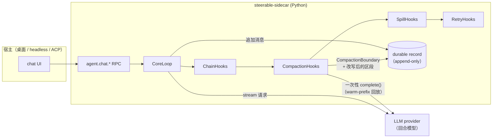
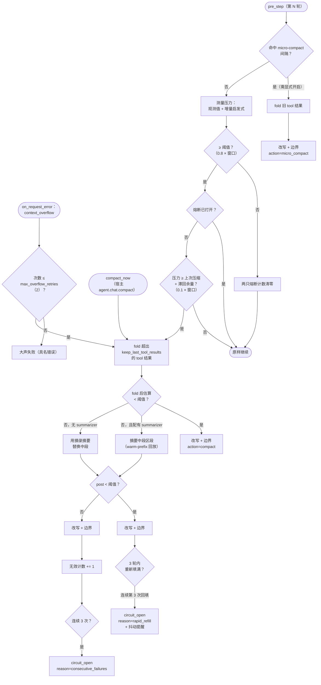
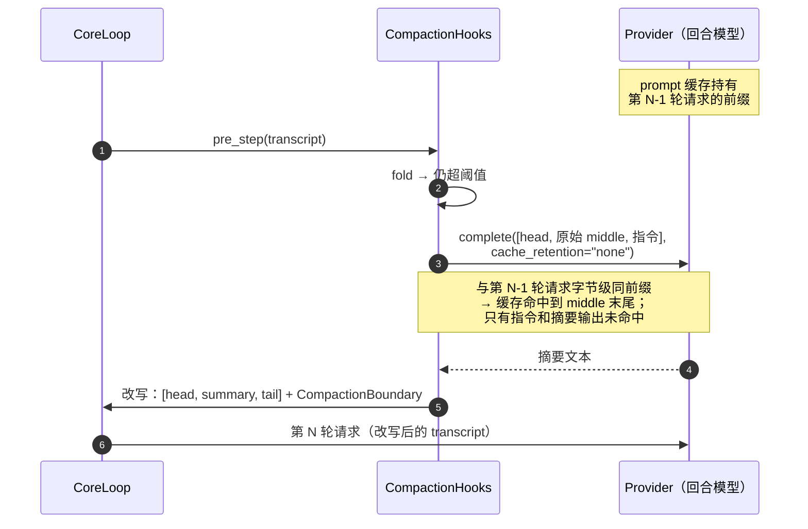
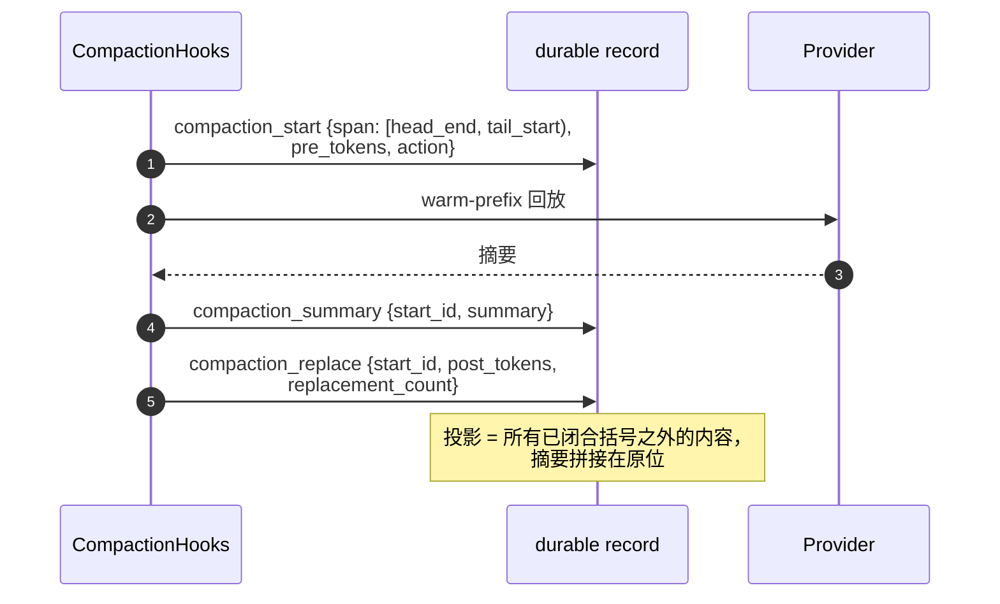
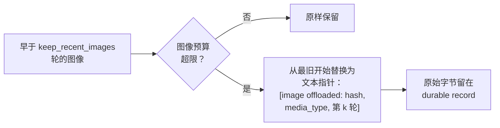

# 压缩策略 Spec

Steerable 如何让一个长回合始终装进模型的上下文窗口：本文覆盖当前实现，
以及补齐与 dsh（`compaction-basic` + 区段事务）、Claude Code 之间
剩余成熟度差距的目标设计。

先划清职责边界：

- **跨轮压缩归框架所有。** `steerable_agent_runtime.compaction` 里的
  `CompactionHooks` 改写 loop transcript，并把压缩边界记入 durable
  record。桌面外壳发送全量原始历史作为种子，由框架 reconcile。
- **外壳只管单轮截断。**
  `agent-shell/ts/src/local-backend/context-compactor.ts` 在单个超大
  tool 结果写回前截断它，并为 @引用对话格式化历史摘录。不再维护滚动
  摘要。

## 当前架构

组件一览：

| 组件 | 职责 |
|---|---|
| `CompactionHooks` | `pre_step` / `on_request_error` 钩子，实现全部四条触发路径、fold 阶段、summarize 阶段、滞回和两只熔断器。 |
| `SpillHooks` | 互补而非竞争：在压缩还没来得及 fold 之前，就把单个超大 tool 结果落盘（`post_tool_result`）。 |
| `summarizer` | 由 sidecar 接线的回合 provider 本身（`_summarizer_for`）。用一次性 `complete()` 为中段区段生成摘要。`STEERABLE_SIDECAR_SUMMARIZER=0` 可关闭（退回确定性摘录）。 |
| `CompactionBoundary` | record 里的声明式改写标记：边界之前的内容仍留在 append-only record 中可审计，但退出可见投影。携带 `action`、`pre_tokens` / `post_tokens`、`replacement_count`。 |
| `default.harness.yaml` | 声明 `context: [pressure_compaction, spill]` 维度顺序；sidecar 在组装期解析运行时参数（上下文窗口、保留量）。 |

### 压力测量

基准真值是上一个请求由 provider 回报的 `prompt_tokens`
（`ctx.last_prompt_tokens`），加上对之后追加消息的启发式估算
（`tokens.py`，CJK 感知、按模型校准）。只有第一轮对整个 transcript
做纯启发式估算。每次改写都会重置观测下标，让下一个请求重新观测。

### 触发流程

四条路径共用 fold/summarize 机制：

- **pressure**——反应式默认路径（上图）。
- **overflow 恢复**——启发式阈值可能漏掉真实窗口；provider 报
  `context_overflow` 时强制走一遍压缩再重试，每轮限 2 次，之后大声
  失败。即使熔断打开，此路径保持可用。
- **micro-compaction**——显式开启（`micro_compact_interval_rounds`，
  默认 0）：每 N 轮无视压力 fold 一次。每次 fold 都会使 prompt 缓存
  前缀失效，所以这个间隔是在用缓存命中换 transcript 有界。
- **manual**——`agent.chat.compact` RPC → `CoreLoop.request_compact()`
  → 下一个 pre_step 边界执行 `compact_now`。绕过阈值、滞回和熔断器；
  并把两只熔断计数清零。

### 区段选择

摘要阶段保留所有 system 消息和第一条 user 消息（目标）作为 **head**，
保留最近 `keep_last_messages` 条作为 **tail**，把 **middle** 替换为
一条摘要消息。tail 会向后拓宽，直到它不再回答任何不由它自己发出的
tool call——孤儿 `tool` 消息会触发 provider 侧 400。如果 transcript
到达时已经缺了发起者（从截断的日志恢复），则按原样摘要，而不是让
摘要功能在剩余回合里整体失效。

### Warm-prefix 回放（summarizer 请求形状）

summarizer 调用的构造目标是命中 provider 的 prompt 缓存，而不是为
一次新 prefill 付费：

三条性质，各由
`packages/agent-runtime/py/tests/test_compaction_strategy.py`
里的一条测试钉死：

1. **回放，不改述。** 请求 = 会话自己的 head + 被影子化的区段*逐字*
   （真实 role、真实 parts）+ 指令作为最后一条 user 消息。没有外来
   system prompt，没有 `[role] 摘录` 式压平。
2. **回放原始区段。** fold 先跑，但它只改写压缩后的投影；summarizer
   拿到的是 fold 前的区段（`replay_source`），因为 fold 会在第一条
   被折叠的消息处就打破与已缓存前缀的字节一致性。两次压缩之间
   transcript 只增不改，所以原始区段正是 provider 缓存的内容。
3. **不静默截断。** 被影子化消息的每一个字节都到达 summarizer。
   （早期版本把每条消息截到 2000 字符——丢弃的恰恰是最需要被摘要
   的内容。）

调用上保留 `cache_retention="none"`：回放的前缀已经被会话自己的
请求焐热，这个标记只是避免把用过即弃的指令后缀写成新的缓存项
（由 `CacheControlProvider` 消费；其它 provider 忽略该键）。

### 安全栏

- **滞回**——一次压缩后，压力必须再涨过
  `recompact_margin_ratio × max_context_tokens`（默认 0.1）才允许
  下一次。没有它，一个压缩后仍超阈值的 transcript 会每轮都重新压缩，
  每次都摧毁缓存前缀（dogfood 里 22 次压缩 / 5 条 trace 的病灶）。
- **失败熔断**——post 估算仍超阈值的压力压缩记为无效；连续 3 次无效
  打开熔断（`circuit_reason=consecutive_failures`），pressure 路径
  停止触发。一轮健康回合会把计数清零。
- **快速回填熔断**——距上一次成功压缩 `rapid_refill_window_rounds`
  （3）轮内再次成功压缩记为一次回填；连续 `max_rapid_refills`（3）次
  回填打开同一只熔断（`circuit_reason=rapid_refill`），并追加一条
  `CompactionThrashingReminder`，让模型和宿主 UI 都看到收敛提醒。

### 配置

带保留量的旋钮由 `resolve_compaction_policy(model, max_context_tokens)`
在组装期一次解析（P3，见下）；下表默认值对应桌面窗口档。

| 旋钮 | 默认值 | 说明 |
|---|---|---|
| `max_context_tokens` | —（必填） | 由 sidecar 解析：显式 `maxContextTokens` 优先，否则查模型目录的窗口（`resolve_context_window`）。 |
| `threshold_ratio` | 0.8 | 压力阈值占窗口的比例。 |
| `keep_last_messages` | 6 | 不动的 tail 长度（≥200k 窗口为 16）。 |
| `keep_last_tool_results` | 2 | 保留可读的 tool 结果数（≥200k 窗口为 16）。 |
| `fold_excerpt_chars` | 160 | fold 标记里保留的头尾线索（≥200k 窗口为 4000）。 |
| `image_offload` | True | 视界内的旧图像降级为文本指针（P2）。 |
| `keep_last_images` | 1 | 保留原始字节的最近图像数（≥200k 窗口为 4）。 |
| `recompact_margin_ratio` | 0.1 | 滞回余量。 |
| `micro_compact_interval_rounds` | 0（关） | 显式开启的周期 fold。 |
| `rapid_refill_window_rounds` / `max_rapid_refills` | 3 / 3 | 回填熔断。 |
| `max_consecutive_failures` | 3 | 失败熔断。 |
| `max_overflow_retries` | 2 | 每轮 overflow 上限。 |

## 目标架构

对比轴（见 `docs/comparison.md`）按可验证的机制而不是功能宣称给压缩
成熟度评级。标准如下，附当前设计的位置：

| # | 条款 | 状态 |
|---|---|---|
| 1 | 带滞回的压力触发 | ✅ 已发布 |
| 2 | 带每轮上限的 overflow 恢复 | ✅ 已发布 |
| 3 | 先确定性裁剪、后 LLM 摘要 | ✅ 已发布（fold 能降压就不点 LLM 阶段） |
| 4 | warm-prefix 回放式摘要 | ✅ 已发布（v0.6.18，本文 §Warm-prefix 回放） |
| 5 | 熔断器（失败 + 快速回填） | ✅ 已发布 |
| 6 | 带 pre/post token 的录制边界 | ✅ 已发布（`CompactionBoundary`） |
| 7 | **区段事务**——区段周围有崩溃安全、可回放的括号 | ✅ 已发布（v0.6.18，record v3 括号三元组；恢复时复用已付费摘要仍待落地） |
| 8 | **图像 offload**——旧图像降级为文本指针 | ✅ 已发布（v0.6.18，prune 阶段内、视界内、record 留原件） |
| 9 | **per-model 策略**——按模型验证过的阈值/保留量表 | ✅ 已发布（v0.6.18，`resolve_compaction_policy`，见 §P3） |
| 10 | **fold 视界对齐**——裁剪不越界进 tail | ✅ 已发布（v0.6.18，基准发现的缺陷修复，见 §基准驱动的修复） |

> 状态口径：「已发布」= 承载提交已进入某个 git tag（`git tag --contains <sha>`
> 可核）；「已落地」= 已合入 develop、尚未进 tag。标「已落地」的条款随下一
> tag 转为已发布，届时同步更新本表与 §迁移路径。2026-09-16 落地的一批
> （条款 4、7–10 与 §迁移路径 P0–P3）已随 v0.6.18 全部转为已发布。

### P1——区段事务（括号先行的压缩）✅ 已发布（v0.6.18）

> **落地状态（2026-09-16）**：record schema v3 增加
> `compaction_start` / `compaction_summary` 两个 envelope；
> `RewriteRequest.bracket` 携带 `{compaction_id, span 索引,
> summary_text}`；loop 在 `replace_all` 前按序写入
> start → summary → boundary（boundary 带同一 `compaction_id` 闭合
> 括号）。L2 断言（括号有序、span 有效、投影不可见、fold-only 无
> 括号）在 `test_compaction_strategy.py`；编解码与 v2→v3 升级在
> `test_history_persistence.py`。**尚未落地**：summarizer 调用*之前*
> 先落 start（需要 hook 持有 record 通道的更大重构），以及恢复时复用
> 已付费摘要——今天的括号把摘要留在 record 里但恢复路径还不消费它。

今天边界和改写同时落库，摘要本身不是一个被录制的事件。在（已付费
的）summarizer 调用和改写之间崩溃，摘要就丢了；trace 不 diff
record 正文就无法展示*摘掉了什么*。目标是把压缩录成 durable
record 里的三事件括号：

性质：

- **崩溃安全。** 在 `compaction_start` 之后崩溃，区段完整可见（括号
  未闭合，投影忽略它）。在 `compaction_summary` 之后崩溃，恢复时
  可以复用已付费的摘要而不是再调一次模型。只有
  `compaction_replace` 闭合括号。
- **可回放。** 会话回放时对日志做 fold：未闭合括号丢弃，已闭合括号
  应用其摘要。崩溃运行的回放到崩溃点为止与正常运行的回放字节一致。
- **可审计。** 区段引用和摘要是一等事件；trace 可以对每个闭合括号
  断言 `post_tokens < pre_tokens`，无需从正文重新估算。

`CompactionBoundary` 成为 `compaction_replace` 的持久化形式；
W6-10 宿主种子 reconcile 语义（`replacement_count`）不变。

### P2——图像 offload ✅ 已发布（v0.6.18）

> **落地状态（2026-09-16）**：`_offload_old_images` 并入 prune 阶段
> （`_prune_with_horizon` = fold + offload，同一视界），旋钮
> `image_offload`（默认开）/ `keep_last_images`（默认 1）。summarizer
> 回放先把 ImagePart 映射成文本指针（`_text_pointer_span`）——文本
> 摘要器拿不到图像字节；纯文本 span 原样通过，字节前缀身份不变。
> 行为测试在 `test_compaction_strategy.py`（视界内 offload、record
> 留原件、回放无图像字节、开关关闭全保留）。与原设计的差异：门控用
> 计数（保留最近 N 张）而不是 token 预算——与 fold 的
> `keep_last_tool_results` 对称，且计数可测试、可推理。

图像目前带着固定的 per-part token 估算值搭车，直到摘要阶段把它们
影子化。目标是在 fold 和 summarize 之间加一个有预算的 offload
阶段：

指针以约 1% 的 token 成本保住「曾经看到过一张图」这个事实（以及
通过 record 取回它的位置）；append-only record 保住字节。offload
和 fold 一样只改写投影。

### P3——per-model 策略 ✅ 已发布（v0.6.18）

> **落地状态（2026-09-16）**：`compaction_policy.py` 的
> `resolve_compaction_policy(model, max_context_tokens)` 是唯一决策点
> （模型族规则优先，否则窗口分档）；sidecar 聊天路径与 headless 路径
> 的内联 if/else 都已删除、改为调用它。原先的大小窗分档成为策略表的
> 头两行（`_POLICY_DESKTOP` / `_POLICY_LARGE`），族表
> `_FAMILY_POLICIES` 目前为空、随真实模型证据扩展。测试在
> `test_compaction_policy.py`（分档边界、族规则优先、params 与
> `CompactionHooks` 构造面对齐）。

今天唯一的按模型差异是组装期的大小窗分档（≥200k 窗口用 16/16/4000
保留量）。目标是一个显式的
`resolve_policy(model) -> CompactionPolicy` 步骤——按模型族验证过的
阈值、保留量、fold 摘录长度、micro 间隔——在 harness 组装期解析，
绝不在钩子内部藏隐式默认值。`tokens.py` 里的
`MODEL_TOKEN_FACTORS` 校准留在测量层；策略是决策层。

### 基准驱动的修复——fold 视界对齐（tail 无泄漏）

评测套件（`evals/compaction/`，见 §验证）的针召回指标在老架构上
只有 0.58（light）/ 0.80（heavy），远低于「摘要保真」应有的 1.0。
根因：fold 阶段的保留视界（最近 2 条工具结果）比 summarize 阶段的
tail 视界（最近 6 条消息 ≈ 3 条结果）更紧——fold 会把 tail 计划
原样保留的第 3 条结果折成 160 字符摘录，折痕留在 tail 里，下一轮
压缩的 raw 回放拿到的已是折后文本，针永久丢失。

修复：fold（与图像 offload）只作用于 summarize 会影子化的中段区域
（`_prune_with_horizon`，视界 = tail 起点）；tail 永远保持原始。
tail 自身就是压力源的退化情形（中段为空）由「兜底无视界 fold」
接住——有损好过卡死。修复后同一标准：light/heavy 针召回均 1.00，
prompt token 总量反而下降（light 68,605 → 61,360；heavy 281,748 →
262,029，少了无效改写）。基线与修复后数据在
`evals/compaction/results/`。

### 验证

三层，与当前设计的测试方式一致：

| 层 | 证明什么 | 在哪里 |
|---|---|---|
| L1 机制 | 上述每条条款存在且行为正确：回放形状、原始区段、无截断、先剪后摘要、熔断、滞回、孤儿拓宽、括号三元组、图像 offload、策略解析。 | `packages/agent-runtime/py/tests/test_compaction.py`、`test_compaction_strategy.py`、`test_compaction_policy.py`、`test_history_persistence.py` |
| L1.5 套件 | 标准本身有区分度且策略间排序正确：模拟器四臂（none / naive / fold_only / current）在针召回、缓存命中、token 成本上分开；known-bad 必须显著差。 | `evals/compaction/`（`standard.md`、`simulator.py`、`run_sim.py`），区分度自检钉在 `evals/tests/test_compaction_sim.py` |
| L2 录制回放 | 真实运行中：闭合括号满足 `post < pre`、滞回余量内无压缩、summarizer 请求是上一轮请求的字节前缀。 | evals trace 断言（steerable-framework-evals） |
| L3 行为 A/B | 压缩配置确实按预期方向移动任务成功率 / 缓存命中率 / 每轮成本——防止循环论证的那道检查。 | dogfood harness、Harbor 扫参 |

套件当前读数（`python -m evals.compaction.run_sim`）：

| 任务 | none | naive | fold_only | current |
|---|---|---|---|---|
| light 针召回 | 0.00（溢出死亡） | 0.25 | 0.33 | **1.00** |
| heavy 针召回 | 0.00（溢出死亡） | 0.17 | 0.24 | **1.00** |
| light 缓存命中 | — | 0.09 | 0.52 | 0.52 |
| heavy 缓存命中 | — | 0.68 | 0.78 | 0.77 |

## 迁移路径

1. **P0 warm-prefix 回放**——✅ 已发布（v0.6.18，2026-09-16）。
   L1 测试先红后绿，随后落地实现（`_summarize` 回放
   `[head, 原始 middle, 指令]`；`_summarize_middle` 新增
   `replay_source`，三个调用点全部接通）。v0.6.17 及以前的
   summarizer 仍是带外来 system prompt、按 `[role] 摘录` 压平并
   截到 2000 字符的旧版。
2. **fold 视界对齐**——✅ 已发布（v0.6.18，2026-09-16）。
   评测套件发现的 tail 泄漏；fold/offload 视界 = tail 起点，兜底
   无视界 fold 只接退化情形。针召回 0.58/0.80 → 1.00/1.00。
3. **P1 区段事务**——✅ 大部分已发布（v0.6.18，2026-09-16）：
   record v3 括号三元组 + loop 接线 + L2 断言。剩余：start
   先于 summarizer 落库（hook 持有 record 通道）与恢复时复用已
   付费摘要，随崩溃注入测试一起落地。
4. **P2 图像 offload**——✅ 已发布（v0.6.18，2026-09-16）：
   prune 阶段内、视界内、计数门控；summarizer 回放文本化。
5. **P3 per-model 策略**——✅ 已发布（v0.6.18，2026-09-16）：
   `resolve_compaction_policy` 成为唯一决策点，两处组装
   if/else 删除。

## 非目标

- **服务端压缩（codex Remote Compaction V2）。** 把策略绑死在单一
  provider 的 Responses API 上。warm-prefix 回放用 provider 中立的
  方式拿到了同等的缓存经济。
- **外壳里的滚动摘要。** 桌面曾经维护过一份；它是跨轮状态的第二个
  属主，并且与 record 分叉。框架是唯一属主。
- **无损上下文。** fold 标记和摘要按设计就是有损的；append-only
  record 才是无损层，宿主可以通过 record 查询 API 把它翻页取回。
