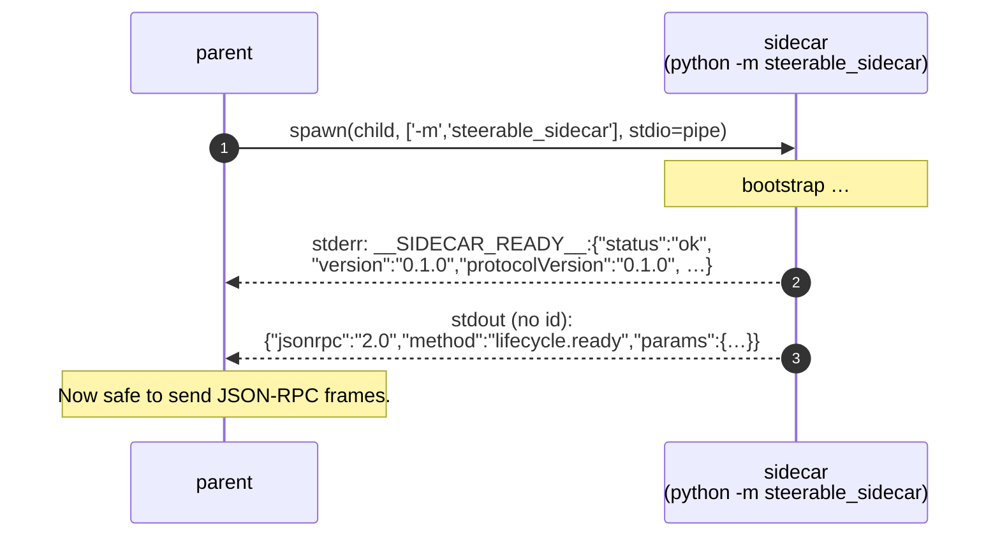

# Sidecar Spec

`steerable-sidecar` is a **portable Python executable** that exposes the
runtime over JSON-RPC 2.0 framed on stdin/stdout. UI shells (Electron,
Tauri, native, …) spawn the sidecar as a subprocess, send method calls
on stdin, receive responses + notifications on stdout, and observe
log + ready markers on stderr.

## Why JSON-RPC over stdio?

- **No port allocation** — works inside sandboxed app containers.
- **No TLS dance** — every byte stays inside the parent process.
- **Native to subprocess supervision** — `child.kill()` is your DR plan.

## Boot sequence



The parent **must wait** for the `__SIDECAR_READY__:` marker on stderr
before sending its first frame. The sidecar **also** emits a
`lifecycle.ready` JSON-RPC notification on stdout immediately after —
parents that use a frame-based reader (rather than peeking stderr) can
key off that instead. Either way, your reader must distinguish
**responses** (carry an `id`) from **notifications** (no `id`).

## Frame format

One JSON object per line, UTF-8, terminated by `\n`. No length-prefix.

### Request

```json
{"jsonrpc":"2.0","id":1,"method":"system.ping"}
```

### Successful response

```json
{"jsonrpc":"2.0","id":1,"result":{"status":"ok","version":"0.1.0","protocolVersion":"0.1.0","uptimeMs":1234,"pid":42,"pythonVersion":"3.12.6","platform":"darwin-arm64","loadedProviders":[],"loadedTools":0,"activeTraces":0,"checks":{}}}
```

### Error response

```json
{"jsonrpc":"2.0","id":1,"error":{"code":-32601,"message":"Method not found","data":{"method":"foo"}}}
```

### Notification (sidecar → parent, no `id`)

```json
{"jsonrpc":"2.0","method":"stream.chunk","params":{"streamId":"s_42","delta":"Hello"}}
```

## Method catalog (v0.1.0)

| Method                  | Direction | Result                                 |
| ----------------------- | --------- | -------------------------------------- |
| `system.ping`           | request   | `SidecarHealth`                        |
| `system.shutdown`       | request   | `null` (graceful drain, then exit)     |
| `system.shutdown_now`   | request   | `null` (immediate exit)                |
| `agent.session.create`  | request   | `AgentSession`                         |
| `agent.session.resume`  | request   | `AgentSession`                         |
| `agent.session.list`    | request   | `AgentSession[]`                       |
| `agent.chat.stream`     | request   | `{"streamId": "s_…"}`                  |
| `agent.chat.cancel`     | request   | `null` (best-effort cancel)            |
| `tool.list`             | request   | `ToolDescriptor[]`                     |
| `tool.invoke`           | request   | `ToolResult`                           |
| `trace.fetch`           | request   | `{"trace": HarnessTrace, "spans": TraceSpan[], "events": TraceEvent[]}` |
| `config.get`            | request   | `Record<string, unknown>`              |
| `config.set`            | request   | `null`                                 |

Notifications emitted by the sidecar:

| Notification         | When                                           | Params                                                  |
| -------------------- | ---------------------------------------------- | ------------------------------------------------------- |
| `lifecycle.ready`    | After boot, before accepting requests          | `{version, protocolVersion, pid, listenInfo}`           |
| `lifecycle.shutdown` | Just before the process exits                  | `{reason}` (`"normal" \| "eof"`)                        |
| `stream.chunk`       | LLM token / tool-call / usage during a stream  | `{streamId, delta?, toolCall?, usage?, finishReason?}`  |
| `stream.done`        | Stream terminated cleanly                      | `{streamId, ok, cancelled?}`                            |
| `stream.error`       | Stream failed (provider error, etc.)           | `{streamId, kind, message}`                             |

## `agent.chat.stream` payload

```json
{
  "jsonrpc":"2.0", "id":7, "method":"agent.chat.stream",
  "params": {
    "provider":"openai_compat",
    "model":"gpt-4o-mini",
    "baseUrl":"https://api.openai.com/v1",
    "apiKey":"sk-…",
    "temperature":0.7,
    "messages":[{"role":"user","content":"Say hi"}],
    "tools":[{"type":"function","function":{"name":"echo","parameters":{}}}]
  }
}
```

The sidecar replies with `{"streamId":"s_42"}` immediately, then pushes
`stream.chunk` notifications until `stream.done`.

## Health snapshot

```json
{
  "status": "ok",
  "version": "0.1.0",
  "protocolVersion": "0.1.0",
  "uptimeMs": 12345,
  "pid": 42,
  "pythonVersion": "3.12.6",
  "platform": "darwin-arm64",
  "loadedProviders": [],
  "loadedTools": 0,
  "activeTraces": 0,
  "checks": {}
}
```

## Error codes

The sidecar reuses standard JSON-RPC error codes (`-32700` parse error,
`-32600` invalid request, `-32601` method not found, `-32602` invalid
params, `-32603` internal error) plus framework-specific:

| Code      | Meaning                                  |
| --------- | ---------------------------------------- |
| `-32001`  | `BudgetExhaustedError`                   |
| `-32002`  | `PolicyDeniedError`                      |
| `-32003`  | `ToolDispatchError`                      |
| `-32004`  | `StorageError`                           |
| `-32005`  | `TransportError`                         |

## CLI flags

```
$ python -m steerable_sidecar --help
usage: steerable-sidecar [-h] [--log-level {DEBUG,INFO,WARNING,ERROR}] [--quiet-ready]

options:
  -h, --help                Show help and exit.
  --log-level {DEBUG,INFO,WARNING,ERROR}
                            Sidecar log level (always logged on stderr).
  --quiet-ready             Skip the __SIDECAR_READY__ stderr marker.
                            (Useful for embedded supervisors that prefer to
                            key off the `lifecycle.ready` stdout notification.)
```

## Implementation notes

- The sidecar is single-loop async; concurrent requests interleave on
  the event loop but are ordered by their JSON-RPC `id`.
- `agent.chat.stream` returns immediately and continues to push
  notifications even if the parent processes them slowly. There's no
  back-pressure on the wire — assume your parent can drain stdout.
- `system.shutdown` triggers a graceful drain (in-flight streams cancel,
  pending tool dispatches abort) before returning `null` and exiting.
  `system.shutdown_now` skips the drain.
- Parent processes should also send `SIGTERM` as a backstop in case
  `system.shutdown` hangs; the sidecar installs a `SIGTERM` handler that
  forces an immediate exit.
