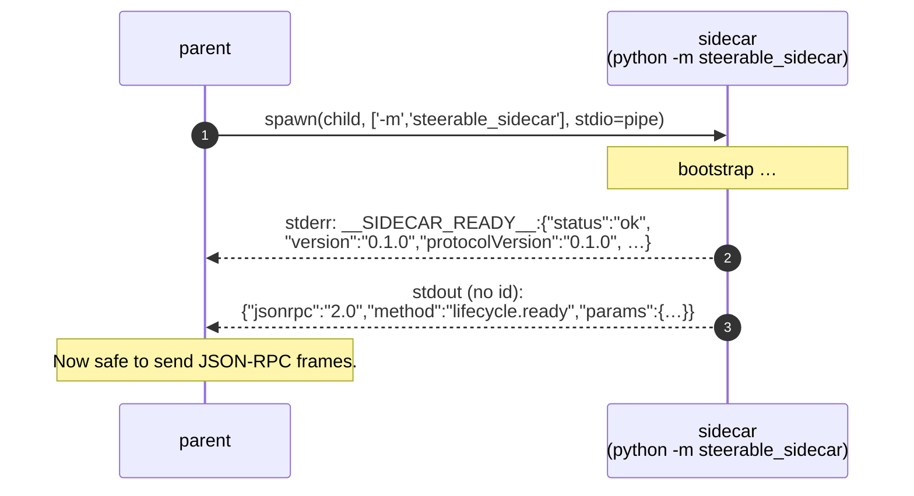

# Sidecar Spec

`steerable-sidecar` is a **portable Python executable** that exposes the
runtime over JSON-RPC 2.0 framed on stdin/stdout. UI shells (Electron,
Tauri, native, …) spawn the sidecar as a subprocess, send method calls
on stdin, receive responses + notifications on stdout, and observe
log + ready markers on stderr.

## Why JSON-RPC over stdio?

- **No port allocation** — works inside sandboxed app containers.
- **No TLS dance** — every byte stays inside the parent process.
- **Native to subprocess supervision** — `child.kill()` is your DR plan.

## Boot sequence


```mermaid
sequenceDiagram
    autonumber
    participant P as parent
    participant S as sidecar<br/>(python -m steerable_sidecar)

    P->>S: spawn(child, ['-m','steerable_sidecar'], stdio=pipe)
    Note over S: bootstrap …
    S-->>P: stderr: __SIDECAR_READY__:{"status":"ok",<br/>"version":"0.1.0","protocolVersion":"0.1.0", …}
    S-->>P: stdout (no id):<br/>{"jsonrpc":"2.0","method":"lifecycle.ready","params":{…}}
    Note over P: Now safe to send JSON-RPC frames.
```

The parent **must wait** for the `__SIDECAR_READY__:` marker on stderr
before sending its first frame. The sidecar **also** emits a
`lifecycle.ready` JSON-RPC notification on stdout immediately after —
parents that use a frame-based reader (rather than peeking stderr) can
key off that instead. Either way, your reader must distinguish
**responses** (carry an `id`) from **notifications** (no `id`).

## Frame format

One JSON object per line, UTF-8, terminated by `\n`. No length-prefix.

### Request

```json
{"jsonrpc":"2.0","id":1,"method":"system.ping"}
```

### Successful response

```json
{"jsonrpc":"2.0","id":1,"result":{"status":"ok","version":"0.1.0","protocolVersion":"0.1.0","uptimeMs":1234,"pid":42,"pythonVersion":"3.12.6","platform":"darwin-arm64","loadedProviders":[],"loadedTools":0,"activeTraces":0,"checks":{}}}
```

### Error response

```json
{"jsonrpc":"2.0","id":1,"error":{"code":-32601,"message":"Method not found","data":{"method":"foo"}}}
```

### Notification (sidecar → parent, no `id`)

```json
{"jsonrpc":"2.0","method":"stream.chunk","params":{"streamId":"s_42","delta":"Hello"}}
```

## Method catalog (v0.1.0)

| Method                  | Direction | Result                                 |
| ----------------------- | --------- | -------------------------------------- |
| `system.ping`           | request   | `SidecarHealth`                        |
| `system.shutdown`       | request   | `null` (graceful drain, then exit)     |
| `system.shutdown_now`   | request   | `null` (immediate exit)                |
| `agent.session.create`  | request   | `AgentSession`                         |
| `agent.session.resume`  | request   | `AgentSession`                         |
| `agent.session.list`    | request   | `AgentSession[]`                       |
| `agent.session.fork`    | request   | `BranchPoint` (fork a record, no turn run) |
| `agent.session.branches`| request   | `{lineage, children}` (branch-family view) |
| `agent.session.tree`    | request   | `{recordId, tree, nodeCount, truncated}` (full branch family from the root) |
| `agent.chat.stream`     | request   | `{"streamId": "s_…"}`                  |
| `agent.chat.cancel`     | request   | `null` (cooperative cancel)            |
| `agent.chat.steer`      | request   | `{"accepted": bool}` (mid-turn steer)  |
| `agent.chat.compact`    | request   | `{"ok": bool}` (manual compact at next pre_step; CC `/compact` parity) |
| `agent.chat.fork`       | request   | fork the running turn's record         |
| `tool.list`             | request   | `ToolDescriptor[]`                     |
| `tool.invoke`           | request   | `ToolResult`                           |
| `workspace.apply_edits` | request   | `{content, diff, applied, matches}` (pure edit algorithm; host owns file I/O) |
| `skills.list`           | request   | `{skills}` (parse + select SKILL.md from host roots) |
| `trace.fetch`           | request   | `{"trace": HarnessTrace, "spans": TraceSpan[], "events": TraceEvent[]}` |
| `trace.export`          | request   | `{status, traceId, privacyMode}` (OTLP/HTTP push) |
| `config.get`            | request   | `Record<string, unknown>`              |
| `config.set`            | request   | `null`                                 |

`config.get` with `{"merged": true}` previews the layered user config — default → `~/.steerable/config.json` → selected profile → `STEERABLE_*` env → per-request RPC override → managed file — reporting each key's resolved value and the layer it came from (the `--dump-config` counterpart). A malformed user file fails loud. The defaults dict doubles as the schema: a value whose type doesn't match the declared default fails the load naming the key, the layer, and the expected type (env strings coerce). The user file may carry named `profiles` blocks, selected by `STEERABLE_PROFILE`; an unknown profile name fails loud listing the available ones. `STEERABLE_MANAGED_CONFIG_PATH` points at an enterprise-managed file applied after every other layer, so its pins (e.g. a restrictive sandbox posture) cannot be loosened from below — CC managed-settings parity.

Notifications emitted by the sidecar:

| Notification         | When                                           | Params                                                  |
| -------------------- | ---------------------------------------------- | ------------------------------------------------------- |
| `lifecycle.ready`    | After boot, before accepting requests          | `{version, protocolVersion, pid, listenInfo}`           |
| `lifecycle.shutdown` | Just before the process exits                  | `{reason}` (`"normal" \| "eof"`)                        |
| `stream.chunk`       | LLM token / tool-call / usage during a stream  | `{streamId, delta?, toolCall?, usage?, finishReason?, rawChunk?}` |
| `stream.done`        | Stream terminated cleanly                      | `{streamId, ok, cancelled?}`                            |
| `stream.error`       | Stream failed (provider error, etc.)           | `{streamId, kind, message}`                             |
| `agent.child`        | Child-agent lifecycle (spawned/completed/failed/cancelled) — from the orchestration pool and from `delegate_subagent` delegations | `{streamId, kind, childId, depth?, status?, profile?}` |

## `agent.chat.stream` payload

```json
{
  "jsonrpc":"2.0", "id":7, "method":"agent.chat.stream",
  "params": {
    "provider":"openai_compat",
    "model":"gpt-4o-mini",
    "baseUrl":"https://api.openai.com/v1",
    "apiKey":"sk-…",
    "temperature":0.7,
    "messages":[{"role":"user","content":"Say hi"}],
    "tools":[{"type":"function","function":{"name":"echo","parameters":{}}}]
  }
}
```

The sidecar replies with `{"streamId":"s_42"}` immediately, then pushes
`stream.chunk` notifications until `stream.done`.

CoreLoop streams accept `contentMode: "all" | "final"` (default `"all"`).
`"all"` streams assistant text from every model request. `"final"` buffers
display text until each request's outcome is known, discards tool-round
narration and rejected retry drafts, and emits only the terminal tool-free
response. Tool progress notifications, the durable record, and the trace are
unchanged. `"final"` requires `useCoreLoop: true`.

`streamRawChunks: true` (CoreLoop-only, default off) forwards every raw
provider chunk the loop's `on_stream_chunk` hook observes — *before* UI-tag
stripping and surrogate splitting turn it into display text — as
`stream.chunk` notifications carrying `rawChunk`:
`{contentDelta?, reasoningDelta?, toolCallDelta?: {id, name, arguments}, finishReason?}`,
unset fields omitted. This is the input for hosts running incremental
renderers (e.g. a streaming UI-tag parser); the digested `delta` /
`reasoningDelta` fields on the same channel stay post-stripping display
text. Emission is fire-and-forget: chunk order is preserved, ordering
against the digested notifications is not. Note the OpenAI-compat provider
buffers tool-call argument fragments into one complete `ToolCall`, so
`toolCallDelta` arrives whole — only content/reasoning are incremental.

`resume: true` (CoreLoop-only) continues the durable record's interrupted
turn instead of opening a new one: the record's projected transcript —
dangling `tool_calls` closed with a synthetic "interrupted" tool message —
becomes the loop seed verbatim, so the host neither re-sends the last user
message nor injects a synthetic continuation prompt. `messages` must be
empty and `recordId` (or `chatId`) must name a non-empty record; both
violations fail with `invalid_params`. A host `systemPrompt` on the same
request replaces the record's leading system message, so a refreshed
prompt takes effect on the resumed turn.

CoreLoop tunables accepted in `params` (all optional): `maxRounds`,
`maxToolErrors`, `budgetTokens`, `softTimeoutMs`, `toolTimeoutMs`.
`toolTimeoutMs` is the per-tool-execution backstop: a tool that produces
no result within the budget is cancelled and returns a failed
`ToolResult` (`error: "tool_timeout"`) instead of hanging the turn — the
consecutive-error breaker treats it like any other tool failure. It
applies to every executor, in-process or remote (reverse channel, future
MCP). Default 300000 (5 min); the default is a hung-tool backstop, not a
budget — set a tighter value for fast tools.

OpenAI-compatible vendor divergences are data, not provider branches
(`steerable_agent_runtime.llm.compat`). An optional `compat` object in
`params` overrides request/response handling for the OpenAI-compatible
path; keys are camelCase (`supportsUsageInStreaming`, `maxTokensField`,
`supportsReasoningEffort`, `supportsTemperature`, `reasoningDeltaFields`,
`cachedTokensFields`) and unknown keys are rejected. Without `compat`,
the sidecar auto-detects known vendors from the `baseUrl` host
(`PROVIDER_COMPAT_HOSTS`); anything unmatched runs on reference OpenAI
behavior.

Optimal generation parameters are data too
(`steerable_agent_runtime.llm.presets`): a `(host, modelPrefix)` table of
vendor-documented sampling optima for the open-weight families (DeepSeek,
Qwen3, GLM, Llama, gpt-oss, MiniMax) fills any request field the caller
left unset — explicit per-request fields, host extra kwargs, and
`default_temperature` always win, and compat flags still gate what may be
sent at all (Moonshot's fixed-temperature models carry no entry for that
reason). Entries key on the model leaf when the family travels across
gateways and on the base-URL host when one vendor serves model classes
with divergent optima (DeepSeek chat vs. reasoner).
`STEERABLE_PROVIDER_PRESETS=0` disables the layer.

`agent.chat.cancel` on a CoreLoop stream is cooperative: the loop winds
down at the next safe point (round boundary, stream chunk, or tool-call
slot), records the partial turn so the chat can continue, and the
terminal `stream.done` carries `status: "cancelled"` with
`cancelled: true`. A 5s watchdog hard-cancels the task only if the
wind-down wedges.

Sub-agent delegation is ON BY DEFAULT: the sidecar advertises
`delegate_subagent` and answers it with a bounded child CoreLoop running
on the agent pool — the model's single multi-agent surface. Pass
`subagent: false` to turn it off, or a dict to configure it:
`{toolFilter?: string[], maxParallel?: int, profiles?: {name:
{toolFilter?, model?, maxRounds?, concurrent?, description?}}}`.
`toolFilter` narrows every child's tool domain (filtered-out calls fail
closed with `tool_not_delegated`); `profiles` adds named profiles the
schema advertises as a `subagent_type` enum (unknown names fail closed
listing the registered ones; a profile's `model` resolves through the
host's provider factory or fails closed). A `concurrent: true` profile
lets same-round delegations execute in parallel under the pool's
`maxParallel` budget — the overflow delegation fails closed with
`orchestration_budget_exceeded`. Children advertise the host tool surface
minus the delegation tool itself (depth-1 by construction), narrowed per
profile. Delegate children emit `agent.child` lifecycle notifications
like orchestration children; the `child_spawned` payload adds `profile`
(the resolved profile name, `general-purpose` when untyped).

Multi-agent orchestration (the explicit six-tool family) is opt-in via
`orchestration: {enabled: true, maxDepth?, maxParallel?, childMaxRounds?}` in `params`: the parent model drives
parallel child CoreLoops through six tools — `agent_spawn` (returns a
lineage id like `0.2`, optional `toolFilter` narrows the child's tool
domain), `agent_send` (steers a running child; resumes a finished or
interrupted one as a follow-up turn seeded from its preserved record),
`agent_wait` (`timeoutMs`; a live child at timeout returns `status:
"running"`), `agent_close` (terminal: cooperative cancel with a
hard-cancel backstop, rejects further sends), `agent_list` (pool
snapshot with per-child status), and `agent_interrupt` (cooperative
cancel that keeps the child addressable for a later `agent_send`). Budgets
fail closed: spawning at the parallel cap returns
`orchestration_budget_exceeded`, and depth is structural — a child only
has orchestration tools when `maxDepth` allows its own pool. Child
lifecycle lands as `agent.child` notifications; every spawn/wait result
carries the child id as structured JSON, so the delegation is
reconstructable from the session record alone. Children still running
when the parent ends are wound down cooperatively. When both surfaces
are on, delegation and the six-tool family share ONE pool — one
`maxParallel` budget and one lineage space, and delegate children appear
in `agent_list`.

Per-turn MCP servers mount via `mcp: [{name?, command, args?, env?}]` in
`params` (CoreLoop, sidecar-local path only). Each entry spawns one stdio
MCP server subprocess; its tools are registered on the turn's router under
the `mcp__<name>__<tool>` prefix and are callable by the model like any
local tool. Every entry needs a non-empty `command` — a malformed entry
fails the request with `invalid_params` before any provider call. Clients
are closed when the stream ends (completion, error, or cancel), so no
server subprocess outlives its turn. The param is ignored under
`toolsViaHost` (the host owns tool execution there) and when an embedder
replaces the harness via a hooks factory. This mirrors the ACP adapter's
`mcpServers` wiring; HTTP/SSE MCP transports remain an honest gap.

## `agent.session.tree` payload

```json
{
  "jsonrpc":"2.0", "id":9, "method":"agent.session.tree",
  "params": { "recordId": "chat_1:r2" }
}
```

Returns the full branch family containing `recordId` in one call — the
view a host needs to render a full-tree branch switcher and to validate
activating ANY family member (cousins included), where
`agent.session.branches` only sees the lineage plus direct children:

```json
{
  "recordId": "chat_1:r2",
  "nodeCount": 4,
  "truncated": false,
  "tree": {
    "recordId": "chat_1", "sourceRecordId": null, "sourceUntilSeq": null,
    "label": "root", "depth": 0,
    "children": [
      {
        "recordId": "chat_1:r2", "sourceRecordId": "chat_1", "sourceUntilSeq": 5,
        "label": "question 1", "depth": 1, "children": []
      }
    ]
  }
}
```

`tree` is the family root (found by walking seed provenance up from
`recordId`); each node carries its fork provenance, the derived label,
and a `depth` that matches `lineage` numbering. Expansion is bounded —
depth ≤ 32 (the lineage corruption bound) and ≤ 500 nodes; a family cut
by either bound returns `truncated: true` with the partial tree. An
unknown record fails with `invalid_request`, as does provenance
corruption (a lineage cycle).

## Health snapshot

```json
{
  "status": "ok",
  "version": "0.1.0",
  "protocolVersion": "0.1.0",
  "uptimeMs": 12345,
  "pid": 42,
  "pythonVersion": "3.12.6",
  "platform": "darwin-arm64",
  "loadedProviders": [],
  "loadedTools": 0,
  "activeTraces": 0,
  "checks": {}
}
```

## Error codes

The sidecar reuses standard JSON-RPC error codes (`-32700` parse error,
`-32600` invalid request, `-32601` method not found, `-32602` invalid
params, `-32603` internal error) plus framework-specific:

| Code      | Meaning                                  |
| --------- | ---------------------------------------- |
| `-32001`  | `BudgetExhaustedError`                   |
| `-32002`  | `PolicyDeniedError`                      |
| `-32003`  | `ToolDispatchError`                      |
| `-32004`  | `StorageError`                           |
| `-32005`  | `TransportError`                         |

## CLI flags

```
$ python -m steerable_sidecar --help
usage: steerable-sidecar [-h] [--log-level {DEBUG,INFO,WARNING,ERROR}] [--quiet-ready]

options:
  -h, --help                Show help and exit.
  --log-level {DEBUG,INFO,WARNING,ERROR}
                            Sidecar log level (always logged on stderr).
  --quiet-ready             Skip the __SIDECAR_READY__ stderr marker.
                            (Useful for embedded supervisors that prefer to
                            key off the `lifecycle.ready` stdout notification.)
```

## Implementation notes

- The sidecar is single-loop async; concurrent requests interleave on
  the event loop but are ordered by their JSON-RPC `id`.
- `agent.chat.stream` returns immediately and continues to push
  notifications even if the parent processes them slowly. There's no
  back-pressure on the wire — assume your parent can drain stdout.
- `system.shutdown` triggers a graceful drain (in-flight streams cancel,
  pending tool dispatches abort) before returning `null` and exiting.
  `system.shutdown_now` skips the drain.
- Parent processes should also send `SIGTERM` as a backstop in case
  `system.shutdown` hangs; the sidecar installs a `SIGTERM` handler that
  forces an immediate exit.
- `web_fetch` (always) and `web_search` (when a search backend is
  configured) are registered on the RPC router at boot
  (`steerable_sidecar/web_tools.py`; bounds and SSRF policy in
  `tools.md` "Web tools"). Hosts learn availability from `tool.list`
  rather than assuming it, and delegate execution with `tool.invoke` —
  the nested call (the sidecar's CoreLoop asking the host over reverse
  `tool.invoke`, and the host forwarding back over forward `tool.invoke`)
  is safe because requests interleave on the loop. A malformed
  `STEERABLE_WEB_*` bound logs an error and leaves the web pair
  unregistered instead of failing boot.
