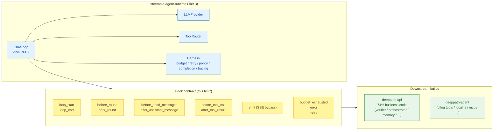
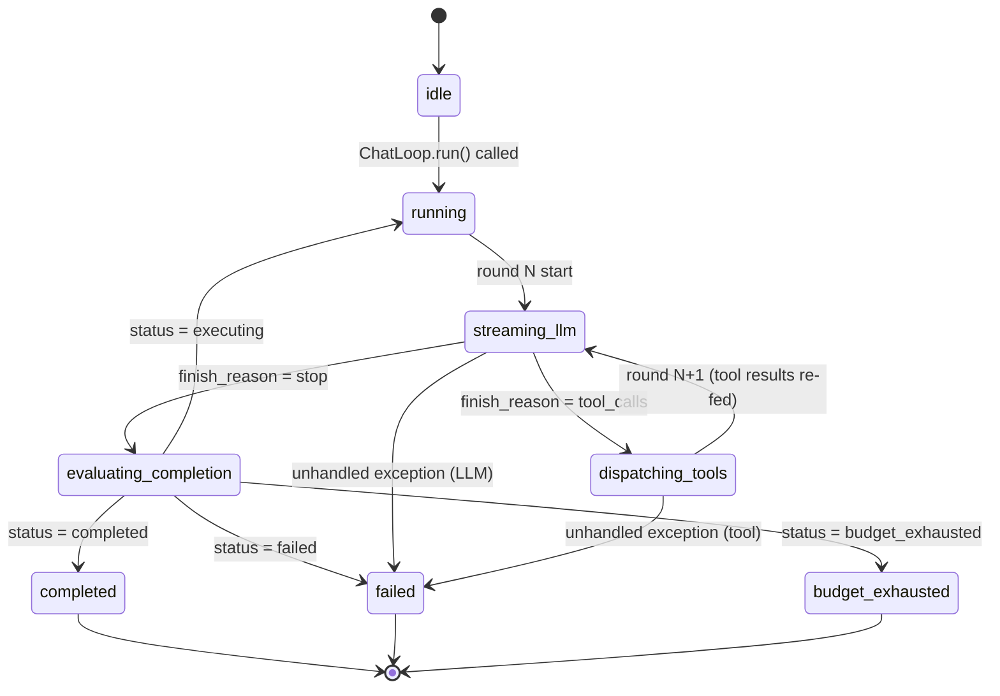

# RFC: ChatLoop — the framework's canonical agent loop

| Field | Value |
|---|---|
| **Status** | Draft |
| **Owner** | DeepPath / Steerable maintainers |
| **Created** | 2026-05-20 |
| **Last updated** | 2026-05-20 |
| **Targets** | `steerable-agent-runtime` (Py) + `steerable-agent-app` (Py, new) + downstream consumers |
| **Supersedes** | (none) |
| **Related** | `spec/events/SSEEvent.schema.json`, `spec/runtime/AgentSession.schema.json`, `spec/runtime/HarnessTrace.schema.json`, `spec/sidecar/README.md` |

> **TL;DR.** Today every downstream (deeppath-api, deeppath-agent, sidecar) re-implements
> the Think-Act-Observe loop. This RFC defines a **single, minimal, ~500-line `ChatLoop`**
> that lives in the framework and exposes **11 callback hooks** so business code (system
> prompts, persistence, verifiers, orchestration, entity linking, …) plugs in without
> ever needing to fork the loop body. Verified against deeppath-api's 5 004-line
> `loop.py` and deeppath-agent's 1 763-line `local-backend/router.ts`: 11 hooks cover
> every existing extension point in both downstreams.

---

## Table of contents

1. [Motivation](#1-motivation)
2. [Goals & Non-Goals](#2-goals--non-goals)
3. [Architecture overview](#3-architecture-overview)
4. [The 8 core responsibilities](#4-the-8-core-responsibilities)
5. [Hook contract](#5-hook-contract)
6. [SSE event sequence contract](#6-sse-event-sequence-contract)
7. [`HookContext` schema](#7-hookcontext-schema)
8. [Lifecycle state machine](#8-lifecycle-state-machine)
9. [API surface (Python pseudo-code)](#9-api-surface-python-pseudo-code)
10. [Downstream mapping: deeppath-api 4 400 lines → 11 hooks](#10-downstream-mapping-deeppath-api-4-400-lines--11-hooks)
11. [Downstream mapping: deeppath-agent → hooks](#11-downstream-mapping-deeppath-agent--hooks)
12. [Migration plan](#12-migration-plan)
13. [Open questions](#13-open-questions)
14. [Next steps](#14-next-steps)

---

## 1. Motivation

### 1.1 Today's state

Three implementations of the same Think-Act-Observe loop exist in this repo group:

| Owner | File / module | Size | Language | Notes |
|---|---|---|---|---|
| `deeppath-api` | `app/services/harness/loop.py` (`HarnessLoop`) | **5 004 lines** | Python | Production SaaS, 5 years of accreted business code |
| `deeppath-agent` | `src/local-backend/router.ts` + `src/harness/*.ts` | **~1 800 lines** | TypeScript | Electron offline shell |
| `steerable-sidecar` | `_run_chat_stream` in `sidecar.py` | ~50 lines | Python | Trivial pass-through, **no tool dispatch, no multi-round, no harness** |

The sidecar implementation is so minimal that any embedder must either (a) wrap it from
the outside (deeppath-agent does this) or (b) write their own loop from scratch
(deeppath-api does this). Neither path leverages the framework's policy / budget / retry
/ completion / tracing harness in a uniform way.

### 1.2 The 5 004-line dissection

The `deeppath-api` `loop.py` was dissected for this RFC. Of 5 004 lines:

| Category | Lines | % | Examples | Should live where? |
|---|---|---|---|---|
| **Generic loop scaffold** | ~600 | 12 % | Round scheduling, LLM stream aggregation, tool call detection, tool dispatch, SSE emission, budget enforcement, provider tool-call shape translation | **framework `ChatLoop`** |
| **Half-generic** | ~700 | 14 % | Tool-result truncation, error classification, surrogate-pair handling, schema-token estimation | framework utils, called *from* hooks |
| **Business-only** | ~3 700 | 74 % | dp-action proposals, UI tools, pseudo-tool-call defense, entity linking, web search, verifier, orchestration, context cache, timezone conversion, reasoning-tag sanitization | **stays in deeppath-api, injected via hooks** |

The 74 % "business-only" bucket is the deal-breaker for any "lift-and-shift to
framework" plan. It contains 5 years of DeepPath-specific defenses (Qwen / DeepSeek
quirks, dp-action wire format, UI tool tags, MCP entity linking, …) that have no place
in a framework that aims to serve **arbitrary** agent builds.

### 1.3 The bet

**11 carefully-placed hooks** can carry all 4 400 lines of business code (74 % +
half-generic 14 %) without ever needing the loop body to change. §10 proves this
claim by mapping every existing extension point in deeppath-api to a specific hook.

If the bet fails — i.e. we find a business behaviour that none of the 11 hooks can host
— we *add a 12th hook*. We do **not** widen the loop body. This is the hard contract.

---

## 2. Goals & Non-Goals

### 2.1 Goals

- **G1** — Define a single Think-Act-Observe loop, owned by the framework, that any
  agent build (SaaS API, Electron desktop, CLI, notebook, sidecar) can reuse.
- **G2** — Keep the loop body *minimal*: 8 responsibilities, target ≤ 500 lines of
  hand-written Python, ≤ 20 cyclomatic complexity per method.
- **G3** — Expose a fixed set of hook points (callback registry) sufficient to host
  every existing business behaviour in deeppath-api and deeppath-agent.
- **G4** — Emit a *stable*, *typed* SSE event stream that conforms to
  `spec/events/SSEEvent.schema.json` and supersedes the ad-hoc `data: {...}\n\n`
  conventions of each downstream.
- **G5** — Integrate the existing `steerable-agent-harness` (policy / budget / retry /
  completion / tracing) without business code needing to call those modules directly.
- **G6** — Be transport-agnostic: the same `ChatLoop` runs behind FastAPI SSE
  (deeppath-api), Electron IPC (deeppath-agent), and stdio JSON-RPC (sidecar).
- **G7** — Be provider-agnostic: OpenAI-compatible, Anthropic-native, Ollama all work
  with the same loop body; provider-specific quirks isolate in `LLMProvider` and one
  `tool-call shape translator` utility.

### 2.2 Non-Goals (explicit)

- **NG1** — Multi-agent orchestration (Coordinator → subordinate task graph). Stays in
  `deeppath-api/app/services/harness/orchestrator.py`. Hooks `before_round` /
  `after_round` are sufficient for the orchestrator to wrap the loop.
- **NG2** — Goal verifier (post-turn LLM judge). Stays in
  `deeppath-api/app/services/harness/goal_verifier.py`. Wraps the loop via
  `loop_end` + a re-invocation on the orchestrator's side.
- **NG3** — Memory / RAG / context cache. Stays in deeppath-api. Injected via
  `before_send_messages`.
- **NG4** — Approval-waiting flows (write tools that become user-approved proposals).
  This is deeppath-specific. `before_tool_call` hook can short-circuit a dispatch and
  return a "deferred" `ToolResult`.
- **NG5** — Trajectory replay / eval harness. Read-side concern that consumes the
  emitted `HarnessTrace` rows; lives in deeppath-api.
- **NG6** — Pseudo-tool-call defense (parsing markdown / function-call-like text out of
  free-form LLM output). DeepPath-specific defense against Qwen/DeepSeek quirks; lives
  in deeppath-api, hooked via `emit` (it rewrites assistant content deltas in-flight).
  *Open question:* should this be promoted to framework utility if it's useful to more
  than DeepPath? See §13.
- **NG7** — Business-tool implementations (MCP tool registry, dp-action proposals,
  desktop-agent relay, synthetic tools, web search, web fetch). Hooks
  `before_tool_call` / `after_tool_result` are the integration points.
- **NG8** — Session locking, distributed coordination (Redis), DB persistence. The
  loop emits typed events; downstream's transport layer decides how to persist /
  serialise / debounce.

---

## 3. Architecture overview



The `ChatLoop` calls **into** `LLMProvider`, `ToolRouter`, and the harness modules
(unchanged). Downstream code attaches **into** the loop via the hook contract; it never
calls into the loop body and never overrides it.

---

## 4. The 8 core responsibilities

The loop body does **exactly these 8 things**, in this order, per turn.

| # | Responsibility | What it does | What it doesn't do |
|---|---|---|---|
| **1** | **Round scheduling** | While `round < max_rounds` *and* `elapsed < max_elapsed_seconds`: drive one Think-Act-Observe cycle. Fire `before_round` / `after_round` hooks. | Does not decide *which* round count or wall-clock limit applies — these come from `LoopConfig` (caller-supplied). |
| **2** | **LLM stream orchestration** | Call `provider.stream(messages, tools, …)`; consume `StreamChunk` iterator; accumulate `content_delta`, `reasoning_delta`, `tool_call_delta`, `finish_reason`, `usage` into a single canonical `AssistantMessage`. | Does not own messages persistence (hook `after_assistant_message`); does not own retry policy (calls `run_with_retry` from harness). |
| **3** | **Tool-call detection** | After stream ends with `finish_reason in {"tool_calls", "tool_use"}`, extract the `ToolCall[]` array from the accumulator using the provider's native shape, normalise to `spec/tools/ToolCall.schema.json`. | Does not parse markdown / pseudo-fn calls out of free-form text (`NG6`). |
| **4** | **Tool dispatch** | For each detected `ToolCall`, fire `before_tool_call` hook, call `ToolRouter.dispatch(call)`, fire `after_tool_result`. Feed results back as `tool` role messages for the next round. | Does not decide what tools exist (caller registers via `ToolRouter`); does not own tool implementations. |
| **5** | **Tool-result truncation** | Apply a fixed truncation policy: each `ToolResult.value` over `max_tool_result_bytes` is replaced with `{"truncated": True, "original_bytes": N, "preview": "…"}` before re-feed. This is a safety net against runaway prompt growth. | Does not run a smarter compression (RAG-style summarisation lives in deeppath-api `artifacts.py`, injected via `after_tool_result`). |
| **6** | **Harness integration** | Per round: consult `HarnessBudget.consume()` for tokens / steps / tool-calls / errors; wrap LLM call in `run_with_retry`; wrap tool dispatch in `run_with_retry` (with `can_retry_write` guard); after each round call `decide_completion(state) → {executing, completed, failed, budget_exhausted}`; record `TraceEvent` / `TraceSpan` to the attached `HarnessTrace`. | Does not own the *policy* of when to retry / give up (that's `RetryPolicy` from harness); does not decide *which* fields are sensitive for trace redaction (that's `sanitize_for_trace`). |
| **7** | **SSE event emission** | Emit a fixed, typed sequence of `SSEEvent`s (see §6). Every emission passes through the `emit` hook first, so downstreams can rewrite / suppress / split events without re-implementing the loop. | Does not buffer or persist events; transport adapter owns that. |
| **8** | **Provider tool-call shape translation** | One internal utility translates between OpenAI-flavour `tool_calls: [{id, function:{name, arguments}}]` and Anthropic-flavour `content: [{type:"tool_use", id, name, input}]`. Both go in/out as `spec/tools/ToolCall.schema.json`. | Does not auto-detect provider; caller passes `provider_kind: "openai_compat" | "anthropic_native"`. |

### 4.1 What the loop body explicitly does **not** contain

Reading down the list of business behaviours found in `deeppath-api/loop.py`,
**none** of the following live in the loop body:

- `_sanitize_reasoning_text`, `_think_title`, reasoning-tag blocklist → hook `emit`
- `_strip_dp_actions`, `_build_executed_dp_action_tag`, `_ui_tool_args_valid` → hook `emit` + `after_assistant_message`
- `_strip_pseudo_fn_chunk`, `_flush_pseudo_fn_state`, `_strip_pseudo_md_tool_call_chunk` and 5 friends → hook `emit`
- `_extract_entity_hints`, `_lookup_entity_titles_from_args` → hook `before_tool_call`
- `_convert_iso_dt_to_local`, `_convert_payload_datetimes_to_local` → hook `after_tool_result`
- `_detect_tool_denial_in_history`, `_build_tool_reality_check`, `_suggest_similar_tools`, `_coerce_tool_args` → hook `before_send_messages` + `before_tool_call`
- `_estimate_tools_schema_tokens` → utility, called from hooks
- `_use_anthropic_native` → caller decision, passed to `LoopConfig`
- All `_execute_*_tool` methods → tool implementations, registered with `ToolRouter`

This explicit absence list is part of the contract. If a future PR adds any of these
*into the loop body*, the reviewer is empowered to reject on this RFC alone.

---

## 5. Hook contract

### 5.1 Design principle: callback registry, not middleware

```python
loop = ChatLoop(config)
loop.on("before_tool_call", inject_entity_hints)
loop.on("after_tool_result", convert_timezones_in_payload)
loop.on("emit", strip_dp_actions_from_content)
```

- Multiple callbacks per hook are allowed; they run in registration order.
- Callbacks are `async` (always `await`-able, even if the body is sync).
- Callbacks **may not** access the loop's internal state directly; everything goes
  through `HookContext` (§7).

**The canonical extension pattern is in-place mutation of the ctx.** Hook ctxs
are deliberately mutable dataclasses (not `frozen=True`) so callbacks can edit
them directly:

```python
async def inject_system_prompt(ctx: SendMessagesCtx) -> None:
    ctx.messages.insert(0, Message(role="system", content="be terse"))
    ctx.temperature = 0.1
```

This matches the ergonomics of Django signals, Starlette middleware, and pytest
fixtures — communities the typical user is already in. Static-type safety is
sacrificed; convention and unit tests cover what the type system can't.

A callback may also return a value:

- `None` → no change, continue (this is the default and the most common case)
- `HOOK_SKIP` sentinel → short-circuit the default behaviour at this site
  (only legal for hooks marked "Skip allowed" in §5.2)
- For the `emit` hook only: returning a new `SSEEvent` rewrites the event
  before it leaves the loop. (`emit` is the single canonical "return-replace"
  hook because the loop body owns the buffer it's about to yield; in-place
  mutation of `ctx.event` is also accepted, with the same effect.)

Hooks that document `(with edits)` in §5.2 use in-place mutation; any non-`None`
return value other than `HOOK_SKIP` or — for `emit` — an `SSEEvent` is ignored
by the loop body (it is logged at `DEBUG` for posterity).

### 5.2 The 11 hooks

| # | Hook | When fired | `ctx` payload | Edit model | Skip allowed? |
|---|---|---|---|---|---|
| 1 | `loop_start` | Once, before round 1 | `LoopStartCtx` | read-only | No |
| 2 | `loop_end` | Once, after last round (any completion status) | `LoopEndCtx` (includes `final_status`, optional `final_decision`) | read-only | No |
| 3 | `before_round` | Each round, before any LLM call | `RoundStartCtx` (round_index, current messages, current tools) | in-place (`ctx.messages`, `ctx.tools`) | **Yes** — `HOOK_SKIP` ends loop early with `completed` |
| 4 | `after_round` | Each round, after tool dispatch (if any) and `decide_completion` | `RoundEndCtx` (round_index, assistant_msg, tool_calls, tool_results, decision, finish_reason) | read-only | No |
| 5 | `before_send_messages` | Right before `provider.stream()` is called | `SendMessagesCtx` (messages, tools, model, provider_kind, temperature, max_tokens) | in-place (any field) | No |
| 6 | `after_assistant_message` | After LLM stream ends and the assistant message is finalised | `AssistantMessageCtx` (message, reasoning, usage) | in-place (`ctx.message.content`, `ctx.message.tool_calls`, `ctx.reasoning`) | No |
| 7 | `before_tool_call` | Per tool call, before `ToolRouter.dispatch` | `ToolCallCtx` (tool_call, round_index) | in-place (`ctx.tool_call.arguments`) | **Yes** — `HOOK_SKIP` synthesises a stub `ToolResult` |
| 8 | `after_tool_result` | Per tool call, after `ToolRouter.dispatch` returns | `ToolResultCtx` (tool_call, tool_result, round_index) | in-place (`ctx.tool_result` fields) | No |
| 9 | `emit` | Right before any `SSEEvent` leaves the loop | `EmitCtx` (the `SSEEvent`) | in-place (`ctx.event`) **or** return `SSEEvent` to replace | **Yes** — `HOOK_SKIP` suppresses the event |
| 10 | `budget_exhausted` | Each of the 4 exhaustion paths: round-entry step debit, end-of-round tokens / tool_calls verdict from `decide_completion`, and the `max_rounds` for-else clause. Fires at most once per `run()`. | `BudgetExhaustedCtx` (`limit_kind` ∈ `{tokens, steps, tool_calls, rounds}`, `budget_state` dict) | read-only | No |
| 11 | `error` | Framework-infrastructure failures only: LLM stream raises (fatal → `final_status="failed"`) or `ToolRouter.dispatch` itself raises (recoverable → loop synthesises a fail `ToolResult` and continues). **A business tool raising is NOT a hook trigger** — `ToolRouter.dispatch` already wraps it into `ToolResult(success=False, error=...)`, which is observable via `after_tool_result`. | `ErrorCtx` (`exception`, `phase` ∈ `{llm_stream, tool_dispatch, hook}`, `round_index`) | read-only | No |

**Edit-model legend.**
- `read-only`: the loop ignores any mutation; the ctx is observational.
- `in-place`: callbacks mutate ctx fields directly; the loop reads the mutated
  values after `fire()` returns.
- `in-place or return`: applies only to `emit`. Either mode is fine; the
  return value, when non-`None`, wins.

**A note on retries.** There is intentionally **no** `retry` hook. Retry behaviour is
fully described by `RetryPolicy` (already in `steerable-agent-harness`), and individual
retry attempts are observable as `TraceEvent`s on the attached `HarnessTrace` (an
existing concept). Adding a `retry` hook would invite business code to *change* retry
policy mid-attempt, which leads to debugging nightmares — instead, business code should
configure `RetryPolicy` up-front (`LoopConfig.retry_policy`).

### 5.3 Exceptions in hooks

A hook callback that raises is a **programming error**. The loop logs at `ERROR`,
wraps the original exception in `HookError(name=<hook>, cause=<exc>)`, and lets it
propagate to the caller of `run()`. Hook exceptions are deliberately **NOT**
routed through the `error` hook — that hook is reserved for *framework
infrastructure* failures (the user's hook *is* the framework's caller, so
re-entrancy here invites infinite loops). Hook authors must catch their own
exceptions if they want best-effort semantics.

The lone exception to "propagate" is cancellation: an `asyncio.CancelledError`
raised inside any hook short-circuits to the outer cancellation handler exactly
as if the LLM stream itself were cancelled — `loop_end` still fires with
`final_status="cancelled"`, `session.end` still emits, and the
`CancelledError` is then re-raised.

---

## 6. SSE event sequence contract

### 6.1 The standard event sequence

The loop emits a fixed envelope from `run()`. Per turn:

```
session.start
  ( error ? )                 # if LLM stream / dispatch infrastructure fails
  ( budget_exhausted ? )      # at most once per run, on the limit that tripped
  done
session.end
```

Future slices will add round-level events (`round.start`, `round.end`,
`assistant.done`, `content_delta`, `tool_call`, `tool_result`, `reasoning`).
For A1.4 the loop **does not emit** those itself — downstreams that need them
plug into `after_assistant_message` / `after_tool_result` and emit via a
custom hook (e.g. `loop.on("after_tool_result", emit_tool_result_event)`),
or use the `emit` hook to rewrite the envelope.

Every event the loop yields is funneled through `_emit()` → the `emit` hook,
so a callback may rewrite (return new `SSEEvent`), mutate `ctx.event` in
place, or return `HOOK_SKIP` to drop the emission entirely.

Mapped to `SSEEvent.type` values from `spec/events/SSEEvent.schema.json`:

| Logical event | `SSEEvent.type` | Payload shape | Emitted by responsibility | A1.4 |
|---|---|---|---|---|
| `session.start` | `agent` | `{event: "session.start", sessionId, traceId}` | §4 #1 | ✅ |
| `done` | `done` | `{}` | §4 #1 | ✅ |
| `session.end` | `agent` | `{event: "session.end", finalStatus}` | §4 #1 | ✅ |
| `error` | `agent` | `{event: "error", payload: {phase, roundIndex, errorType, message}}` | §4 #6 (infrastructure) | ✅ |
| `budget_exhausted` | `agent` | `{event: "budget_exhausted", payload: {limitKind, budgetState}}` | §4 #6 | ✅ |
| `round.start` | `agent` | `{event: "round.start", round}` | §4 #1 | A1.5+ |
| `content_delta` | `content` | `{content: "<delta text>"}` | §4 #2 | A1.5+ |
| `reasoning_delta` | `content` | `{content: "<delta text>", event: "reasoning"}` | §4 #2 | A1.5+ |
| `tool_call_delta` | `tool_call` | `{payload: {callId, name, argumentsDelta}}` | §4 #2 | A1.5+ |
| `assistant.done` | `agent` | `{event: "assistant.done", messageId, usage}` | §4 #2 | A1.5+ |
| `tool_call` | `tool_call` | `{payload: ToolCall}` | §4 #4 | A1.5+ |
| `tool_result` | `tool_result` | `{payload: ToolResult}` | §4 #4 | A1.5+ |
| `round.end` | `agent` | `{event: "round.end", round, completionStatus}` | §4 #6 | A1.5+ |

### 6.2 Implications for `SSEEvent.schema.json`

The current schema already permits all of these via `additionalProperties: true`, but
this RFC formalises:

- `event` field on `type: "agent"` events is **required** and drawn from a finite
  enum (`session.start | session.end | round.start | round.end | assistant.done`)
- A future RFC may move these to discriminated subtypes (one schema per `event`
  value) once the set stabilises

### 6.3 The "raw chunks" escape hatch

Some downstreams (e.g. deeppath-agent today) want to emit *opaque* chunks for backwards
compatibility with their own front-end parsers. The `emit` hook can fully rewrite any
event (including to a non-standard shape); the loop never inspects events after `emit`
returns. This is the documented compatibility lever; it is **not** a license for the
loop body to emit non-standard events itself.

---

## 7. `HookContext` schema

### 7.1 Shared base

All hook ctxs inherit from `HookContext`:

```python
@dataclass(slots=True)
class HookContext:
    loop_id: str                         # uuid for this loop run
    session_id: str                      # AgentSession.sessionId
    trace_id: str                        # HarnessTrace.traceId, monotonic across loop
    config: LoopConfig                   # frozen, immutable snapshot
    state: MutableMapping[str, Any]      # mutable, shared across hooks (see below)
    storage: StorageAdapter | None       # for hook code that needs persistence
```

`state` is the **single sanctioned channel** for hook callbacks to share data across
hook fires. Example: `before_round` writes `state["last_user_message_hash"]`, then
`after_assistant_message` reads it back for entity-link diffing.

**`state` is a plain `dict` shared across all rounds and all hooks within one
`ChatLoop.run()` invocation.** There is no copy-on-write or per-round isolation
— hooks read and write a single mutable dict. Hook authors are responsible for
not clobbering keys their peers depend on; the convention is namespacing under
the hook owner's prefix (`state["entity_link.cache"]`,
`state["budget_warning.last_fired_round"]`, …).

State does **not** persist across separate `ChatLoop` instances; orchestrators
that need cross-turn state should keep it in their own scope and re-seed via
`LoopConfig.initial_state`.

### 7.2 Per-hook ctx fields

| Hook | Ctx subclass | Additional fields |
|---|---|---|
| `loop_start` | `LoopStartCtx` | `initial_messages: list[Message]`, `initial_tools: list[dict]` |
| `loop_end` | `LoopEndCtx` | `final_status: CompletionStatus`, `final_decision: dict \| None`, `rounds_completed: int`, `total_usage: dict \| None` |
| `before_round` | `RoundStartCtx` | `round_index: int`, `messages: list[Message]`, `tools: list[dict]` |
| `after_round` | `RoundEndCtx` | `round_index`, `assistant_message`, `tool_calls`, `tool_results`, `decision`, `finish_reason: str \| None` |
| `before_send_messages` | `SendMessagesCtx` | `messages`, `tools`, `model`, `provider_kind`, `temperature`, `max_tokens` |
| `after_assistant_message` | `AssistantMessageCtx` | `message: Message`, `reasoning: str \| None`, `usage: dict \| None` |
| `before_tool_call` | `ToolCallCtx` | `tool_call: ToolCall`, `round_index` |
| `after_tool_result` | `ToolResultCtx` | `tool_call`, `tool_result: ToolResult`, `round_index` |
| `emit` | `EmitCtx` | `event: SSEEvent` |
| `budget_exhausted` | `BudgetExhaustedCtx` | `limit_kind: str`, `budget_state: dict \| None` |
| `error` | `ErrorCtx` | `exception: BaseException`, `phase: Literal["llm_stream", "tool_dispatch", "hook"]`, `round_index` |

All ctx subclasses are `@dataclass(slots=True)` — **mutable on purpose**. The
canonical extension pattern is in-place mutation (see §5.1). `state` is shared
across hooks within one `run()`; `config` is conceptually frozen (declared as a
`frozen=True` dataclass) but `HookContext.config` typing makes it clear the
loop will not re-read changed fields after construction.

---

## 8. Lifecycle state machine



Notes:

- `running` is a "between rounds" gate where `before_round` / `after_round` fire and
  `decide_completion` runs.
- `cancelled` is intentionally absent from this diagram — cancellation is observed
  at the *outer* `asyncio.CancelledError` boundary and lands in `loop_end` with
  `final_status="cancelled"` and `final_decision = {status: "cancelled", reason:
  "cancelled_by_caller", limit_kind: null, terminal_index: null}`. The loop body
  does not enter a distinct state for it; cleanup is best-effort (`loop_end` +
  one final `session.end` SSE through `_emit()`) and then `CancelledError` is
  re-raised so structured-concurrency callers see the cancellation contract
  preserved.
- `paused` / `waiting_approval` / `waiting_user` are explicitly NOT modelled. These
  are deeppath-api's higher-level orchestration concerns; the orchestrator owns
  *whether to call `loop.run()` again*, the loop itself does not block waiting.

---

## 9. API surface (Python pseudo-code)

This is **illustrative**, not normative. Final signatures land in the implementation
PR (`steerable-agent-runtime` 0.3.x).

### 9.1 Construction

```python
from steerable_agent_runtime import ChatLoop, LoopConfig, LLMProvider, ToolRouter
from steerable_agent_runtime.storage import InMemoryStorage
from steerable_agent_harness import BudgetLimit, RetryPolicy

config = LoopConfig(
    provider=OpenAICompatProvider(model="gpt-4o-mini", api_key=...),
    provider_kind="openai_compat",                  # or "anthropic_native"
    tool_router=router,                             # a ToolRouter with @tool-registered fns
    storage=InMemoryStorage(),                      # or SQLAlchemyStorage(...)
    budget=BudgetLimit(max_tokens=120_000, max_steps=12, max_tool_calls=20),
    retry_policy=RetryPolicy(max_attempts=3, base_delay_seconds=1.0),
    max_rounds=12,                                  # ChatLoop-owned safety net
    max_elapsed_seconds=180.0,
    max_tool_result_bytes=64 * 1024,
    initial_messages=[Message(role="user", content="…")],
    initial_state={"feature_flags": {…}},
)

loop = ChatLoop(config)
```

### 9.2 Hook registration

```python
loop.on("before_send_messages", inject_system_prompt_and_recent_context)
loop.on("after_assistant_message", persist_assistant_message_to_db)
loop.on("before_tool_call", entity_link_args)
loop.on("after_tool_result", convert_payload_timezones_to_user_tz)
loop.on("emit", strip_dp_action_tags_from_content)
loop.on("budget_exhausted", notify_user_via_websocket)

async def inject_system_prompt_and_recent_context(ctx: SendMessagesCtx) -> SendMessagesCtx:
    sys_msg = await build_system_prompt(user_id=ctx.state["user_id"])
    recent  = await build_recent_context(session_id=ctx.session_id)
    return ctx.copy(messages=[sys_msg, *recent, *ctx.messages])
```

### 9.3 Run

```python
async for event in loop.run():
    # `event` is an SSEEvent already passed through the `emit` hook.
    yield encode_sse_event(event)   # from steerable_agent_runtime.transport
```

### 9.4 Cancellation

The standard `asyncio.CancelledError` contract:

1. Caller cancels the task running `loop.run()`.
2. The loop catches `CancelledError` exactly once (in a single `try` around the
   entire round body).
3. Best-effort cleanup: fire `loop_end` with `final_status="cancelled"` and
   `final_decision = {status: "cancelled", reason: "cancelled_by_caller", ...}`,
   then emit a final `agent.event=session.end` SSE through `_emit()` (so the
   `emit` hook still sees it).
4. Any exception raised during the cleanup is swallowed (logged at `ERROR`) so
   the `CancelledError` itself always wins.
5. The `CancelledError` is then re-raised so `asyncio.shield` / `TaskGroup`
   semantics are preserved.

Hook authors should treat the cancellation path as "your hook may not get to
finish" — write side-effects defensively, especially in `loop_end`.

### 9.5 Completion decision contract

The loop drives termination through a single gating predicate from
`steerable_agent_harness`:

```python
def decide_completion(
    *,
    tool_calls: list[dict],           # this round's tool_calls (serialised)
    tool_results: list[dict],         # this round's tool_results, same order
    budget_state: BudgetState,        # the loop's running BudgetState
    budget_limits: BudgetLimit | None,
    finish_reason: str | None,        # from the LLM stream
) -> CompletionDecision: ...

@dataclass(frozen=True)
class CompletionDecision:
    status: Literal[
        "executing", "completed", "failed", "budget_exhausted", "cancelled"
    ]
    reason: str                            # short machine-readable label
    limit_kind: Literal[
        "tokens", "steps", "tool_calls", "rounds"
    ] | None = None
    terminal_index: int | None = None      # index of the terminal tool_result
    def to_dict(self) -> dict: ...
```

Evaluation order (highest priority first, short-circuits at the first match):

1. **Budget exhaustion** (`status="budget_exhausted"`, `limit_kind` ∈
   `{tokens, steps, tool_calls}`) — checked first so that a runaway
   that *also* happens to return a terminal-success result still reports
   the spend overrun. Cost protection beats happy-path reporting.
2. **No tool_calls** → `status="completed"`, `reason="no_tool_calls"`.
   The natural stop.
3. **Terminal tool_result** → `status` is `"completed"` if the terminal
   result has `success=True`, `"failed"` if `success=False`. The terminal
   result wins regardless of where it appears among the round's results;
   `terminal_index` carries the position.
4. **All results non-terminal but every one is `success=False` with
   `needsFollowup=False`** → `status="failed"`,
   `reason="all_results_failed_without_followup"`.
5. Otherwise → `status="executing"`, `reason="has_pending_tool_calls"`.

#### `max_rounds` vs `budget` — who is responsible for what

| Cap | Owner | Trips reported as |
|---|---|---|
| `LoopConfig.max_rounds` | **ChatLoop** | `status="budget_exhausted"`, `limit_kind="rounds"` |
| `LoopConfig.max_elapsed_seconds` | **ChatLoop** | `status="budget_exhausted"`, `limit_kind="time"` |
| `LoopConfig.budget.max_tokens` | **harness** | `status="budget_exhausted"`, `limit_kind="tokens"` |
| `LoopConfig.budget.max_steps` | **harness** | `status="budget_exhausted"`, `limit_kind="steps"` |
| `LoopConfig.budget.max_tool_calls` | **harness** | `status="budget_exhausted"`, `limit_kind="tool_calls"` |

* `budget=None` is allowed — the loop runs without harness budget
  enforcement and only `max_rounds` + `max_elapsed_seconds` act as safety
  nets. Useful for unit tests and trivial demos.
* When both `budget.max_steps=N` and `max_rounds=M` are set, **whichever
  is smaller fires first**. They are intentionally distinct so callers
  can let the harness control step-level cost while keeping `max_rounds`
  as a "this orchestration is clearly broken, eject" hard ceiling
  (typically `max_rounds == 2 × budget.max_steps`).
* `max_rounds` and `max_elapsed_seconds` are both reported via synthetic
  `CompletionDecision` objects the loop constructs (the for-else clause
  and the round-entry wall-clock check respectively). `decide_completion`
  itself never observes round count or wall-clock — that's deliberate,
  it keeps the harness predicate stateless wrt loop-structural concerns.
* `max_elapsed_seconds <= 0` disables the wall-clock guard entirely.
  Otherwise the guard runs at every round entry (before the harness step
  pre-debit) using `time.monotonic()`, so NTP / suspend clock jumps do
  not spuriously trigger the cap.

#### Per-round consumption schedule

0. **Round entry, before everything else** — wall-clock guard:
   `if (now - wall_start) > max_elapsed_seconds` → synthetic
   `CompletionDecision(limit_kind="time")`, fire `budget_exhausted`, break.
1. **Round entry** (still before `before_round`): `consume_budget(step=True)`.
   If the cap is hit, the loop emits a synthetic
   `CompletionDecision(limit_kind="steps")` and breaks before paying for
   another LLM call.
2. **After the LLM stream resolves**: `consume_budget(tokens=usage.total_tokens)`.
   The exhaustion flag is **not** acted on immediately; the round
   continues to dispatch any tool_calls so that downstream hooks see a
   consistent view of "this round actually ran." The decision is taken
   once, at the end-of-round `decide_completion`.
3. **After each tool dispatch** (including `HOOK_SKIP` stubs):
   `consume_budget(tool_call=True)`. Same deferred-decision rule.
4. **Before re-feeding each tool result to the LLM**: `_truncate_oversized`
   over `LoopConfig.max_tool_result_bytes`. The `ToolResult` and the
   `after_tool_result` ctx are unchanged; only the LLM-visible content
   gets the `{"truncated": true, "preview": ..., "original_bytes": N}`
   envelope. `max_tool_result_bytes <= 0` disables truncation.
5. **End of round**: `decide_completion(...)` runs over the updated
   `budget_state`, populates `RoundEndCtx.decision`, and the loop breaks
   iff `decision.status != "executing"`.

### 9.6 Retry contract (A1.5b)

The loop wraps `provider.stream(...)` with retry-on-startup using
`LoopConfig.retry_policy` (a `steerable_agent_harness.RetryPolicy`).

**Coverage** — retry spans only:

1. The `provider.stream(...)` call itself, and
2. Awaiting the **first** chunk from the returned iterator.

Once any chunk has been yielded to the round body, accumulators
(`content_parts`, `reasoning_parts`, `tool_calls_acc`, `usage`,
`finish_reason`) are already mutating. A mid-stream retry would either
duplicate or silently drop accumulated state, so mid-stream exceptions
propagate verbatim into the existing fatal-error path (§9.4 + §5.2
`error`).

**Classifier** — `is_retryable_error(exc)` is the default policy:

* `asyncio.CancelledError`, `KeyboardInterrupt`, `SystemExit` → never
  retried; they signal caller intent, not transient failure.
* `getattr(exc, "should_retry", None) is False` → not retried.
* `getattr(exc, "should_retry", None) is True` → retried (provider
  adapters can opt-in their own exception types this way).
* Otherwise: retried iff `isinstance(exc, (asyncio.TimeoutError,
  ConnectionError, TimeoutError, OSError))`.
* `HookError` is **never** retried — hook bugs are programming errors,
  not transient failures.

**Hook visibility** — retries are *silent* with respect to the
`error` hook. Individual attempt failures are logged at `WARNING` only.
Only the **final** failure path is observable:

| Outcome | What surfaces |
|---|---|
| First attempt succeeds | nothing — round body sees a normal stream |
| Attempt k fails (1 ≤ k < max_attempts) with retryable exc | `WARNING` log; next attempt after `next_retry_delay_ms(policy, k)` |
| All attempts fail / non-retryable exc / `HookError` | `error` hook fires (`phase="llm_stream"`); fatal — `final_status="failed"` |
| Mid-stream exception (after first chunk) | `error` hook fires (`phase="llm_stream"`); fatal — no retry |

**Backoff** — `await asyncio.sleep(next_retry_delay_ms(policy, attempt) / 1000)`
between attempts. `asyncio.CancelledError` raised during this sleep
propagates immediately (the standard cancellation contract from §9.4
applies — the loop fires `loop_end(final_status="cancelled")` and
emits a final `session.end` before re-raising).

**Disabling retry** — `retry_policy=None` or `max_attempts <= 1`
yields behaviour observably identical to a bare `provider.stream(...)`
call: one attempt, no extra `await`, no extra log line.

**Tool dispatch retry** — out of scope for A1.5b. The `ToolRouter`
already wraps business-tool exceptions into `ToolResult(success=False)`
internally; the only thing left to retry would be router-infrastructure
failures, which are vanishingly rare and best fixed at the source. A
future slice may revisit this if profiling shows otherwise.

### 9.6.1 OpenAI partial-args streaming reassembly (A1.5d.1)

The OpenAI chat-completions streaming format splits each tool call's
`function.arguments` into **one growing JSON string** sent across many
SSE chunks. Within a single tool call, only the **final** fragment
closes the JSON object; intermediate concatenations are syntactically
invalid.

Naïve per-chunk `json.loads` (the pre-A1.5d.1 behaviour) discards every
fragment as `{}` and emits an empty `tool_call_delta.arguments` to the
loop, which then dispatches a tool call without any arguments.

**Contract.** `OpenAICompatProvider.stream()` maintains an internal
`tool_buf: dict[int, dict]` keyed by the OpenAI
`tool_calls[].index`. Each slot stores:

| Key | Purpose |
|---|---|
| `id` | Tool-call id from the first chunk that carries it |
| `name` | Function name from the first chunk that carries it |
| `args_str` | Raw concatenation of all `function.arguments` fragments so far |
| `last_args` | Last successful `json.loads(args_str)` |

For every chunk that contains a tool-call delta, the provider:

1. Appends `function.arguments` to `args_str`.
2. Best-effort decodes `args_str`. On success, updates `last_args`;
   on failure (mid-stream invalid prefix), keeps the previous
   `last_args` so the exposed `arguments` dict is **monotonically
   non-shrinking**.
3. Emits an `LLMStreamChunk(tool_call_delta=ToolCall(id, name,
   last_args))`, carrying the **full** best-effort parse of
   everything received so far for that index.

ChatLoop's `_accumulate_tool_call` overwrites `arguments` on every
delta, so this contract guarantees the loop sees the complete args
dict by the final `finish_reason="tool_calls"` chunk.

**Multi-tool calls.** OpenAI in practice sends one tool-call delta
per chunk. The protocol allows `tool_calls.length > 1` per chunk; when
that happens the provider processes the first and emits a `WARNING`
log so we learn about it. No real provider does this in 2025.

**Backward compatibility.** `_parse_stream_chunk(chunk)` called
without a `tool_buf` keeps the pre-A1.5d.1 single-shot behaviour
(documented as lossy for multi-chunk args). Only the in-provider
`stream()` path uses the accumulator.

**Anthropic parity is deferred.** The Anthropic native provider's
`input_json_delta` events have the same fragment-streaming pattern.
That fix is intentionally postponed to A1.5d.2 and tracked separately;
it lands only when a PoC actually exercises the Anthropic native
path.

### 9.7 Trace persistence contract (A1.5c)

When `LoopConfig.storage` is supplied the loop persists a
`HarnessTrace` record plus a tree of `TraceSpan`s and `TraceEvent`s for
each `run()`. With `storage=None`, the persistence path is a strict
no-op (zero extra `await`s; observable behaviour identical to A1.5b).

**Span hierarchy.**

```
ChatLoop.run                   (kind="loop",  parentSpanId=null)
└── round.0                    (kind="round", parent=loop)
│   ├── llm_stream             (kind="llm",   parent=round)
│   └── tool:{name}            (kind="tool",  parent=round)  [0..N]
└── round.1                    …
```

| Span `kind` | Name | Status vocabulary | Notable `attrs` |
|---|---|---|---|
| `loop` | `ChatLoop.run` | `ok` / `error` / `cancelled` | — |
| `round` | `round.{idx}` | `ok` (executing/completed) / `error` (otherwise) | — |
| `llm` | `llm_stream` | `ok` / `error` | `promptTokens`, `completionTokens`, `totalTokens`, `finishReason` |
| `tool` | `tool:{toolName}` | `ok` if `ToolResult.success`, else `error` | `toolName`, `toolCallId`, `success`, optional `error` |

**Event vocabulary.**

| `kind` | `name` | Fired when |
|---|---|---|
| `lifecycle` | `loop.start` | at start of `run()` |
| `lifecycle` | `loop.end` | at end of `run()` (payload includes `finalStatus`) |
| `round` | `round.start` | after the budget step pre-debit, before `before_round` |
| `round` | `round.end` | after `after_round` (payload includes `decision`) |
| `error` | `error` | alongside the `error` hook (`phase` = `llm_stream` \| `tool_dispatch`) |
| `budget_exhausted` | `budget.exhausted` | alongside the `budget_exhausted` hook |
| `cancellation` | `loop.cancelled` | when `asyncio.CancelledError` reaches the loop |

Event `sequence` is a strictly monotonically increasing integer scoped
to the run.

**`HarnessTrace` finalisation.** At `loop_end` (and on the
cancellation path) the loop upserts the trace record with:

* `status` — exact final status (`completed` / `failed` /
  `budget_exhausted` / `cancelled`).
* `hadError` — `True` iff there were any `error` events, or the final
  status is `failed` / `cancelled`.
* `errorMessage` — the first error captured (defensive: `None` is OK
  for the common case).
* `durationMs` — wall-clock duration since `start_loop`.
* `eventCount` / `spanCount` — running counters from the recorder.
* `totalTokens` — sum of `LLMUsage.total_tokens` across rounds (or
  `None` if zero).
* `modelId` — `provider.model` at start.

**Flush policy.** Spans/events are buffered in memory and flushed at:

1. end of each round (after `after_round`),
2. on every `budget_exhausted` fire,
3. at `loop_end` (or its cancellation analogue).

This keeps DB roundtrips proportional to round count rather than
chunk count, while still surfacing intermediate state for long runs.

**Best-effort semantics.** Storage failures (`upsert_trace`,
`append_spans`, `append_events`) are caught, logged at `WARNING`, and
disable further trace writes for the remainder of the run. They
**never** propagate to the caller — tracing must not break the loop.
The loop's own status (`failed`, `completed`, etc.) is unaffected.

**Cancellation.** The cancellation handler does a best-effort
`recorder.record_cancelled()` + `recorder.end_loop(final_status=
"cancelled")` inside the try/except block that already wraps
`loop_end` and `session.end` SSE emission; failures during this
cleanup are swallowed to keep `CancelledError` propagation honest.

---

## 10. Downstream mapping: deeppath-api 4 400 lines → 11 hooks

This is the **validity proof** of the hook set. Every business behaviour currently
inside `deeppath-api/app/services/harness/loop.py` is assigned to a specific hook.

| Business behaviour | Today's location | Future hook | Notes |
|---|---|---|---|
| Build system prompt from agent persona | `_build_messages` | `before_send_messages` | One-shot at round 0 (cache in `ctx.state`) |
| Build recent-context window | `_build_recent_context` | `before_send_messages` | Same |
| Inject MCP / local / synthetic / UI tool descriptors | `load_openai_tools` | `before_send_messages` | Returns `tools` array edit |
| `_estimate_tools_schema_tokens` for context-pressure check | inline in `run()` | `before_send_messages` | Utility — same place |
| `_truncate_old_tool_results_in_place` (inline compression) | inline | **loop body** | Promoted to §4 #5 (generic safety net) |
| Anthropic vs OpenAI provider selection | `_use_anthropic_native` | `LoopConfig.provider_kind` | Caller decision, not hook |
| `stream_chat_as_openai` (Anthropic→OpenAI shape) | `llm_anthropic.py` | Provider adapter | Already in `agent-runtime/llm/anthropic_native.py`; no hook needed |
| `_strip_pseudo_fn_chunk` (defend against markdown fn calls in Qwen) | inline | `emit` | Rewrites content deltas |
| `_strip_pseudo_md_tool_call_chunk` (defend against md fn calls) | inline | `emit` | Same |
| `_split_trailing_high_surrogate` (UTF-16 surrogate pair) | inline | **loop body** | Tiny utility, used by §4 #2 |
| `_sanitize_reasoning_text` (reasoning-tag blocklist) | inline | `emit` | Rewrites reasoning deltas |
| `_think_title` (reasoning header) | inline | `emit` (synthesise event) | Or caller emits a synthetic agent event |
| `_strip_dp_actions` (remove `<dp-action>` from content) | inline | `emit` | Same |
| `_build_executed_dp_action_tag` (add executed-action info to content) | inline | `emit` (synthesise event) | |
| `_ui_tool_args_valid`, `_extract_embedded_ui_tag` | inline | `before_tool_call` + `emit` | |
| `_extract_inline_tool_calls` (parse JSON object out of free text) | inline | `after_assistant_message` | Hook returns an edited message with `tool_calls` populated |
| `_scan_balanced_json_object` | inline | utility used by above hook | |
| `_extract_entity_hints`, `_lookup_entity_titles_from_args` | inline | `before_tool_call` | Edit `tool_call.arguments` to add resolved IDs |
| `_coerce_tool_args`, `_suggest_similar_tools` | inline | `before_tool_call` | Edit args / inject hint into `arguments._hint` |
| `_convert_iso_dt_to_local`, `_convert_payload_datetimes_to_local` | inline | `after_tool_result` | Edit `tool_result.value` payload |
| `_truncate_tool_result` (over-large result handling) | inline | **loop body** | §4 #5 |
| `_detect_tool_denial_in_history`, `_build_tool_reality_check` | inline | `before_send_messages` | Inject a defensive system insertion at round N when needed |
| `_result_contains_error` (counts toward `max_tool_errors`) | inline | `after_tool_result` | Hook flips a `ctx.state["tool_errors_this_round"]` counter; budget consults |
| `_is_upstream_*_error` (auth / rate-limit / model-unavail) classifiers | inline | utility (`harness.retry.classify_retryable_error`) | Already partially in framework; expand here |
| `_extract_embedded_auth_error`, `_extract_embedded_rate_limit_error` (embedded JSON error parsing) | inline | `emit` + `error` hooks | Extract → emit a clean `error` event |
| Goal verifier (per-round + outer-attempt retries) | `goal_verifier.py` called from `run()` | `after_round` (decide whether to continue) | Orchestrator-level wrapper actually owns this; loop sees only `decide_completion`'s output |
| Web search progress streaming | `_execute_web_search` | tool implementation (registered in `ToolRouter`) | Hook `before_tool_call` is the integration point |
| Web fetch / location enrichment | `_execute_web_fetch`, `_enrich_query_with_location` | tool implementation | Same |
| dp-action proposal queue building | `_execute_write_tool` | `before_tool_call` returning a deferred `ToolResult` | Queue lives in deeppath-api; hook returns the synthesised result |
| Desktop-agent relay | `_relay_to_desktop_agent` | tool implementation | Same |
| Trace events: `_trace_event`, `_trace_span`, `_record_step_decision` | inline | **loop body** | Already in §4 #6 |
| Session lock acquire/release | `entrypoint.py` (outside loop) | **outside the loop** | Caller's job |
| `_get_user_timezone` cache | inline | hook code (cache in `ctx.state`) | Trivial in `loop_start` |

**Result:** 33 of 33 enumerated behaviours map cleanly to the 11 hooks (or to
already-existing framework modules: harness, runtime LLM adapters, ToolRouter,
StorageAdapter). **No 12th hook is needed.**

---

## 11. Downstream mapping: deeppath-agent → hooks

The Electron desktop has a *smaller* version of the same problem. Mapped:

| Business behaviour | Today's location | Future hook |
|---|---|---|
| System prompt (chat agent persona) | `local-backend/prompt-builder.ts` | `before_send_messages` |
| AI title generation (post-stream, fire-and-forget) | `local-backend/ai-title.ts` | `loop_end` (schedule async task) |
| Deferred-execution detection (multi-line / heredoc detection) | `local-backend/deferred-detector.ts` | `before_tool_call` (route to headless local-executor) |
| Skill prompt loader (`/api/v2/skills`) | `local-backend/skill-loader.ts` | `before_send_messages` |
| cflog tools | `cflog/service.ts` | tool implementations via `ToolRouter` |
| MCP relay | `mcp-executor.ts` | tool implementations |
| Local shell / file / script tools | `local-executor.ts` | tool implementations |
| Visible PTY routing | `maybeExecInTerminal` in `main.ts` | `before_tool_call` (returns `ToolResult` produced by PTY) |
| Local trace persistence (SQLite) | `harness/tracing.ts` | `after_round` + `loop_end` (write `HarnessTrace` to SQLite via `StorageAdapter`) |

**Result:** every behaviour fits. Hooks `before_tool_call` and `after_round` carry the
local-agent-specific weight; `before_send_messages` carries persona + skills.

---

## 12. Migration plan

This RFC is a **pre-condition** to writing any of the Phase 1 code. Once accepted:

1. **A1 (5d).** Implement `ChatLoop` in `steerable-agent-runtime/src/steerable_agent_runtime/chat_loop.py`. Target ≤ 500 lines hand-written.
2. **A2 (4d).** Build `steerable-agent-app` (new package) with FastAPI factory + `/api/v2/chats/*` endpoints that drive `ChatLoop` over `FastAPISseTransport`.
3. **A3 (3d).** Lock the SSE event subtypes (move `agent.event` enum from prose §6 to discriminated JSON Schemas).
4. **B1 (5d, parallel).** Build `@steerable/agent-app` TS package consuming the standardised SSE shape.

After Phase 1: deeppath-api migrates to ChatLoop via the hook contract; deeppath-agent
follows.

---

## 13. Open questions

### Q1. Should pseudo-tool-call defense be promoted to a framework utility?

**Context.** `_strip_pseudo_fn_chunk` and the 5 related functions (~700 lines) defend
against open-weight models (Qwen, DeepSeek, sometimes Llama-3) emitting markdown that
*looks like* a tool call. Today it's deeppath-specific, but any agent build using these
models will hit the same problem.

**Options.**

- **A.** Keep as deeppath-api hook code; copy-paste to deeppath-agent if needed.
- **B.** Promote to `steerable-agent-runtime/defenses/pseudo_tool_calls.py` as an *optional* utility imported by the user's `emit` hook.
- **C.** Bake into the loop body conditionally (`LoopConfig.defenses.strip_pseudo_tool_calls = True`).

**Recommendation:** **B**. Keeps the loop body clean (option C violates §2 G2) while
recognising it's broadly useful (option A duplicates code).

### Q2. Hook for "inject synthetic tool calls"?

**Context.** `_extract_inline_tool_calls` parses raw JSON objects out of free text and
treats them as tool calls. This is a kind of pseudo-tool-call defense in the *opposite*
direction (recover a real call from broken output, instead of strip a fake call from
text).

**Options.**

- **A.** Do this entirely in `after_assistant_message` (the message-edit hook).
- **B.** Add a `synthesize_tool_calls` hook.

**Recommendation:** **A** for now. If multiple business cases emerge, revisit.

### Q3. Streaming hooks vs end-of-event hooks?

The 11 hooks fire at *event boundaries* (round, message, tool call) — not on individual
content deltas. The only hook that sees deltas is `emit`. Question: do we need a
streaming-content hook (`on_content_delta`, fires per chunk)?

**Recommendation:** No. `emit` already sees every `SSEEvent.type=="content"` event, and
that's the chunk boundary. Adding a deeper hook just creates two ways to do the same
thing.

### Q4. Cross-turn state: how does an orchestrator share context across multiple `loop.run()` calls?

The orchestrator pattern is: run loop A (Coordinator), produce a plan, then run loop B
(Worker) per plan task, then run loop C (Summariser). Today this is glued together in
`orchestration_dispatch.py` outside the loop.

**Recommendation:** Out of scope for this RFC. Cross-turn state is the orchestrator's
problem; each `loop.run()` is hermetic. The orchestrator constructs each `LoopConfig`
explicitly (incl. messages and `initial_state`).

### Q5. Should `ChatLoop` be in `steerable-agent-runtime` or its own package?

The implementation decision (per user decision 2026-05-20) is: **inside
`steerable-agent-runtime`** as `chat_loop.py`, peer to `tools.py` / `llm/` /
`storage/` / `transport/`. The FastAPI app factory lives in a separate new package
(`steerable-agent-app`) that depends on `steerable-agent-runtime`.

---

## 14. Next steps

| # | Action | Owner | When |
|---|---|---|---|
| 1 | Circulate this RFC for review (deeppath-api, deeppath-agent maintainers) | RFC author | T+0 |
| 2 | Resolve open questions §13 Q1-Q5 | reviewers | T+2 |
| 3 | Merge RFC as `Accepted` | RFC author | T+3 |
| 4 | Begin A1: `ChatLoop` implementation in `steerable-agent-runtime` | implementer | T+3 |
| 5 | Begin A3: SSE event subtype schemas (parallel) | implementer | T+3 |
| 6 | Begin A2: `steerable-agent-app` skeleton (depends on A1) | implementer | T+8 |

---

## Appendix A. Comparison with existing framework `_run_chat_stream`

The sidecar's `_run_chat_stream` (`packages/sidecar/py/src/steerable_sidecar/sidecar.py`
line 388-435) is **not** the canonical ChatLoop. It is a thin pass-through:
`provider.stream()` → emit `stream.chunk` notifications. It has no:

- Tool dispatch
- Multi-round
- Harness integration (budget / retry / completion / tracing)
- Hook surface

This RFC's ChatLoop is what the sidecar's `_handle_chat_stream` *should* call into.
Migration: A2 will refactor sidecar `_run_chat_stream` to instantiate a `ChatLoop`
configured with stdio JSON-RPC transport, and forward the loop's SSE events as
`stream.chunk` JSON-RPC notifications.

## Appendix B. Hook examples (illustrative)

### B.1 deeppath-api: inject system prompt + recent context

```python
async def inject_system_prompt(ctx: SendMessagesCtx) -> SendMessagesCtx:
    if ctx.state.get("system_prompt_injected"):
        return ctx
    user_id = ctx.state["user_id"]
    agent_id = ctx.state["agent_id"]
    sys_msg = await build_system_prompt(user_id=user_id, agent_id=agent_id)
    recent = await build_recent_context(session_id=ctx.session_id, limit=4)
    ctx.state["system_prompt_injected"] = True
    return ctx.copy(messages=[sys_msg, *recent, *ctx.messages])
```

### B.2 deeppath-api: dp-action proposal (skip dispatch, queue instead)

```python
async def queue_dp_action_proposal(ctx: ToolCallCtx) -> ToolResult | None:
    if not is_destructive_tool(ctx.tool_call.name):
        return None
    proposal_id = await persist_proposal(
        user_id=ctx.state["user_id"],
        session_id=ctx.session_id,
        tool_call=ctx.tool_call,
    )
    return ToolResult(
        call_id=ctx.tool_call.id,
        success=True,
        value={"proposal_id": proposal_id, "status": "queued_for_approval"},
    )
```

### B.3 deeppath-agent: route shell commands through the visible PTY

```python
async def route_shell_via_pty(ctx: ToolCallCtx) -> ToolResult | None:
    if ctx.tool_call.name != "local_exec_shell":
        return None
    if "\n" in ctx.tool_call.arguments.get("command", ""):
        return None       # multiline → fall back to headless executor
    result = await terminal_manager.exec(...)
    return ToolResult(
        call_id=ctx.tool_call.id,
        success=result.success,
        value=result.to_dict(),
    )
```

### B.4 Both downstreams: strip secrets from emitted events

```python
async def redact_secrets(ctx: EmitCtx) -> SSEEvent | None:
    if ctx.event.type == "tool_result":
        payload = ctx.event.payload or {}
        redacted = sanitize_for_trace(payload)  # from steerable_agent_harness.tracing
        return ctx.event.copy(payload=redacted)
    return None
```

---

*End of RFC.*
